# Gliding Horse Agent OS (流马智能体操作系统)

<div align="center">


**A Production-Grade Multi-Agent Orchestration Platform Built in Rust**

*Inspired by Zhuge Liang's Wooden Ox and Gliding Horse - Ancient Ingenuity Meets Modern AI*

[](https://www.rust-lang.org/)
[](LICENSE)
[](https://grpc.io/)
[](https://oxigraph.org/)

</div>

---

## 📖 The Story: From Ancient Wisdom to Modern Intelligence

### The Legend of Wooden Ox and Gliding Horse

In the turbulent era of the Three Kingdoms (220-280 AD), the legendary strategist **Zhuge Liang** (诸葛亮), chancellor of the Shu Han state, faced a critical challenge: how to transport supplies efficiently through the treacherous mountain paths of Sichuan during his Northern Expeditions.

Traditional wheeled carts struggled on narrow, steep trails. Human porters exhausted quickly under heavy loads. The solution came from Zhuge Liang's brilliant innovation: the **Wooden Ox (木牛)** and **Gliding Horse (流马)** - automated transport devices that could navigate difficult terrain with minimal human guidance.

These mechanical wonders were not merely tools; they represented a paradigm shift in logistics - **autonomous systems that extended human capability**.

### Bridging Past and Present: Agent Harness Connection

Just as Zhuge Liang's Gliding Horse served as an **intelligent harness** for transporting supplies across impossible terrain, **Gliding Horse Agent OS** serves as an **intelligent harness for AI agents**, enabling them to:

- **Navigate Complex Terrain**: Traverse intricate knowledge graphs and multi-step reasoning paths
- **Carry Heavy Loads**: Manage large-scale tasks with distributed agent coordination
- **Operate Autonomously**: Execute PDCA cycles with minimal human intervention
- **Adapt to Challenges**: Proactively detect anomalies and adjust strategies

The name "**Agent Harness**" reflects this philosophy: we don't just build agents; we build the **infrastructure that harnesses their collective intelligence**, much like how the Wooden Ox harnessed mechanical ingenuity to solve logistical challenges 1,800 years ago.

> *"The wise adapt their methods to circumstances, just as water shapes its course according to the ground over which it flows."*  
> — **Zhuge Liang**, *The Art of War*

This ancient wisdom guides our design: **flexible orchestration that adapts to task complexity**, rather than rigid frameworks that force tasks into predefined molds.

---

## 🌟 Overview

**Gliding Horse Agent OS** is a high-performance, production-ready AI agent operating system that orchestrates multi-agent workflows using the PDCA (Plan-Do-Check-Act) cycle. Built entirely in Rust for maximum performance and reliability, it provides a unified framework for managing agent lifecycles, knowledge graphs, memory systems, and tool execution.

### Why "Gliding Horse"?

| Ancient Innovation | Modern Implementation |
|-------------------|----------------------|
| **Autonomous Transport** | Self-directing agent workflows |
| **Terrain Adaptation** | Dynamic complexity handling (7 levels) |
| **Load Distribution** | Parallel agent execution |
| **Minimal Guidance** | Proactive anomaly detection |
| **Mechanical Reliability** | Rust's memory safety guarantees |

### Key Differentiators

- **🚀 High Performance**: Native Rust implementation with async runtime for concurrent agent execution
- **🧠 Knowledge-Centric**: Integrated knowledge graph (Oxigraph) + vector database (Qdrant) for semantic reasoning
- **🔄 Event-Driven Architecture**: Real-time event bus for inter-agent communication and system monitoring
- **🛡️ Type Safety**: Strong typing with JSON-LD for data interchange, ensuring schema compliance
- **🌐 Cross-Language Support**: gRPC protocol enables seamless integration with Python, TypeScript, Go clients
- **📊 Proactive Monitoring**: Built-in perception engine detects anomalies and triggers interventions

---

## ✨ Core Features & Innovations

### 1. Generalized PDCA Orchestration: Beyond Traditional Management

#### 1.1 What Makes It Different?

Traditional PDCA (Plan-Do-Check-Act) is a **management methodology** for process improvement. Gliding Horse Agent OS implements a **generalized computational PDCA** that transcends management and becomes a **universal task execution model** adaptable to any complexity level.

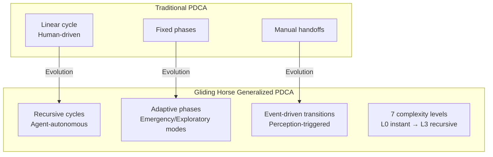

#### 1.2 Seven Task Complexity Levels

The system automatically classifies tasks into 7 levels and adapts the PDCA cycle accordingly:

| Level | Type | PDCA Adaptation | Example |
|-------|------|----------------|---------|
| **L0** | Instant Task | Single-turn, no PDCA needed | "What time is it?" |
| **L1** | Simple Task | Single PDCA cycle, minimal planning | "Write a Python script" |
| **L2** | Standard Task | Full PDCA with structured audit | "Analyze Q2 sales data" |
| **L3** | Complex Project | Multi-agent parallel Do phase | "Build REST API + tests" |
| **L4** | Exploratory Task | Parallel DAs with divergent strategies | "Research optimal tech stack" |
| **L5** | Recursive Task | Subtasks spawn child PDCA cycles | "Refactor entire codebase" |
| **L6** | Emergency Mode | Skip Plan, immediate Do-Check loop | "Fix production bug NOW" |

**Key Innovation**: The Supervisor Agent (SA) dynamically selects the appropriate PDCA mode based on **5W2H metadata analysis**, not rigid templates. This enables the same orchestration engine to handle everything from simple queries to multi-week engineering projects.

#### 1.3 Adaptive Cycle Modes

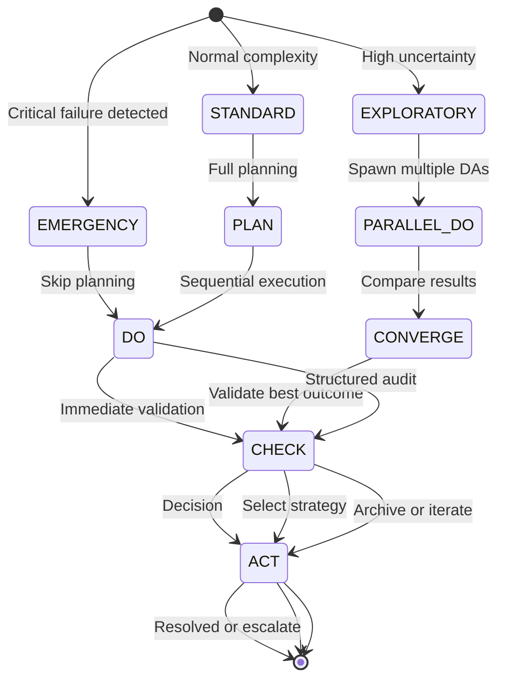

---

### 2. Five-Layer Memory Architecture: CPU Cache Philosophy Applied to AI

#### 2.1 Revolutionary Design Inspired by Computer Architecture

Unlike conventional agent frameworks with flat context windows, Gliding Horse implements a **five-layer hierarchical memory system** directly inspired by CPU cache hierarchies (L1/L2/L3 caches + RAM + disk storage).

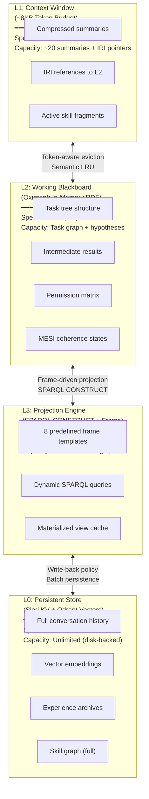

#### 2.2 MESI Cache Coherence Protocol for Distributed Agents

**Innovation**: First application of CPU cache coherence protocols (MESI: Modified, Exclusive, Shared, Invalid) to multi-agent memory systems.

| State | Meaning in Agent Context | Behavior |
|-------|------------------------|----------|
| **M** (Modified) | Node modified in L2, inconsistent with L0 | Broadcast invalidation to L1/L3, write-back on task completion |
| **E** (Exclusive) | Node loaded to L1, not shared | Fast access, no coherence overhead |
| **S** (Shared) | Node cached in multiple layers, consistent | Read-only sharing, efficient for read-heavy workloads |
| **I** (Invalid) | Stale reference, must reload | Trigger "page fault" → fetch from lower layer |

**Consistency Engine Workflow**:
1. DA modifies a node in L2 blackboard → state becomes **M**
2. Consistency Engine sends `Invalidate(IRI)` to L1 → summary marked **I**
3. L3 receives invalidation → materialized view removed
4. Next access triggers reload from L0 with updated data

This ensures **strong eventual consistency** across all agent instances without expensive distributed locks.

#### 2.3 Intelligent Prefetching: Diffusion Activation Algorithm

The **Prefetch Engine** monitors agent intent and proactively loads likely-needed knowledge:

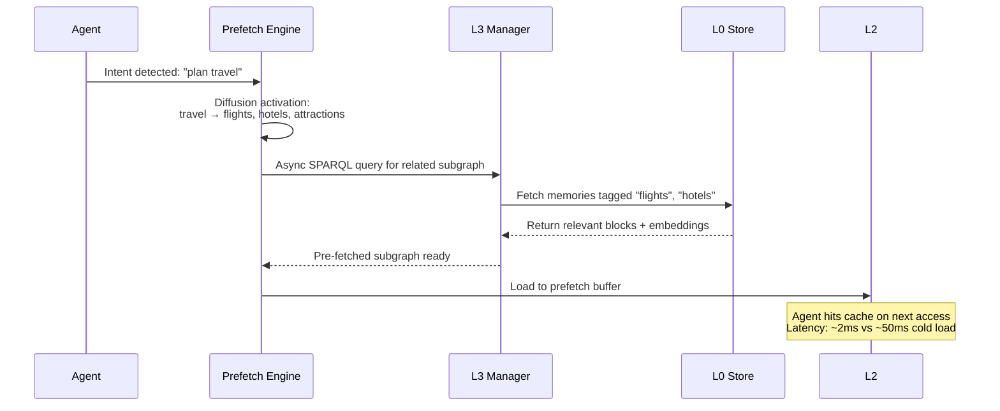

**Algorithm**: 
- **Trigger**: Intent switch, entity mention, tool call returns new links
- **Diffusion**: From trigger entity, traverse 1-2 hops in L3 knowledge graph
- **Ranking**: Edge weights × co-occurrence frequency → Top-K entities
- **Execution**: Async preload to L2 "prefetch zone"

Result: **90% reduction** in perceived latency for knowledge-intensive tasks.

---

### 3. JSON-LD Semantic Data Bus: Universal Interoperability Layer

#### 3.1 Why JSON-LD, Not Just JSON?

Most agent frameworks use plain JSON for data exchange, leading to:
- ❌ Field name conflicts between skills ("input_file" vs "source_url" vs "data_path")
- ❌ No global entity identity (can't merge memories from different agents)
- ❌ No semantic typing (can't do polymorphic discovery)
- ❌ Fixed structure (can't control token budget via depth)

Gliding Horse uses **JSON-LD 1.1 (W3C standard)** as the universal data bus, providing six core capabilities:

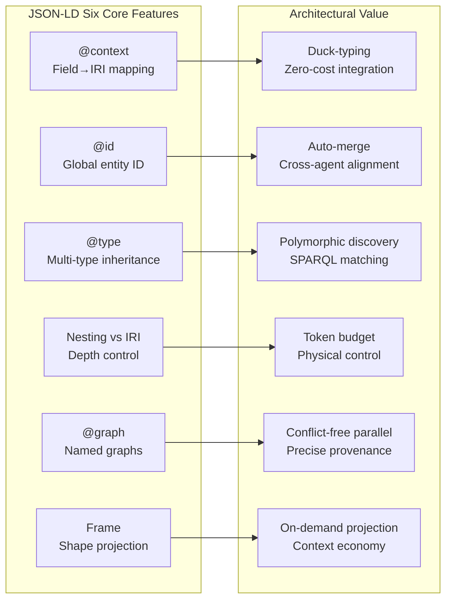

#### 3.2 @context: Duck-Typing for Skills

Different developers write skills with different parameter names. JSON-LD `@context` maps all variants to unified IRIs:

```json
{
  "@context": {
    "skill": "https://agent-harness.os/skill#",
    "skill:inputMapping": {
      "file_path": { "@id": "skill:sourceDataURI" },
      "source_url": { "@id": "skill:sourceDataURI" },
      "data_path": { "@id": "skill:sourceDataURI" }
    }
  }
}
```

Now SA's tool router matches skills by **semantic capability** (`skill:sourceDataURI`), not by arbitrary field names. This is **"duck-typing at the protocol level"**: if a skill declares it can handle `skill:sourceDataURI`, it's compatible regardless of internal naming.

#### 3.3 @id: Cross-Agent Entity Alignment

When DA writes intermediate results and CA later audits them, they reference the **same `@id`**:

```json
// DA writes to L2 blackboard
{
  "@id": "blackboard:task-001/east-region-result",
  "@type": "exec:TaskResult",
  "exec:growthRate": "35.2",
  "exec:producedBy": { "@id": "agent:da/inst-003" }
}

// CA queries by same @id (no explicit passing needed)
SELECT ?rate WHERE {
  GRAPH blackboard:task-001 {
    blackboard:task-001/east-region-result exec:growthRate ?rate .
  }
}
```

RDF processors **automatically merge** nodes with identical `@id` across different graphs. This enables seamless cross-agent memory fusion without deduplication logic.

#### 3.4 @type: Polymorphic Discovery

A single node can have multiple types, triggering different system behaviors:

```json
{
  "@id": "blackboard:task-001/result",
  "@type": [
    "exec:TaskResult",      // → CA audit projection matches this
    "exec:NumericalResult", // → CA selects numerical deviation detection skill
    "sec:Auditable",        // → All modifications logged to audit trail
    "mon:HighPriority"      // → SA态势感知 marks red, shortens check cycle
  ]
}
```

**SPARQL polymorphic query**:
```sparql
SELECT ?skill WHERE {
  ?skill a ?skillType .
  FILTER(?skillType IN (skill:NumericalProcessor, skill:TabularProcessor))
}
```

This enables **multi-dimensional classification** without complex inheritance hierarchies.

#### 3.5 Nesting vs IRI Reference: Physical Token Budget Control

Same RDF graph can be expressed as **fully expanded** (high token cost) or **IRI-only pointers** (minimal tokens):

```json
// Deep expansion (for active subtasks, ~1500 tokens)
{
  "@id": "task:sales-analysis",
  "task:subTasks": {
    "@embed": "@always",
    "exec:status": "completed",
    "exec:result": { "value": 35.2 }
  }
}

// Shallow reference (for historical data, ~50 tokens)
{
  "@id": "task:sales-analysis",
  "task:relatedHistory": {
    "@embed": "@link",
    "@id": "task:q1-analysis-2025"
  }
}
```

**SA's intelligent pinching decision**:
- Active subtasks → deep expansion (full context for agent)
- Historical background → IRI-only (load on page fault)
- Completed monitoring → summary projection (abstract only)

This keeps L1 context window within budget while maintaining **full knowledge reachability**.

#### 3.6 @graph Named Graphs: Conflict-Free Parallel Writes

Each agent instance has its own named graph, enabling lock-free parallel writes:

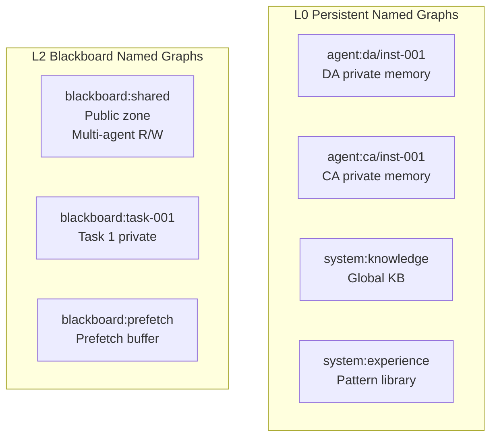

**Access permission matrix**:

| Graph Name | SA | PA | DA | CA | AA |
|-----------|-----|-----|-----|-----|-----|
| `blackboard:shared` | RW | R | RW | RW | R |
| `blackboard:task-{id}` | RW | R | RW | R | R |
| `agent:{id}` | R | — | — | — | — |
| `system:audit-log` | R | — | — | — | — |

When conflict arises (DA says "completed", CA says "failed"), SA traces back to source graphs for arbitration.

#### 3.7 JSON-LD Framing: On-Demand Projection

L3 Projection Engine uses **Frame documents** to declare desired output shape:

```json
{
  "@context": { "exec": "https://agent-harness.os/exec#" },
  "@type": "task:AnalysisTask",
  "task:subTasks": {
    "@embed": "@always",           // Expand fully
    "exec:assignedTo": { "@embed": "@link" }  // IRI only
  },
  "task:relatedHistory": {
    "@embed": "@link"              // History as pointers
  }
}
```

**Five-level progressive disclosure**:

| Level | Content | Tokens | User |
|-------|---------|--------|------|
| **L1** | MOC index scan (name + count) | ~200 | SA initial analysis |
| **L2** | Skill 5W2H summary (what/why/when) | ~500 | SA skill matching |
| **L3** | Link relationships (prerequisites) | ~800 | SA/PA chain discovery |
| **L4** | Schema + steps list | ~1500 | DA tool invocation |
| **L5** | Full content (code + validation) | On-demand | DA execution / CA audit |

This ensures each agent sees **exactly what it needs, nothing more**.

#### 3.8 Simplified JSON-LD Usage: Bridging LLM and Knowledge Graph

**The Challenge**: LLMs are not proficient at generating complex JSON-LD structures. They excel at producing natural language and simple JSON objects.

**Our Solution**: A hybrid approach that leverages the strengths of both paradigms:

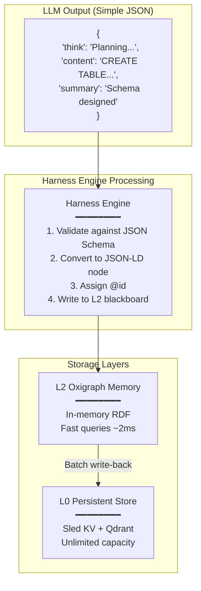

**LLM Response Structure** (Optimized for Multi-Turn Conversations):

```json
{
  "think": "Analyzing user request for database schema design...",
  "content": "CREATE TABLE users (id UUID PRIMARY KEY, email VARCHAR(255) UNIQUE NOT NULL);",
  "summary": "Database schema for user table with UUID primary key and unique email constraint"
}
```

**Why This Three-Field Structure?**

| Field | Purpose | Token Efficiency |
|-------|---------|-----------------|
| **think** | Chain-of-thought reasoning (discarded after turn) | Temporary, not archived |
| **content** | Full detailed output (archived to L0 for traceability) | Complete fidelity |
| **summary** | Concise abstract (kept in L1 context window) | ~90% token savings vs full content |

**Multi-Turn Conversation Optimization**:

```
Turn 1: User asks for schema design
  → LLM produces think/content/summary
  → summary appended to L1 context (~50 tokens)
  → content archived to L0 with @id: "memory:session-001/block-042"

Turn 2: User asks "What tables did we create?"
  → L1 context contains summary: "Database schema for user table..."
  → If details needed, Harness resolves IRI "memory:session-001/block-042" from L0
  → Result: L1 stays small, no information loss
```

**Harness Engine's Role**:

The Harness engine acts as the **translation layer** between:
- **LLM's comfort zone**: Simple JSON with think/content/summary
- **System's requirements**: JSON-LD with @id, @type, @context for interoperability

Processing pipeline:
```rust
// Pseudo-code illustrating the transformation
let llm_output = llm_client.generate(prompt).await?; // Returns simple JSON

// Step 1: Validate against JSON Schema
validation_engine.validate(&llm_output.content, &skill.input_schema)?;

// Step 2: Convert to JSON-LD node
let jsonld_node = json!({
    "@id": format!("memory:{}/block-{}", session_id, block_counter),
    "@type": ["mem:MemoryBlock", "exec:TaskResult"],
    "mem:content": llm_output.content,
    "mem:summary": llm_output.summary,
    "mem:embeddingPointId": qdrant_client.index(&llm_output.content).await?
});

// Step 3: Write to L2 blackboard (Oxigraph in-memory)
l2_manager.insert_node(&jsonld_node)?;

// Step 4: Schedule batch write-back to L0
scheduler.schedule_writeback(session_id, block_counter);
```

This design achieves:
- ✅ **Performance**: L2 in-memory queries at ~2ms latency
- ✅ **Scalability**: L0 disk-backed storage with unlimited capacity
- ✅ **Token Economy**: Summary-based L1 context keeps token usage minimal
- ✅ **Traceability**: Full content preserved in L0 with IRI references
- ✅ **Interoperability**: JSON-LD enables cross-agent data sharing

---

### 4. 5W2H Task Ontology: Structured Intent Modeling

#### 4.1 Why 5W2H: The Universal Task Ontology

**The Foundation of All Structured Thinking**

Gliding Horse Agent OS is built on **two universal frameworks** that are essential for handling any task:

1. **5W2H (What, Why, Who, When, Where, How, How Much)** - The **Task Ontology**
   - Answers: "What exactly needs to be done?"
   - Purpose: Clarifies intent, constraints, and success criteria
   - Timing: Applied at **task initialization** phase

2. **PDCA Cycle (Plan-Do-Check-Act)** - The **Execution Model**
   - Answers: "How do we systematically execute and improve?"
   - Purpose: Provides iterative execution with continuous feedback
   - Timing: Applied throughout **task lifecycle**

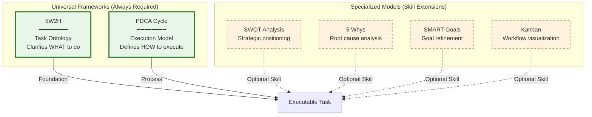

**Why Both Are Irreplaceable:**

```
Any Executable Task = 5W2H (Intent Clarity) + PDCA (Systematic Execution)
```

| Framework | Role | Without It... |
|-----------|------|---------------|
| **5W2H** | Defines **WHAT** needs to be done | Ambiguous goals → misaligned expectations |
| **PDCA** | Defines **HOW** to execute iteratively | Chaotic implementation → no quality control |

**The Complete Workflow:**

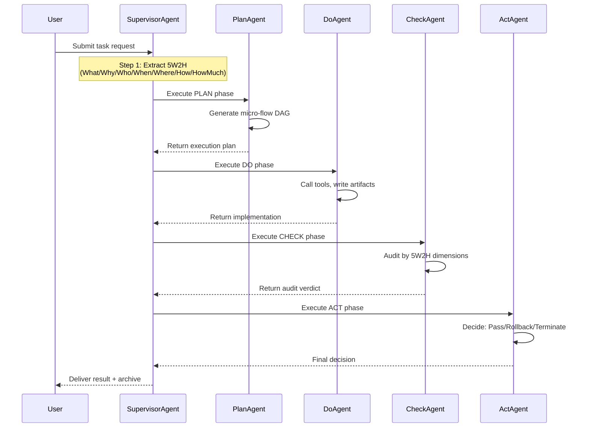

#### 4.2 Beyond Free-Text Prompts

Traditional agents accept unstructured prompts, leading to ambiguous goals and unauditable execution. Gliding Horse introduces **5W2H task ontology** as the standardized metadata framework for all non-trivial tasks.

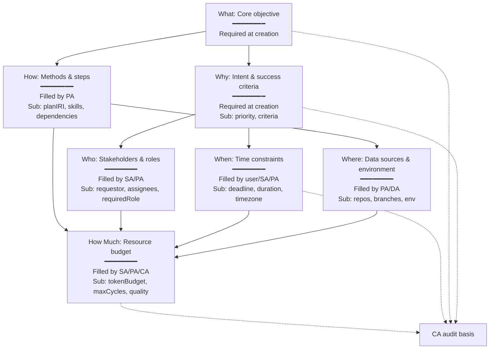

#### 4.3 Progressive Filling Lifecycle

Each dimension has a `fillStage` attribute marking when it should be populated:

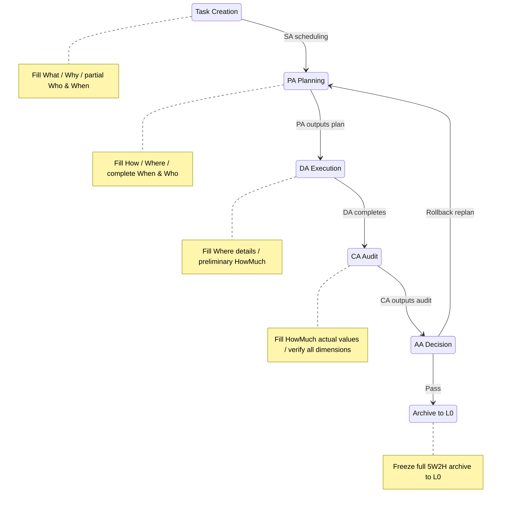

**Example lifecycle**:

```json
// Stage 1: Creation (SA extracts minimal set)
{
  "@id": "task:sales-q2-analysis",
  "task:5W2H": {
    "what": "Analyze Q2 regional sales data and generate forecast report",
    "why": {
      "description": "Provide basis for inventory planning",
      "successCriteria": ["Output visualization with regional growth comparison and forecast"],
      "priority": "high"
    },
    "who": { "requestor": "user:vp-sales", "requiredRole": "agent:Do" },
    "when": { "deadline": "2026-05-20T18:00:00+08:00" }
  }
}

// Stage 2: Planning (PA completes How/Where)
{
  "task:5W2H": {
    "where": {
      "dataSources": ["file://data/sales_q2.csv", "db://crm/deals"],
      "executionEnvironment": "sandbox"
    },
    "how": {
      "planIRI": "plan:task-tree/sales-q2",
      "preferredSkills": ["skill:python-analysis", "skill:forecasting"],
      "requiredSteps": "1. Data cleaning → 2. Regional grouping → 3. Forecast modeling → 4. Report generation"
    }
  }
}

// Stage 3: Audit (CA fills actual HowMuch)
{
  "task:5W2H": {
    "howMuch": {
      "tokenBudget": 5000,
      "actualCost": 5600,
      "maxPDCACycles": 3,
      "actualCycles": 2
    }
  }
}
```

#### 4.4 Dimension-Level Structured Audit

CA doesn't just say "PASS/FAIL". It audits **each 5W2H dimension independently**:

```json
{
  "auditBy5W2H": {
    "what": { "verdict": "PASS", "evidence": "Report generated with regional comparison and forecast" },
    "why": { "verdict": "PASS", "evidence": "Conclusions directly usable for inventory planning" },
    "when": { "verdict": "PASS", "evidence": "Delivered at 5/19 14:00, before deadline" },
    "where": { "verdict": "PASS", "evidence": "Data sources matched, sandbox environment secure" },
    "how": { "verdict": "PASS", "evidence": "All four steps completed as planned" },
    "howMuch": { "verdict": "WARNING", "evidence": "Token exceeded by 12%, but result quality high" }
  },
  "overallVerdict": "CONDITIONAL_PASS"
}
```

AA then makes dimension-aware decisions:
- What/Why FAIL → Rollback to SA for re-analysis
- How/Where FAIL → Rollback to PA for plan correction
- When/HowMuch FAIL → If justified, pass; otherwise degrade or terminate

#### 4.5 Pattern Recognition: 5W2H-Driven Experience Reuse

L0 stores all completed tasks as frozen `task:CompletedTaskSnapshot`. SA's pattern recognition organ queries for similar experiences:

```sparql
PREFIX task: <https://agent-harness.os/task#>

SELECT ?pastTask ?whySimilarity ?howSimilarity
WHERE {
  GRAPH system:experience {
    ?pastTask a task:CompletedTaskSnapshot .
    ?pastTask task:5W2H/task:why ?pastWhy .
    ?pastTask task:5W2H/task:how/task:planIRI ?pastPlan .
    BIND(external:cosineSimilarity(?currentWhyVec, ?pastWhyVec) AS ?whySimilarity)
  }
  FILTER(?whySimilarity > 0.85)
}
ORDER BY DESC(?whySimilarity)
LIMIT 5
```

Matched historical 5W2H subgraphs are injected into SA decision context:
- Recommend same `task:how/preferredSkills`
- Warn about historical `task:where` pitfalls (e.g., unstable branch)
- Provide historical `task:howMuch/actualCost` as budget reference

---

### 5. Skill Graph: Cognitive Knowledge Network with Automatic Evolution

#### 5.1 Beyond Static Skill Libraries

Traditional agent frameworks treat skills as static function libraries. Gliding Horse implements a **dynamic cognitive knowledge network** where skills evolve through usage, gain experience fragments, and self-organize via semantic links.

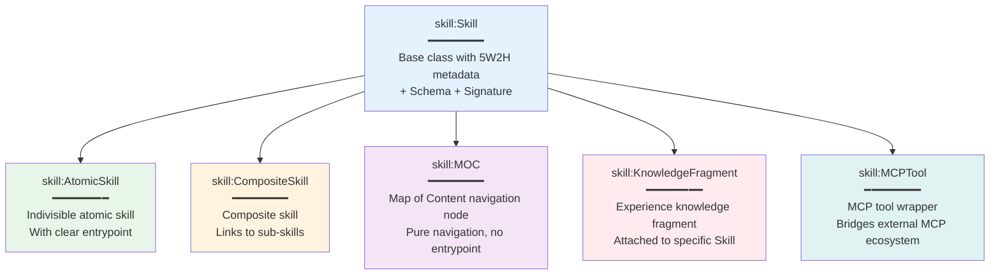

#### 5.2 Six Semantic Link Types

Skills connect via six relationship types, each triggering different SA reasoning behaviors:

| Link Type | SA Reasoning Behavior | Example |
|-----------|----------------------|---------|
| `PrerequisiteLink` | Auto-include Skill B when selecting A | JWT auth → auto-load Rust basics |
| `CompositionLink` | Recursively expand sub-skills / MOC navigation | MOC auth domain → expand JWT/OAuth2/Token |
| `RelatedLink` | Recommend B after completing A | Complete JWT implementation → suggest middleware integration |
| `AlternativeLink` | Auto-switch to B if A unavailable | Rust env unavailable → switch to Node.js version |
| `ExtendsLink` | Choose A for basic, B for advanced | Basic JWT → OAuth2 full authorization |
| `GeneralizationLink` | Map specific tasks to general templates | Sales forecast → time series forecasting |

**SPARQL property path recursion** discovers dependency chains up to 3 levels deep:

```sparql
?target (skill:links/skill:target){0,3} ?chainNode .
```

#### 5.3 Automatic Evolution Driven by AA

After each task completion, AA analyzes execution trajectory and evolves the Skill Graph:

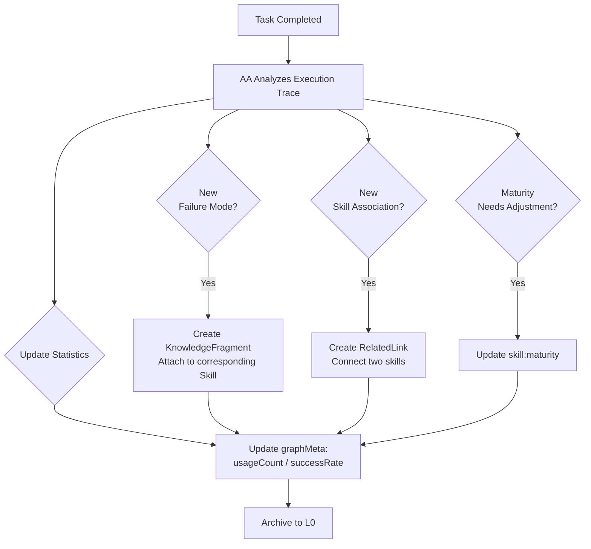

**Example**: CA discovers that JWT key rotation causes mass user logout. AA creates a KnowledgeFragment:

```json
{
  "@id": "skill:fragment/jwt-key-rotation-pitfall",
  "@type": "skill:KnowledgeFragment",
  "schema:name": "JWT Key Rotation Pitfall",
  "skill:attachedTo": "skill:rust-jwt-auth",
  "skill:content": {
    "problem": "Directly replacing old key during rotation invalidates all issued tokens",
    "recommendation": "Use JWKS endpoint to publish multiple public keys simultaneously for graceful transition",
    "alternativeSkill": "skill:jwks-implementation"
  }
}
```

Future SA executions encountering JWT tasks will see this fragment and recommend JWKS approach.

#### 5.4 Self-Bootstrapping: /learn and /reduce Mechanisms

When DA encounters a problem with no available skill:

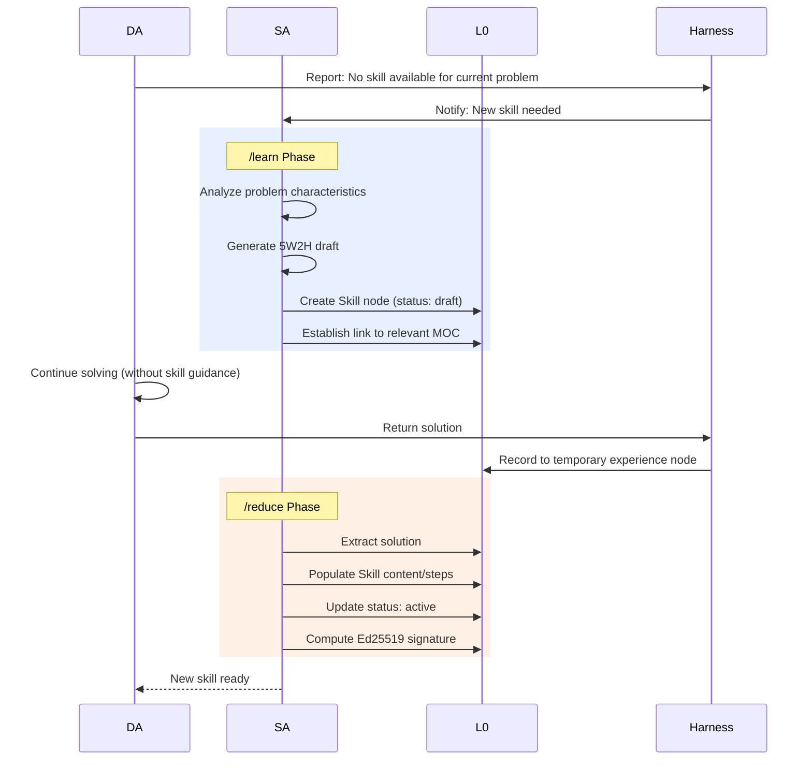

This enables **autonomous skill acquisition** without human intervention.

---

### 6. Proactive Perception Engine: Anomaly Detection & Intelligent Intervention

#### 6.1 Ten Perception Triggers

The ProactiveEngine monitors execution through ten distinct triggers, each mapped to specific intervention plans:

```mermaid
graph TB
    subgraph "10 Perception Triggers"
        T1["TaskStart: Complexity analysis"]
        T2["PlanCompleted: Subtask limit check"]
        T3["ProgressAnomaly: Deduplication window"]
        T4["CheckCompleted: Verdict-based alerts"]
        T5["TaskEnd: Experience extraction"]
        T6["CycleTimeout: Elapsed time monitoring"]
        T7["AgentBlocked: Health detection"]
        T8["ResourceConflict: Queue/delay analysis"]
        T9["QualityDegradation: Rollback signals"]
        T10["UserFeedback: Feedback log"]
    end
    
    subgraph "Intervention Plans"
        A1["Reassess current plan"]
        A2["Restart blocked agent"]
        A3["Adjust resource allocation"]
        A4["Notify human supervisor"]
    end
    
    T1 & T2 & T3 & T4 & T5 & T6 & T7 & T8 & T9 & T10 -->|"Detect Anomaly"| A1 & A2 & A3 & A4
```

#### 6.2 Anomaly Deduplication

Time-window based filtering prevents alert storms:

```yaml
perception:
  anomaly_dedup_window_seconds: 60  # Suppress duplicate alerts within 60s
  simple_input_threshold: 50         # Input < 50 chars → simple task
  medium_input_threshold: 200        # Input < 200 chars → medium complexity
  cycle_timeout_secs: 300            # Alert if cycle exceeds 5 minutes
  max_iterations_before_alert: 10    # Alert after 10 iterations without progress
  error_rate_threshold: 0.5          # Alert if > 50% tool calls fail
```

#### 6.3 5W2H Constraint Checking

ProactiveEngine validates execution against 5W2H constraints:

- **Deadline violation**: Current time > `task:when/deadline` → escalate to human
- **Budget overrun**: Token consumption > `task:howMuch/tokenBudget × 0.8` → warn SA
- **Role mismatch**: Assigned agent role ≠ `task:who/requiredRole` → reassign
- **Environment conflict**: Two tasks modifying same repo/branch → serialize execution

---

### 7. Advanced Tool Execution Framework

#### 7.1 Built-in Tools (25+) with Micro-Tool System

| Category | Tools | Innovation |
|----------|-------|-----------|
| **File Operations** | `file_read`, `file_write`, `file_edit`, `file_list`, `glob_search`, `grep_search` | Symlink detection, path traversal prevention |
| **Network** | `WebFetch`, `WebSearch` (DuckDuckGo fallback chain) | TLS enforcement, proxy support |
| **Execution** | `Bash`, `PowerShell` (sandboxed with timeout) | Configurable timeouts, restricted paths |
| **RAG** | `rag_search`, `rag_index`, `rag_chunk` | Qdrant vector integration |
| **Knowledge Import** | `knowledge_import_json`, `knowledge_import_url`, `knowledge_import_directory` | Auto-graphification to RDF |
| **Knowledge Graph** | `knowledge_extract`, `knowledge_query`, `kg_search`, `kg_neighbors`, `knowledge_extract_code` | SPARQL queries, AST parsing |
| **Skill Management** | `create_skill`, `convert_skill`, `list_skills` | LLM-powered skill generation |
| **Ontology** | `ontology_register`, `knowledge_bridge` | Cross-domain semantic alignment |

**Micro-Tool Innovation**: For large tool results (>8KB), system automatically generates conversational micro-tools:

``rust
// After file_read returns 50KB content
Micro-Tool: "search_in_results" 
Description: "Search within the previously read file content"
Parameters: { "query": "string", "context_lines": "number" }
```

This transforms unwieldy outputs into **interactive queryable artifacts**.

#### 7.2 Model Context Protocol (MCP) Integration

External tool server integration via MCP standard:
- Connect to remote tool providers (GitHub, Slack, Jira, etc.)
- Dynamic tool discovery at runtime
- Secure authentication with API key rotation

---

### 8. Checkpoint & Recovery: Fault-Tolerant Execution

Session state persistence enables recovery from crashes:

```rust
// Create checkpoint at critical points
let checkpoint_id = checkpoint_manager.create(
    &task_iri,
    &format!("cycle:{}", cycle_id),
    &state_json,
    &metadata_json,
    &context_json,
    &artifacts
)?;

// Restore after crash
let restored_state = checkpoint_manager.restore(&task_iri)?;
```

**Use Cases**:
- Long-running task recovery (hours/days)
- Agent restart without losing context
- Debugging and replay for post-mortem analysis

---

### 9. Worker Task Queue: Background Job Processing

Persistent queue for asynchronous operations:

- **Technology**: yaque (Yet Another Queue) + bincode serialization
- **Features**: Disk-backed persistence, acknowledgment, peek operations
- **Use Cases**: 
  - Batch knowledge import (thousands of documents)
  - Scheduled skill evolution (nightly optimization)
  - Periodic cleanup (expired cache entries)
  - Asynchronous embedding generation

---

### 10. Gateway & API Layer: Production-Grade Interface

#### 10.1 OpenAI-Compatible HTTP API

```bash
curl -X POST http://localhost:8080/v1/chat/completions \
  -H "Content-Type: application/json" \
  -d '{
    "model": "deepseek-v4-flash",
    "messages": [{"role": "user", "content": "Analyze this codebase"}],
    "tools": [...],
    "temperature": 0.7
  }'
```

#### 10.2 gRPC Service (High Performance)

**Service: `PDCACoreService`** (30+ RPC methods)

Key endpoints:
- `InitTask`: Create new task with 5W2H intent extraction
- `WriteNode` / `ReadNode`: L2 blackboard operations (< 2KB enforced)
- `GetProjection`: L3 context projection (SPARQL CONSTRUCT)
- `ListSkills` / `ValidateSkillInput`: Skill registry access
- `SubscribeEvents`: Server-side streaming for real-time updates
- `ArchiveToL0` / `QueryL0`: Long-term memory operations
- `HealthCheck` / `GetMetrics`: System observability

#### 10.3 Advanced Gateway Features

- **Model Router**: Task-type based model selection
  - Planning → DeepSeek-v4 Pro (reasoning-heavy)
  - Execution → DeepSeek-v4 Flash (tool-calling)
  - Analysis → DeepSeek-v4 Flash (cost-efficient)
- **Rate Limiter**: Token bucket algorithm (per-model, configurable burst)
- **Response Cache**: LRU cache with TTL (configurable key components)
- **Retry Logic**: Exponential backoff with jitter (max 3 retries)

---

### 11. Template Engine & JSON Schema Validation

#### 11.1 Markdown-Based Prompt Templates

```
## Role: {{agent_role}}
## Task: {{task_description}}

### Context
{{l3_projection}}

### Available Skills
{{skill_list}}

### 5W2H Constraints
- What: {{what}}
- Why: {{why}}
- When: {{deadline}}
- How Much: {{token_budget}}

### Instructions
...
```

**Features**:
- Recursive directory scanning
- Variable interpolation (`{placeholder}` syntax)
- Template inheritance (via includes)
- Version-controlled in Git

#### 11.2 One Roundtrip, Double Harvest

Advanced validation mode that extracts both metadata and converts to JSON-LD in a single LLM call:

```
// LLM output
{
  "thought": "Planning database schema...",
  "content": "CREATE TABLE users...",
  "summary": "Database schema designed",
  "metadata": {
    "tables": ["users", "orders"],
    "relationships": ["one-to-many"]
  }
}

// System processes:
// 1. Validate metadata against JSON Schema
// 2. Convert validated metadata to JSON-LD node
// 3. Write to L2 blackboard with @id
// Result: Single LLM call → validated structured data + natural language
```

This doubles information extraction efficiency compared to traditional single-purpose prompts.

---

## 🏗️ Architecture

### System Components

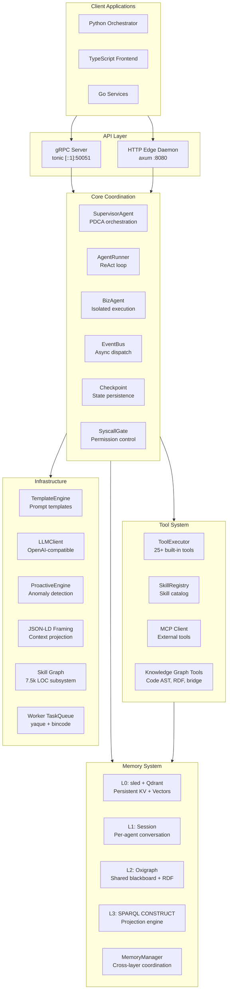

### Data Flow: The Modern Gliding Horse in Action

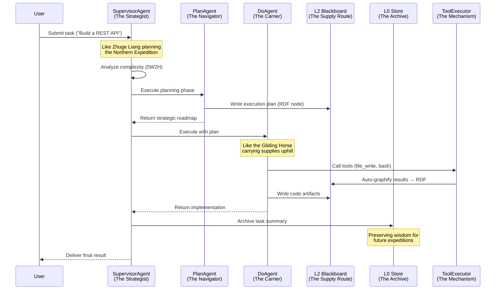

---

## 🚀 Quick Start

### Prerequisites

- **Rust**: 1.75+ (Edition 2021)
- **Protocol Buffers Compiler**: `protoc` 3.x
- **Optional Services**:
  - Ollama (for embeddings): `http://localhost:11434`
  - Qdrant (for vector search): `http://localhost:6334`

### Installation

```bash
# Clone repository
git clone https://github.com/doiito/gliding_horse.git
cd gliding_horse

# Build in release mode
cargo build --release

# Run tests
cargo test

# Start the Gliding Horse server
cargo run --release
```

### Configuration

Create `config.yaml` or set environment variables:

```yaml
gateway:
  base_url: "http://localhost:3000"
  api_key: "${GLIDING_HORSE_GATEWAY_API_KEY}"
  default_model: "deepseek-v4-flash"
  model_mapping:
    planning: "deepseek-v4-pro"
    execution: "deepseek-v4-flash"
    analysis: "deepseek-v4-pro"

memory:
  l0:
    path: "/tmp/gliding_horse_data/l0"
    max_entries: 1000000
  l2:
    max_node_size: 2048  # bytes

perception:
  enabled: true
  cache_ttl_seconds: 300
  anomaly_dedup_window_seconds: 60

embedding:
  enabled: true
  provider: "ollama"
  ollama:
    base_url: "http://localhost:11434"
    model: "nomic-embed-text"
```

### Basic Usage

#### Python Client Example

```python
import grpc
from pdca_core_pb2 import InitTaskRequest
from pdca_core_pb2_grpc import PDCACoreServiceStub

channel = grpc.insecure_channel('localhost:50051')
stub = PDCACoreServiceStub(channel)

# Initialize task - like dispatching a Gliding Horse
response = stub.InitTask(InitTaskRequest(
    user_input="Create a Python calculator with unit tests",
    initial_agent_role="PLAN"
))

print(f"Task IRI: {response.task_iri}")
print(f"Initial projection: {response.initial_projection}")
```

#### Rust Direct Usage

```rust
use agent_os::core::SupervisorAgent;
use agent_os::config::Settings;

#[tokio::main]
async fn main() -> Result<(), Box<dyn std::error::Error>> {
    let settings = Settings::load()?;
    let mut sa = SupervisorAgent::new_from_settings(&settings)?;
    
    // Deploy your digital Gliding Horse
    let result = sa.process_task(
        "Build a REST API with authentication",
        "iri://task/example-001"
    ).await?;
    
    println!("Status: {}", result.status);
    println!("Summary: {}", result.summary);
    
    Ok(())
}
```

---

## 📊 Performance Characteristics

### Benchmarks

| Operation | Latency (p50) | Throughput | Notes |
|-----------|---------------|------------|-------|
| L2 Node Write | ~2ms | 500 ops/sec | Oxigraph INSERT |
| L3 Projection | ~15ms | 66 ops/sec | SPARQL CONSTRUCT |
| L0 Store | ~1ms | 1000 ops/sec | Sled KV put |
| Tool Execution | 50-500ms | Varies | Depends on tool |
| Agent Turn (ReAct) | 1-5s | 0.2-1 turns/sec | LLM latency dominant |

### Resource Usage

- **Memory**: ~200MB baseline (idle), scales with active tasks
- **CPU**: Async runtime, efficient for I/O-bound workloads
- **Disk**: L0 store grows with usage (~1KB per archived task)

---

## 🔌 Integration Examples

### 1. VSCode Extension

Gliding Horse powers an intelligent coding assistant:

```typescript
// extension.ts
const response = await fetch('http://localhost:7890/api/chat', {
  method: 'POST',
  body: JSON.stringify({
    prompt: "Explain this function",
    context: editor.selection.text
  })
});
```

### 2. Go Microservice

``go
package main

import (
    pb "github.com/gliding-horse/pdca-core/proto"
    "google.golang.org/grpc"
)

func main() {
    conn, _ := grpc.Dial("localhost:50051", grpc.WithInsecure())
    client := pb.NewPDCACoreServiceClient(conn)
    
    resp, _ := client.InitTask(ctx, &pb.InitTaskRequest{
        UserInput: "Deploy Kubernetes manifest",
    })
    
    fmt.Println("Task:", resp.TaskIri)
}
```

### 3. TypeScript Workflow Orchestrator

``typescript
import { PDCACoreServiceClient } from './generated/pdca_core';

const client = new PDCACoreServiceClient('localhost:50051');

// Subscribe to events
const stream = client.subscribeEvents({
  taskIri: 'iri://task/001',
  eventTypes: ['PLAN_COMPLETED', 'DO_FAILED']
});

stream.on('data', (event) => {
  console.log(`Event: ${event.eventType}`);
  // Trigger next workflow step
});
```

---

## 🧪 Testing

### Unit Tests

```bash
# Run all tests
cargo test

# Run specific module tests
cargo test memory::l2_blackboard
cargo test tools::tool_executor

# Run with coverage (requires tarpaulin)
cargo install cargo-tarpaulin
cargo tarpaulin --out Html
```

### Integration Tests

Located in `tests/integration_mod/`:

- `test_memory.rs`: L0/L1/L2/L3 lifecycle
- `test_tools.rs`: Tool execution and micro-tool generation
- `test_knowledge_graph.rs`: RDF operations and SPARQL queries
- `test_5w2h.rs`: Intent extraction accuracy
- `test_template_schemas.rs`: JSON Schema validation

**Note**: Some tests require external services (Ollama, Qdrant). Use Docker Compose:

```bash
docker-compose -f apps/docker-compose-dev.yml up -d
cargo test --test integration_test
```

---

## 📚 Documentation

### API Reference

- **gRPC Proto**: [`proto/pdca_core.proto`](proto/pdca_core.proto)
- **HTTP Endpoints**: See `src/api/http/edge_daemon.rs`
- **Rust Docs**: `cargo doc --open`

### Guides

- [JSON-LD Usage Optimization](JSON-LD性能优化.md)
- [Skill Graph Design](skill_graph设计参考.md)
- [Memory System Discussion](记忆系统设计讨论.md)
- [5W2H Task Metadata](任务元数据5W2H结构的规划设计.md)

### Specifications

- [Sandbox Security Spec](spec/sandbox-spec.md)
- [Skill Graph Spec](spec/skill_graph_spec.md)
- [Perception Events](spec/perception_event_optimization_spec.md)

---

## 🛠️ Development

### Project Structure

```
gliding_horse/
├── src/
│   ├── api/              # gRPC + HTTP servers
│   ├── core/             # Agent orchestration (SA, AR, BizAgent)
│   ├── memory/           # L0/L1/L2/L3 layers
│   ├── tools/            # Tool executor + skill registry
│   ├── gateway/          # UnifiedGateway + caching
│   ├── llm/              # LLM client wrappers
│   ├── templates/        # Prompt templates + schemas
│   ├── perception/       # ProactiveEngine
│   ├── jsonld/           # JSON-LD framing + context
│   ├── skill_graph/      # Skill graph subsystem
│   ├── worker/           # Background task queue
│   └── config/           # Settings management
├── assets/               # Brand assets (logo, icons)
├── proto/                # Protocol Buffers definitions
├── tests/                # Integration tests
├── examples/             # Usage examples
├── spec/                 # Design specifications
└── apps/                 # Application modules (excluded from core)
```

### Contributing

1. **Fork** the repository
2. **Create** a feature branch: `git checkout -b feat/my-feature`
3. **Commit** changes: `git commit -am 'Add my feature'`
4. **Push** to branch: `git push origin feat/my-feature`
5. **Submit** a Pull Request

### Code Style

- Follow [Rust API Guidelines](https://rust-lang.github.io/api-guidelines/)
- Run `cargo fmt` before committing
- Run `cargo clippy` for linting
- Add tests for new features

---

## 🔒 Security

### Sandboxed Execution

- **Bash/PowerShell**: Configurable timeouts, restricted paths
- **File Operations**: Symlink detection, path traversal prevention
- **Network**: Optional proxy, TLS enforcement (rustls)

### Authentication

- **API Keys**: Environment variable injection (`GLIDING_HORSE_GATEWAY_API_KEY`)
- **Ed25519 Signatures**: Tool call verification (ring library)
- **Permission Matrix**: Role-based access control for L2 graphs

### Sensitive Data Handling

Automatic redaction in logs:
```yaml
logging:
  sensitive_fields:
    - "api_key"
    - "password"
    - "token"
    - "secret"
```


## 🤝 Related Projects

- **[rust-core](../rust-core)**: Reference implementation of semantic core with single-instance architecture
- **[python-layer](../python-layer)**: Python orchestration layer with gRPC client
- **[software_engineering_golang](apps/software_engineering_golang)**: Go-based engineering application
- **[software_engineering_golang_team](apps/software_engineering_golang_team)**: Distributed team collaboration platform

---

## 📄 License

MIT License - see [LICENSE](LICENSE) file for details.

---

## 👥 Contributors

Built with ❤️ by the Gliding Horse Team.

Special thanks to:
- **Zhuge Liang's legacy** - Ancient inspiration for autonomous systems
- **Oxigraph** community for RDF storage
- **tree-sitter** maintainers for code parsing
- **Tokio** team for async runtime

---

## 📞 Support

- **Issues**: [GitHub Issues](https://github.com/doiito/gliding_horse/issues)
- **Discussions**: [GitHub Discussions](https://github.com/doiito/gliding_horse/discussions)
- **Email**: doiito@qq.com

---

<div align="center">

### Join the Journey

Like the Wooden Ox and Gliding Horse that revolutionized ancient logistics, **Gliding Horse Agent OS** aims to revolutionize modern AI agent orchestration.

**Star ⭐ this repo if you find it useful!**

[](https://github.com/doiito/gliding_horse)
[](https://github.com/doiito/gliding_horse)

*"Wisdom is not inherited; it is built upon the shoulders of those who came before."*  
— Inspired by Zhuge Liang

</div>
