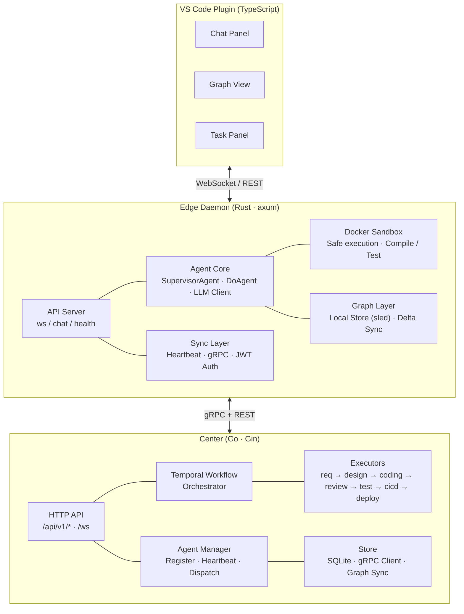

# Gliding Horse Agent OS (流马智能体操作系统)

<div align="center">


**An Industrial-Grade AI Agent Operating System Built in Rust**

*Inspired by Zhuge Liang's Wooden Ox and Gliding Horse — Ancient Ingenuity Meets Modern AI*

[](https://www.rust-lang.org/)
[](LICENSE)
[](https://grpc.io/)
[](https://oxigraph.org/)

---

[**English**](README.md) · [**中文**](README.zh.md) · [**Design Detail →**](docs/DESIGN_DETAIL.md)

</div>

---

## What Is Gliding Horse?

An **AI agent operating system** that orchestrates multiple agents through the PDCA (Plan-Do-Check-Act) cycle. Think of it as the infrastructure layer that harnesses AI agents into a coordinated, auditable, and self-improving system — much like how Zhuge Liang's **Wooden Ox and Gliding Horse** revolutionized logistics by harnessing mechanical power across treacherous terrain.

> "We don't just build agents; we build the **infrastructure that harnesses their collective intelligence**."

### Core Architecture

| Layer | Technology | Role |
|-------|-----------|------|
| **Core Coordination** (Rust) | `PDCA cycle` · `5W2H ontology` · `EventBus` | Agent orchestration & lifecycle |
| **Memory System** | `L0: Sled+Qdrant` · `L2: Oxigraph` · `MESI coherence` | 5-layer hierarchical memory |
| **Data Bus** | `JSON-LD 1.1` · `@id/@type/@context` · `Named Graphs` | Universal interoperability |
| **Knowledge Graph** | `Oxigraph RDF` · `SPARQL 1.1` · `Code AST` | Cross-subsystem unified store |
| **Skill Graph** | `RDF` · `7.5k LOC` · `Self-evolving` | Dynamic cognitive network |
| **Perception Engine** | `10 triggers` · `Anomaly dedup` · `5W2H constraint check` | Proactive monitoring |
| **Gateway** | `gRPC` · `HTTP (OpenAI-compatible)` · `MCP` | Production interface |

---

## 📖 The Story: From Ancient Wisdom to Modern Intelligence

In the turbulent era of the Three Kingdoms (220–280 AD), the legendary strategist **Zhuge Liang** (诸葛亮), chancellor of the Shu Han state, faced a critical challenge: how to transport supplies efficiently through the treacherous mountain paths of Sichuan during his Northern Expeditions. Traditional wheeled carts struggled on narrow trails; human porters exhausted quickly.

His solution — the **Wooden Ox (木牛)** and **Gliding Horse (流马)** — were autonomous transport devices that could navigate difficult terrain with minimal human guidance. These mechanical wonders were not merely tools; they represented a paradigm shift — **autonomous systems that extended human capability**.

### Bridging Past and Present

Just as the Gliding Horse served as an **intelligent harness** for transporting supplies across impossible terrain, **Gliding Horse Agent OS** serves as an **intelligent harness for AI agents**:

| Ancient Innovation | Modern Implementation |
|-------------------|----------------------|
| **Autonomous Transport** | Self-directing agent workflows |
| **Terrain Adaptation** | Dynamic complexity handling (7 levels) |
| **Load Distribution** | Parallel agent execution |
| **Minimal Guidance** | Proactive anomaly detection |
| **Mechanical Reliability** | Rust's memory safety guarantees |

> *"The wise adapt their methods to circumstances, just as water shapes its course according to the ground over which it flows."*  
> — **Zhuge Liang**

This ancient wisdom guides our design: **flexible orchestration that adapts to task complexity**, rather than rigid frameworks that force tasks into predefined molds.

---

## 🖥️ Software Engineering Team — The Flagship Application

The **Software Engineering Team** app demonstrates the full power of Gliding Horse — a federated architecture where multiple AI agents collaborate on real-world software engineering tasks.


*Center dashboard — project oversight, agent status, pipeline progress*

<div align="center">
  <table>
    <tr>
      <td><br/><em>Project lifecycle management<br/>from req → design → code → review → deploy</em></td>
      <td><br/><em>Multi-stage SDLC pipeline<br/>with real-time status tracking</em></td>
    </tr>
  </table>
</div>


*VS Code Plugin — chat panel, graph view, and task panel for real-time agent collaboration*

### Architecture: Center + Edge Federation



**Key Design Patterns:**
- **Center (Go)**: Workflow orchestration via Temporal, project CRUD, agent registry, graph sync
- **Edge (Rust)**: Local LLM execution, Docker sandbox, VS Code WebSocket bridge
- **VS Code Plugin**: Developer UI with real-time agent awareness

---

## 🖥️ Gliding Code — The Terminal AI Assistant

**Gliding Code** is a terminal-based AI coding assistant that brings the power of Gliding Horse's knowledge graph and agent orchestration directly into your command line — no IDE required.


*Knowledge graph visualization — real-time entity relationships, code structure understanding, and cross-subsystem awareness powered by Oxigraph RDF*


*Task completion interface — AI agent successfully analyzing and solving a programming task with full traceability*

---

## 🚀 Quick Start (with Software Engineering Team)

### Prerequisites

- **Rust** 1.75+ · **Go** 1.25+ · **Docker** · **Temporal Server**
- LLM API key (OpenAI-compatible)

### 1. Clone & Configure

```bash
git clone https://github.com/doiito/gliding_horse.git
cd gliding_horse/apps/software_engineering_team

cp center/config.yaml center/config.local.yaml
# Edit your LLM keys, Temporal host, etc.
```

### 2. Start the Center

```bash
cd center
go run ./cmd/server/...     # API server on :8080
go run ./cmd/worker/...     # Temporal worker
```

### 3. Start the Edge Daemon

```bash
cd edge/daemon
cargo run -- daemon start   # Agent daemon on :7890
```

### 4. Open VS Code

Install the plugin from `edge/vscode/` and connect to the daemon — you now have an AI software engineering team at your fingertips.

### Or Use the API Directly

```bash
curl http://localhost:8080/api/v1/projects \
  -X POST -H "Content-Type: application/json" \
  -d '{"name":"My Project","description":"Build a microservice"}'
```

---

## 🔧 Key Highlights

1. **Generalized PDCA — 7-Level Adaptive Execution**  
   Dynamically selects from 7 complexity levels (L0 instant → L5 recursive → L6 emergency) via 5W2H metadata. One engine handles everything from instant queries to multi-week projects — no rigid workflows.

2. **CPU Cache-Inspired Memory — 5 Layers + MESI Coherence**  
   First-ever application of CPU cache coherence to multi-agent memory. L0 disk → L1 context → L2 Oxigraph RDF → L3 SPARQL projection. Intelligent prefetching reduces perceived latency by 90%. Solves context explosion and shared memory inconsistency.

3. **JSON-LD Universal Data Bus — W3C-Standard Interoperability**  
   `@context` duck-typing eliminates field name conflicts between skills. `@id` enables zero-cost cross-agent entity merging. `@graph` named graphs allow conflict-free parallel writes. Turns interoperability hell into plug-and-play.

4. **Self-Evolving Skill Graph — Cognitive Network**  
   7,500+ LOC dynamic network with 6 semantic link types (Prerequisite, Composition, Related, etc.). AA creates knowledge fragments and new links after each task. `/learn` and `/reduce` mechanisms enable autonomous skill acquisition.

5. **Universal Knowledge Graph — Unified Cognitive Backbone**  
   All subsystems (skills, memories, tasks, code knowledge) share a single Oxigraph RDF store via named graphs, enabling cross-subsystem SPARQL joins. Code ASTs parsed by tree-sitter are automatically converted to RDF triples and linked into the same graph. A single `@id` ensures consistent entity identity across all contexts — no silos, no duplication.

6. **5W2H Dimension-Level Audit — Precision Rollback**  
   CA audits each of the 7 dimensions independently. What/Why fail → re-analyze. How/Where fail → re-plan. When/HowMuch fail → conditional pass. No more black-box "PASS/FAIL" — you know exactly what went wrong.

7. **Proactive Perception Engine — Catch Failures Before They Happen**  
   10 execution triggers with 60-second anomaly deduplication. Monitors deadline violations, budget overruns (>80% tokens), role mismatches, environment conflicts. Auto-escalates to human when needed.

8. **Micro-Tool System — Tame Large Outputs**  
   Results >8KB auto-generate conversational micro-tools (e.g., "search_in_results"). Transforms unwieldy 50KB+ outputs into interactive, queryable artifacts within the LLM context.

9. **MCP Integration — One Protocol to Connect Them All**  
   Standard Model Context Protocol connects GitHub, Slack, Jira, and any MCP-compatible server. Dynamic tool discovery at runtime. No more custom integrations for every external service.

10. **Checkpoint & Recovery — Crash-Proof Long-Running Tasks**  
    Session state snapshots at critical points. Full restoration on crash without context loss. Enables hour/day-long agent tasks and post-mortem replay debugging.

11. **Center + Edge Federation — Local Autonomy, Global Orchestration**  
    Go Center handles workflow orchestration (Temporal), project management, agent registry. Rust Edge runs local LLM execution with Docker sandbox. VS Code Plugin provides real-time developer awareness. No single point of failure.

---

## 🗺️ Roadmap

**Core OS** (ongoing):
- Enhanced MCP tool ecosystem and dynamic discovery
- Multi-model routing optimization with cost-aware scheduling
- Knowledge graph query performance and scale improvements
- Template engine with versioned prompt inheritance
- Rich event system with fine-grained subscription filters

**Application Layer** (upcoming):
- **Q3 2026**: Native web dashboard for agent monitoring and task management; Python/TypeScript SDK for easier integration
- **Q4 2026**: Kubernetes deployment operator; Multi-turn conversation memory compression; Skill marketplace prototype
- **2027**: Distributed agent mesh across Edge nodes; Multi-modal agent support (vision, audio); Community plugin registry

---

## 📊 Performance

| Operation | Latency | Throughput |
|-----------|---------|-----------|
| L2 Node Write (Oxigraph) | ~2ms | 500 ops/sec |
| L3 SPARQL Projection | ~15ms | 66 ops/sec |
| L0 Sled KV Read | ~1ms | 1000 ops/sec |
| Agent ReAct Turn | 1-5s | 0.2-1 turns/sec |
| **Idle Memory** | ~200MB | scales with tasks |

---

## 📚 Documentation

- **Design Detail** → [`docs/DESIGN_DETAIL.md`](docs/DESIGN_DETAIL.md) · [`docs/DESIGN_DETAIL.zh.md`](docs/DESIGN_DETAIL.zh.md) (中文)
- **Core Design Philosophy** → [`docs/CORE_DESIGN_PHILOSOPHY.md`](docs/CORE_DESIGN_PHILOSOPHY.md) · [`docs/CORE_DESIGN_PHILOSOPHY.zh.md`](docs/CORE_DESIGN_PHILOSOPHY.zh.md) (中文)
- **gRPC Proto** → [`proto/pdca_core.proto`](proto/pdca_core.proto)
- **Specs** → [`spec/`](spec/)

---

## 🤝 Contributing

We welcome contributions from the community!

- **🐛 Report bugs**: [GitHub Issues](https://github.com/doiito/gliding_horse/issues)
- **💡 Propose ideas**: [GitHub Discussions](https://github.com/doiito/gliding_horse/discussions)
- **🔀 Submit PRs**: Fork → feature branch → PR against `main`

```bash
git checkout -b feat/my-feature
# Make your changes
cargo fmt && cargo clippy  # Keep code clean
cargo test                 # Ensure nothing breaks
git commit -am 'Add my feature'
git push origin feat/my-feature
```

All contributors are expected to adhere to our [Code of Conduct](docs/CODE_OF_CONDUCT.md).

---

## 📄 License

MIT License — see [LICENSE](LICENSE).

---

<div align="center">

Star ⭐ if you find this useful — join us in building the infrastructure for tomorrow's AI.

[](https://github.com/doiito/gliding_horse)

*"Wisdom is not inherited; it is built upon the shoulders of those who came before."*

</div>
