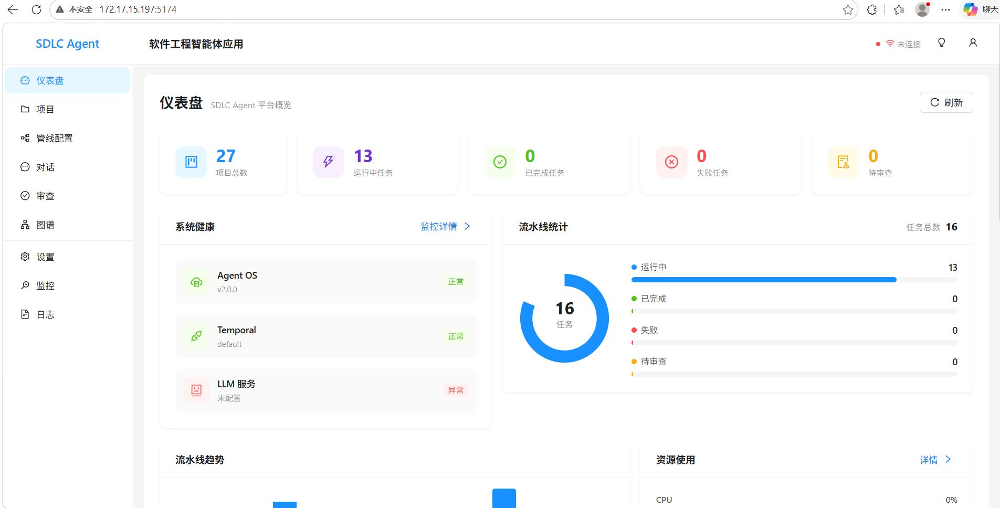
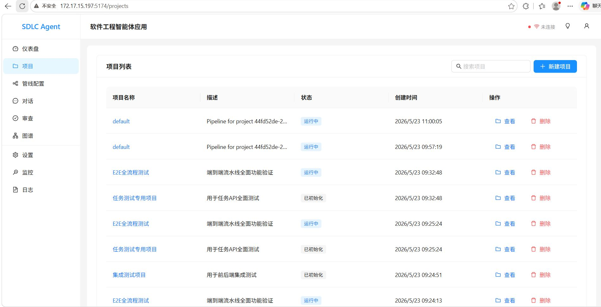
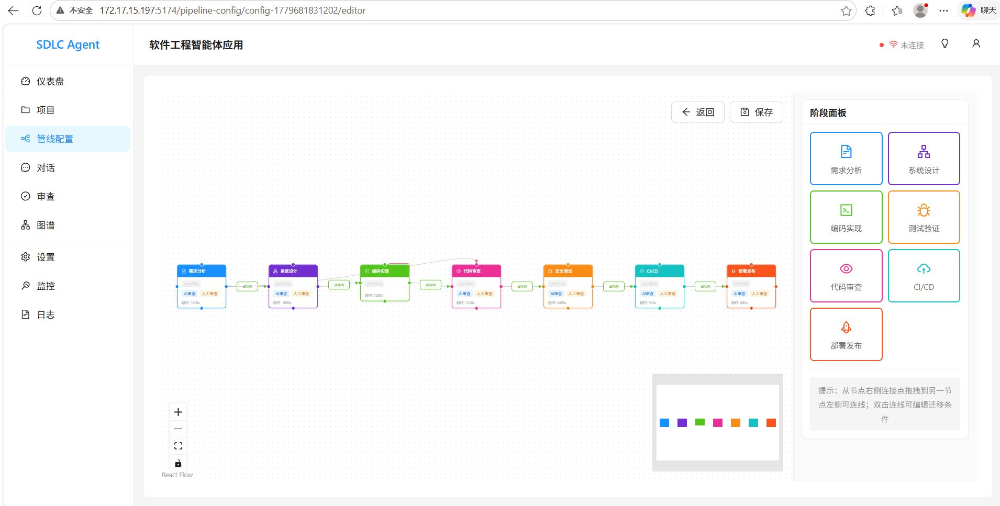
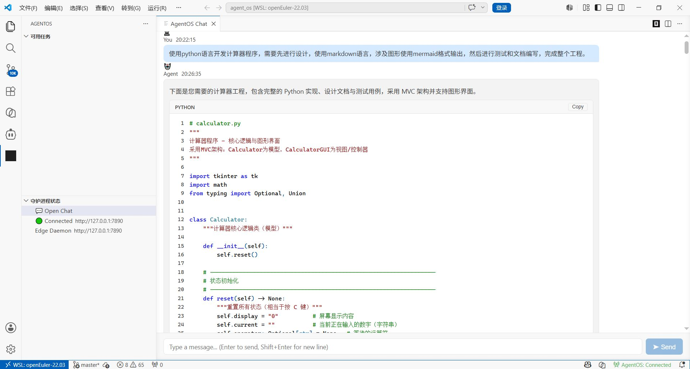
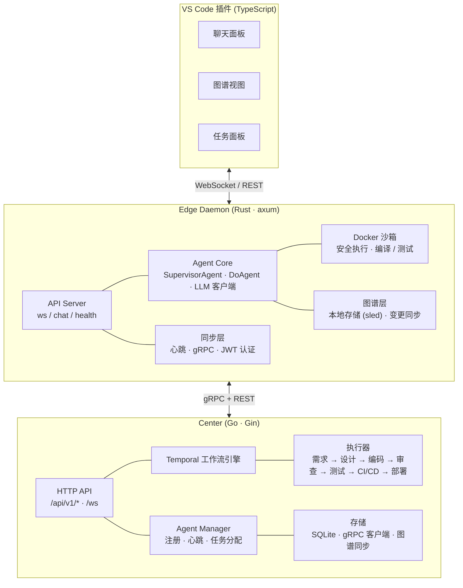
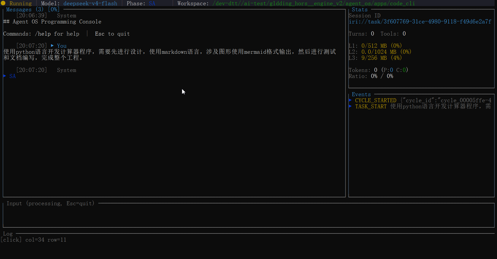
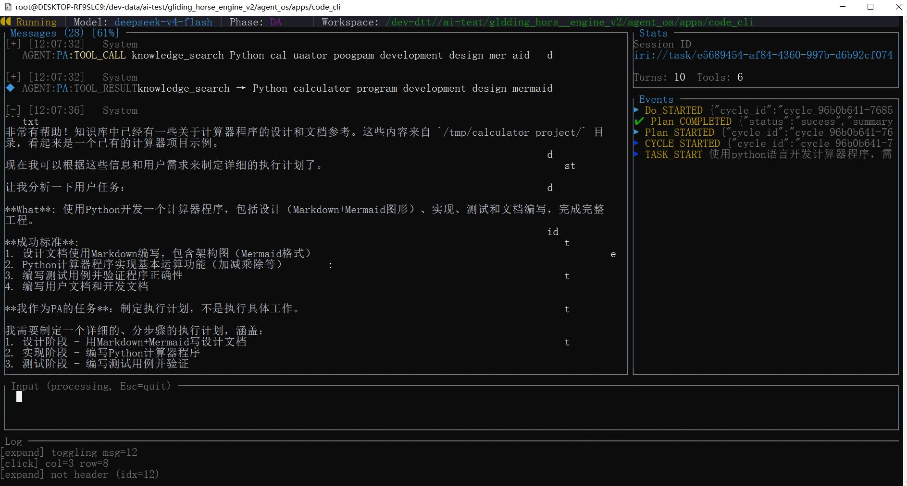
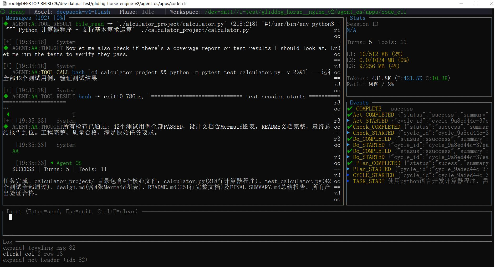

# Gliding Horse Agent OS (流马智能体操作系统)
<div align="center">


**工业级 AI 智能体操作系统 · Rust 构建**  [](https://github.com/doiito/gliding_horse)

*受诸葛亮木牛流马启发 — 古老智慧与现代 AI 的融合*

[](https://www.rust-lang.org/)
[](LICENSE)
[](https://grpc.io/)
[](https://oxigraph.org/)
[](https://github.com/doiito/gliding_horse/releases)

---

[**中文**] · [**English**](README.md) · [**设计细节 →**](docs/DESIGN_DETAIL.zh.md)
[**medium URL**](https://medium.com/@doiito-sun)
[**中文思否博客地址**](https://segmentfault.com/u/chenwendejiezi_bn4i4z/articles)
[**中文CSDN博客地址**](https://blog.csdn.net/2604_96270735)
[**B站播客地址**](https://space.bilibili.com/1547455799/lists)

</div>

---

## 什么是 Gliding Horse？

一个 **基于Rust构建的AI智能体操作系统**，通过PDCA循环编排多智能体，实现协调、可审计和自我改进的系统。——正如诸葛亮当年用木牛流马在险峻山路上革新了后勤运输。

> "我们不只构建智能体；我们构建**驾驭集体智能的基础设施**。"

### 核心技术栈

| 层级 | 技术 | 职责 |
|-------|-----------|------|
| **核心编排** (Rust) | `PDCA 循环` · `5W2H 本体` · `事件总线` | 智能体编排与生命周期管理 |
| **记忆系统** | `L0: Sled+Qdrant` · `L2: Oxigraph` · `MESI 一致性` | 五层分层记忆 |
| **数据总线** | `JSON-LD 1.1` · `@id/@type/@context` · `命名图` | 通用互操作层 |
| **知识图谱** | `Oxigraph RDF` · `SPARQL 1.1` · `代码 AST` | 跨子系统统一存储 |
| **技能图谱** | `RDF` · `7500 行` · `自我进化` | 动态认知网络 |
| **感知引擎** | `10 种触发器` · `异常去重` · `5W2H 约束检查` | 主动监控 |
| **网关** | `gRPC` · `HTTP (兼容 OpenAI)` · `MCP` | 生产级接口 |

---

## 📖 故事：从古老智慧到现代智能

三国时期（220–280年）， legendary 战略家**诸葛亮**（蜀汉丞相）面临一项严峻挑战：如何在北伐中通过四川险峻的山路高效运输补给。传统轮车在狭窄陡峭的小路上举步维艰；人力搬运工负重有限，很快便精疲力竭。

他的解决方案——**木牛流马**——是能够以最少人力引导在复杂地形中行驶的自动运输装置。这些机械奇迹不仅仅是工具；它们代表了一种范式转变——**延伸人类能力的自主系统**。

### 连接古今：Agent Harness

正如流马作为穿越天险运输补给的**智能鞍具**，**Gliding Horse Agent OS** 充当了 AI 智能体的**智能驾驭层**：

| 古代创新 | 现代实现 |
|-------------------|----------------------|
| **自主运输** | 自驱动智能体工作流 |
| **地形适应** | 动态复杂度处理（7 级） |
| **负载分配** | 并行智能体执行 |
| **最小引导** | 主动异常检测 |
| **机械可靠性** | Rust 内存安全保障 |

> *"善战者因其势而利导之，譬如以水投水。"*  
> — **诸葛亮**

这一古老智慧指导着我们的设计：**适应任务复杂度的灵活编排**，而非将任务强行塞入预定模具的僵化框架。

---

## 🖥️ Software Engineering Team — 旗舰应用

**Software Engineering Team** 展示了 Gliding Horse 的全部能力——一种联邦架构，多个 AI 智能体在真实的软件工程任务中协作。


*Center 仪表盘 — 项目概览、智能体状态、流水线进度*

<div align="center">
  <table>
    <tr>
      <td><br/><em>项目全生命周期管理<br/>需求 → 设计 → 编码 → 审查 → 部署</em></td>
      <td><br/><em>多阶段 SDLC 流水线<br/>实时状态追踪</em></td>
    </tr>
  </table>
</div>


*VS Code 插件 — 聊天面板、图谱视图、任务面板，实时智能体协作*

### 架构：Center + Edge 联邦



**关键设计模式：**
- **Center (Go)**：Temporal 工作流编排、项目 CRUD、智能体注册、图谱同步
- **Edge (Rust)**：本地 LLM 执行、Docker 沙箱、VS Code WebSocket 桥接
- **VS Code 插件**：开发者 UI，实时智能体感知

---

## 🖥️ Gliding Code — 终端 AI 编程助手

**Gliding Code** 是一款基于终端的 AI 编程助手，将流马智能体操作系统的知识图谱与智能体编排能力直接带入命令行——无需 IDE。




*知识图谱可视化——实时实体关系、代码结构理解、基于 Oxigraph RDF 的跨子系统感知*


*任务完成界面——AI 智能体成功分析并解决编程任务，全程可追溯*

---

## 🚀 快速开始

选择你的路径——**直接下载**预编译的终端 AI 助手（零依赖），或**从源码构建**完整的 Software Engineering Team。

### 选项 A：直接下载 — Gliding Code

无需任何依赖。下载、解压、直接运行：

| 平台 | 下载 |
|----------|------|
| Linux (x86_64, musl) | [`glidingcode-x86_64-unknown-linux-musl.tar.gz`](https://github.com/doiito/gliding_horse/releases) (13.9 MB) |
| Linux (aarch64, musl) | [`glidingcode-aarch64-unknown-linux-musl.tar.gz`](https://github.com/doiito/gliding_horse/releases) (12.9 MB) |
| macOS (Apple Silicon) | [`glidingcode-aarch64-apple-darwin.tar.gz`](https://github.com/doiito/gliding_horse/releases) (12.1 MB) |
| Windows (x86_64) | [`glidingcode-x86_64-pc-windows-msvc.zip`](https://github.com/doiito/gliding_horse/releases) (11.6 MB) |

```bash
# Linux / macOS
tar xzf glidingcode-*.tar.gz
./glidingcode --help

# Windows (PowerShell)
Expand-Archive glidingcode-x86_64-pc-windows-msvc.zip .
.\glidingcode.exe --help
```

> 所有 Linux 版本均为**全静态链接**（musl），无需任何运行时依赖。

设置 API 密钥后即可使用：

```bash
export DEEPSEEK_API_KEY="sk-..."        # Linux / macOS
# 或
set DEEPSEEK_API_KEY="sk-..."           # Windows (cmd)
# 或
$env:DEEPSEEK_API_KEY="sk-..."          # Windows (PowerShell)

# 也可使用任意兼容 OpenAI 的服务：
export AGENT_OS_GATEWAY_API_KEY="sk-..."
export AGENT_OS_GATEWAY_API_URL="https://your-endpoint/v1"

# 启动交互式会话
./glidingcode

# 或单次执行任务
./glidingcode "解释 Rust 的借用检查器工作原理"
```

### 选项 B：完整搭建 — Software Engineering Team

从源码构建完整的多智能体系统（需要 Rust + Go + Docker）。

#### 前置要求

- **Rust** 1.75+ · **Go** 1.25+ · **Docker** · **Temporal Server**
- LLM API 密钥（兼容 OpenAI）

#### 1. 克隆并配置

```bash
git clone https://github.com/doiito/gliding_horse.git
cd gliding_horse/apps/software_engineering_team

cp center/config.yaml center/config.local.yaml
# 编辑 LLM 密钥、Temporal 地址等
```

#### 2. 启动 Center

```bash
cd center
go run ./cmd/server/...     # API 服务 :8080
go run ./cmd/worker/...     # Temporal Worker
```

#### 3. 启动 Edge Daemon

```bash
cd edge/daemon
cargo run -- daemon start   # Agent 守护进程 :7890
```

#### 4. 打开 VS Code

从 `edge/vscode/` 安装插件并连接到 daemon——一个 AI 软件工程团队就已就绪。

#### 或直接使用 API

```bash
curl http://localhost:8080/api/v1/projects \
  -X POST -H "Content-Type: application/json" \
  -d '{"name":"我的项目","description":"构建微服务"}'
```

---

## 🔧 亮点速览

1. **泛化 PDCA — 7 级自适应执行**  
   通过 5W2H 元数据动态选择 7 级复杂度（L0 即时 → L5 递归 → L6 应急）。同一引擎同时处理即时查询与数周工程项目——无需僵硬的固定流程。

2. **CPU 缓存记忆 — 5 层结构 + MESI 一致性**  
   业界首创将 CPU 缓存一致性协议应用于多智能体记忆系统。L0 磁盘 → L1 上下文 → L2 Oxigraph RDF → L3 SPARQL 投影。智能预取降低 90% 感知延迟。解决上下文爆炸与共享内存不一致问题。

3. **JSON-LD 通用数据总线 — W3C 标准互操作**  
   `@context` 鸭子类型消除技能间的字段名冲突。`@id` 实现零成本跨智能体实体合并。`@graph` 命名图支持无锁并行写入。将互操作难题变为即插即用。

4. **自进化技能图谱 — 动态认知网络**  
   7500+ 行动态网络，6 种语义链接类型（前置依赖、组合、关联等）。AA 每次任务后自动创建知识片段和新链接。`/learn`/`/reduce` 机制实现自主技能获取。

5. **通用知识图谱 — 统一认知骨干**  
   所有子系统（技能、记忆、任务、代码知识）共享同一 Oxigraph RDF 存储，通过命名图隔离，支持跨子系统 SPARQL 联合查询。tree-sitter 解析的代码 AST 自动转为 RDF 三元组并链接到同一图谱。统一的 `@id` 确保跨上下文的实体身份一致性——无孤岛、无重复。

6. **5W2H 维度级审计 — 精准回滚**  
   CA 独立审计 7 个维度。What/Why 失败 → 重新分析。How/Where 失败 → 重新规划。When/HowMuch 失败 → 条件通过。告别黑盒"通过/不通过"——精确定位问题根因。

7. **主动感知引擎 — 防患于未然**  
   10 种执行触发器，60 秒异常去重窗口。监控截止时间违规、预算超支（>80% Token）、角色不匹配、环境冲突。必要时自动升级到人工处理。

8. **微工具系统 — 驾驭大型输出**  
   结果 >8KB 时自动生成可对话的微工具（如"search_in_results"）。将 50KB+ 的笨重输出转变为 LLM 上下文中可交互、可查询的产物。

9. **MCP 集成 — 一个协议连接一切**  
   标准 Model Context Protocol 连接 GitHub、Slack、Jira 等任意 MCP 兼容服务器。运行时动态发现工具。无需为每个外部服务编写自定义集成。

10. **检查点与恢复 — 崩溃不丢上下文**  
    关键执行点保存会话快照。崩溃后完整恢复，上下文零丢失。支持数小时/数天的长任务执行及事后回放调试。

11. **Center + Edge 联邦 — 本地自治，全局编排**  
    Go Center 负责工作流编排（Temporal）、项目管理、智能体注册。Rust Edge 运行本地 LLM 执行与 Docker 沙箱。VS Code 插件提供实时开发者感知。无单点故障。

---

## 🗺️ 路线图

**核心 OS**（持续进行）：
- 增强 MCP 工具生态与动态发现
- 多模型路由优化与成本感知调度
- 知识图谱查询性能与规模改进
- 带版本化提示继承的模板引擎
- 支持精细化订阅过滤的丰富事件系统

**应用层**（规划中）：
- **2026 Q3**：原生 Web 仪表盘（智能体监控与任务管理）；Python/TypeScript SDK 简化集成
- **2026 Q4**：Kubernetes 部署算子；多轮对话记忆压缩；技能市场原型
- **2027**：跨 Edge 节点的分布式智能体网格；多模态智能体支持（视觉、音频）；社区插件注册表

---

## 📊 性能目标

| 操作 | 延迟 | 吞吐量 |
|-----------|---------|-----------|
| L2 节点写入 (Oxigraph) | ~2ms | 500 ops/sec |
| L3 SPARQL 投影 | ~15ms | 66 ops/sec |
| L0 Sled KV 读取 | ~1ms | 1000 ops/sec |
| Agent ReAct 单轮 | 1-5s | 0.2-1 turns/sec |
| **空闲内存** | ~200MB | 随任务扩展 |

---

## 📚 文档

- **设计细节** → [`docs/DESIGN_DETAIL.zh.md`](docs/DESIGN_DETAIL.zh.md) · [`docs/DESIGN_DETAIL.md`](docs/DESIGN_DETAIL.md) (English)
- **核心设计理念** → [`docs/CORE_DESIGN_PHILOSOPHY.zh.md`](docs/CORE_DESIGN_PHILOSOPHY.zh.md) · [`docs/CORE_DESIGN_PHILOSOPHY.md`](docs/CORE_DESIGN_PHILOSOPHY.md) (English)
- **gRPC Proto** → [`proto/pdca_core.proto`](proto/pdca_core.proto)

---

## 🤝 参与贡献

欢迎社区贡献！

- **🐛 报告 Bug**：[GitHub Issues](https://github.com/doiito/gliding_horse/issues)
- **💡 提出想法**：[GitHub Discussions](https://github.com/doiito/gliding_horse/discussions)
- **🔀 提交 PR**：Fork → 功能分支 → PR 至 `main`

```bash
git checkout -b feat/my-feature
# 进行你的修改
cargo fmt && cargo clippy  # 保持代码整洁
cargo test                 # 确保一切正常
git commit -am '添加我的功能'
git push origin feat/my-feature
```

所有贡献者应遵守我们的[行为准则](docs/CODE_OF_CONDUCT.zh.md)。

---

## 📄 许可证

MIT License — 详见 [LICENSE](LICENSE)。

---

<div align="center">

觉得有用就点个 ⭐ —— 和我们一起构建未来 AI 的基础设施。

[](https://github.com/doiito/gliding_horse)

*"智慧并非继承而来；它建立在先辈的肩膀之上。"*

</div>
