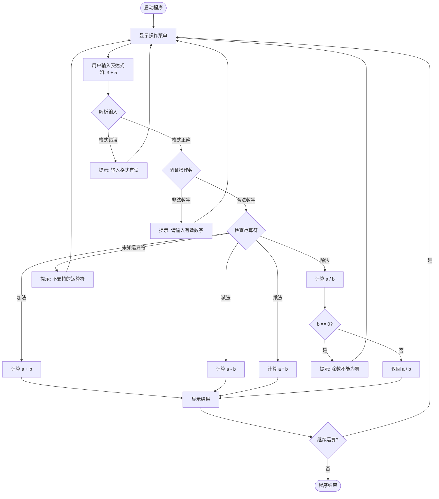
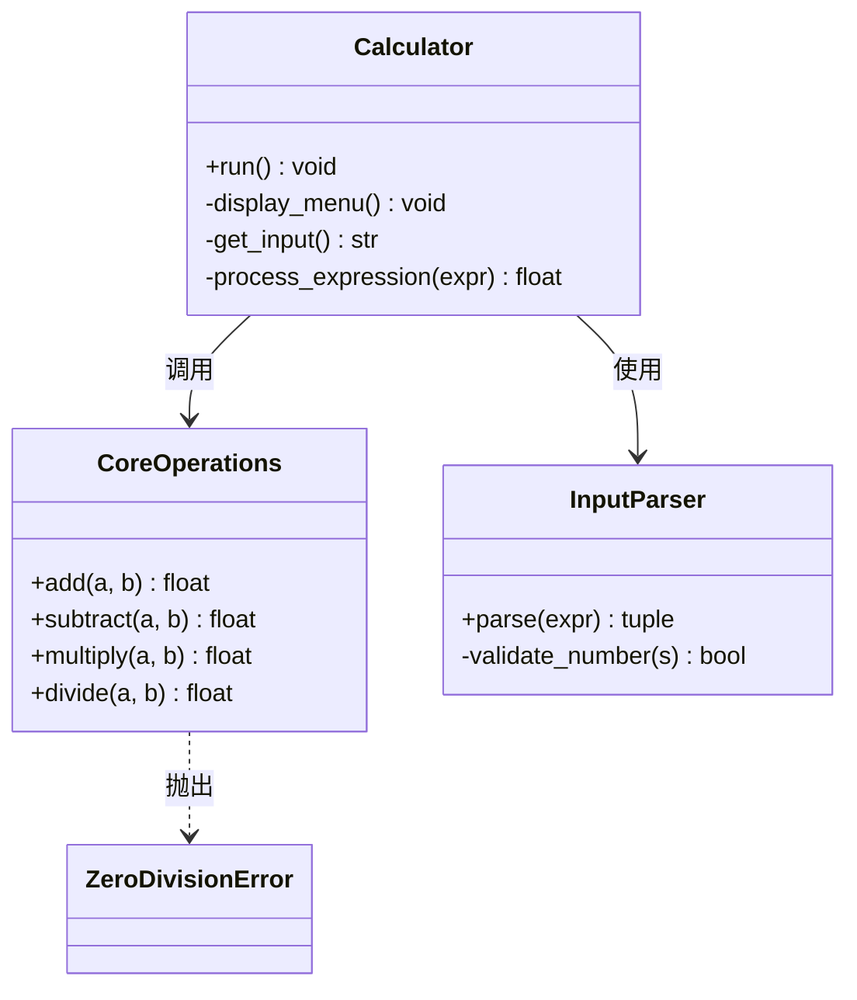
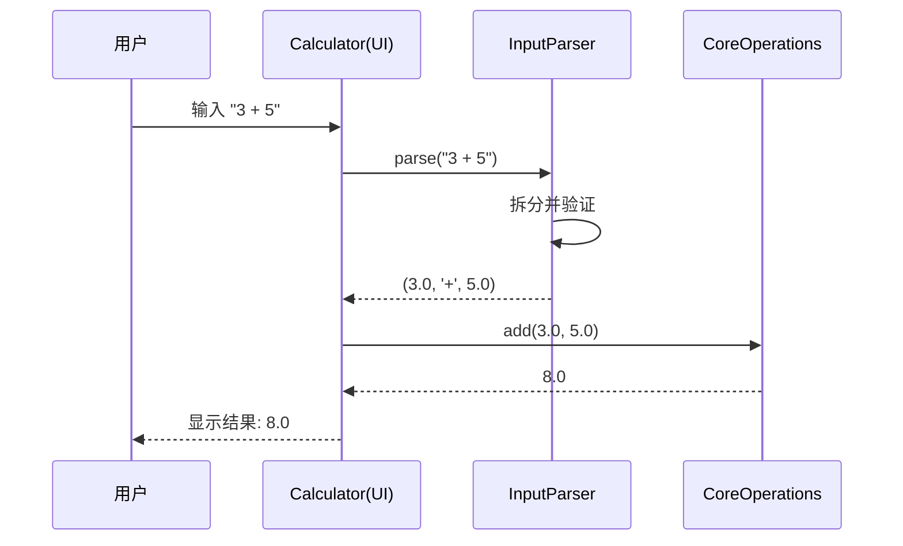

# 计算器程序 - 设计文档

## 1. 概述

本文档描述 Python 计算器程序的设计思路、架构和核心流程。该计算器支持基本的四则运算（加、减、乘、除）以及辅助功能。

## 2. 系统架构

计算器采用**分层架构**，共分为三层：

```
┌──────────────────────┐
│    用户界面层 (UI)    │  ← 命令行交互 / 输入输出
├──────────────────────┤
│     业务逻辑层        │  ← 运算调度、表达式解析
├──────────────────────┤
│     核心计算层        │  ← 四则运算实现
└──────────────────────┘
```

### 2.1 模块职责

| 模块 | 职责 |
|------|------|
| `calculator.py` | 主入口，命令行交互，用户输入处理 |
| `core.py` | 核心运算函数（加、减、乘、除） |
| `operations.py` | 运算调度与校验 |

## 3. 功能需求

- 支持加法 (`+`)
- 支持减法 (`-`)
- 支持乘法 (`*`)
- 支持除法 (`/`)，包含除零错误处理
- 支持连续运算（基于上一次结果）
- 清空重置功能
- 友好的错误提示

## 4. 核心流程图



## 5. 类设计



## 6. 数据流



## 7. 错误处理策略

| 错误场景 | 处理方式 |
|----------|----------|
| 输入格式错误 | 提示用户输入格式应为 "a + b" |
| 非数字输入 | 捕获 ValueError，提示输入有效数字 |
| 除零操作 | 捕获 ZeroDivisionError，提示除数不能为零 |
| 不支持的运算符 | 提示支持的运算符列表 |

## 8. 测试策略

- **单元测试**: 对 `CoreOperations` 每个方法进行独立测试
- **异常测试**: 验证除零、非法输入等场景
- **集成测试**: 验证完整运算流程

---

*版本: 1.0*
*最后更新: 2024年*
