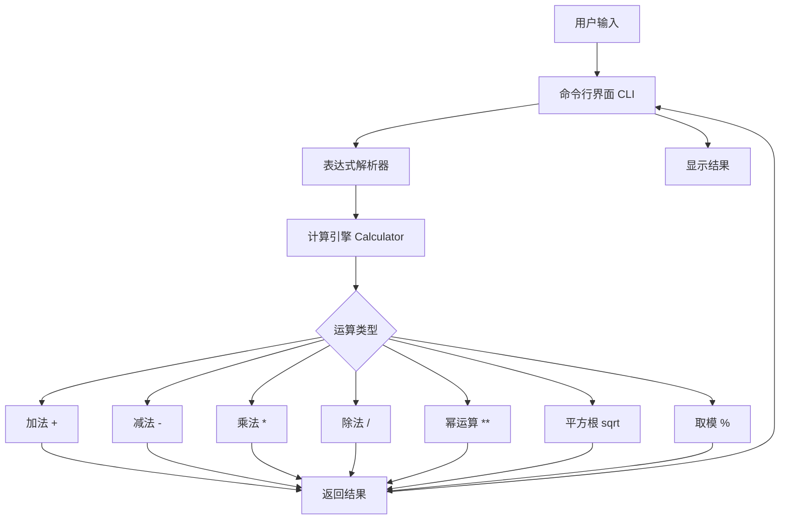
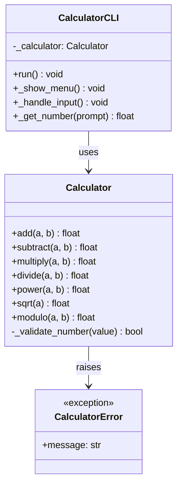
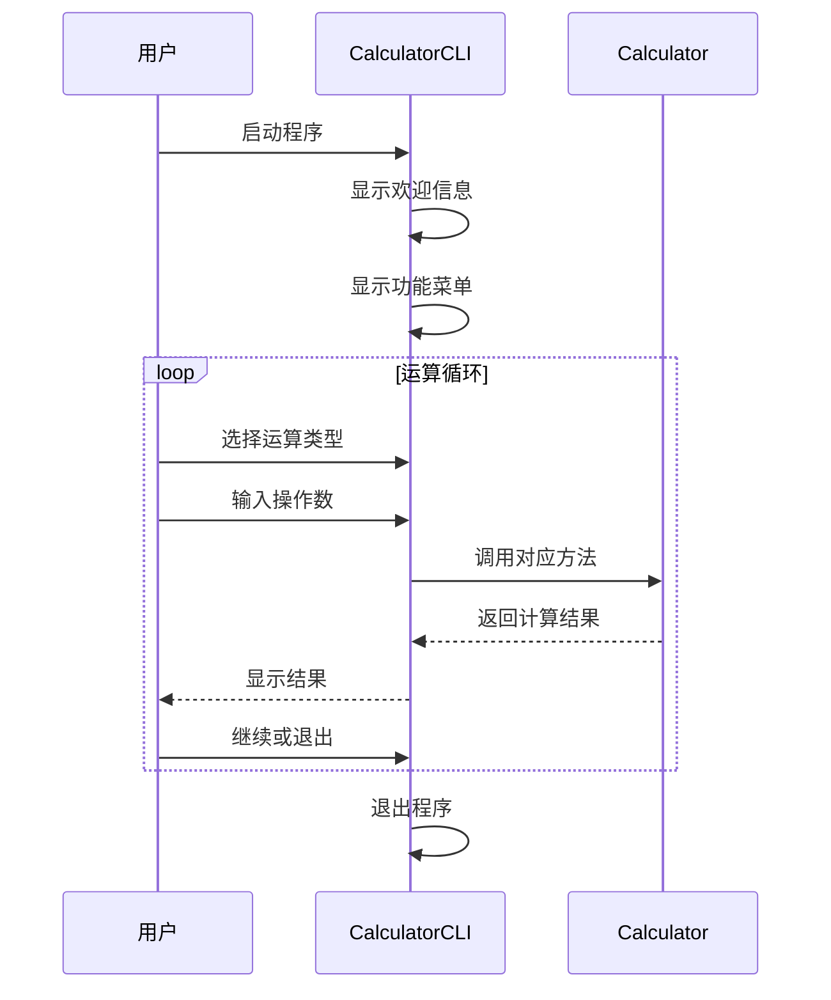
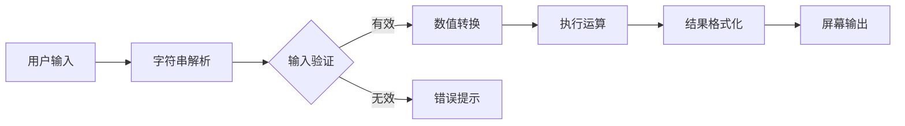

# 计算器程序设计文档

## 1. 项目概述

本项目实现了一个基于 Python 的命令行计算器程序，支持基本算术运算和高级数学函数。采用面向对象设计，将计算逻辑与用户界面分离，便于测试和扩展。

## 2. 系统架构

## 3. 模块设计

### 3.1 模块划分

### 3.2 计算引擎 (Calculator)

核心计算类，封装所有数学运算逻辑。

- **输入验证**: 对所有输入进行类型和范围检查
- **异常处理**: 除零错误、负数开平方等场景抛出有意义的异常
- **可扩展性**: 新增运算只需在类中添加方法，无需修改其他模块

### 3.3 命令行界面 (CalculatorCLI)

用户交互层，负责与用户的输入输出交互。

- **菜单驱动**: 提供清晰的运算选择菜单
- **输入循环**: 支持连续运算，直到用户选择退出
- **友好提示**: 输入错误时给出具体指引

### 3.4 异常体系 (CalculatorError)

自定义异常类，区分计算错误与系统错误。

## 4. 交互流程

## 5. 数据流

## 6. 测试策略

- **单元测试**: 对 Calculator 类的每个方法进行独立测试
- **边界测试**: 测试零、负数、大数等边界情况
- **异常测试**: 验证除零、无效输入等异常场景
- **集成测试**: 验证 CLI 与 Calculator 的协作

## 7. 扩展性设计

- 新增运算: 在 Calculator 类中添加方法，在 CLI 菜单中添加选项
- 支持 GUI: 可复用 Calculator 类，替换 CLI 层为 GUI 层
- 复数支持: 扩展 Calculator 以支持复数运算
