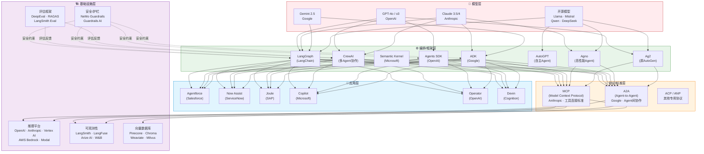
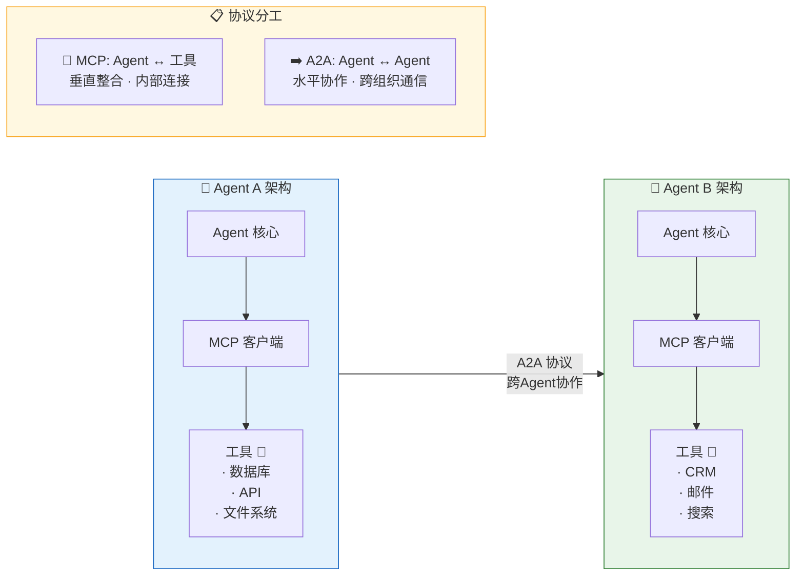
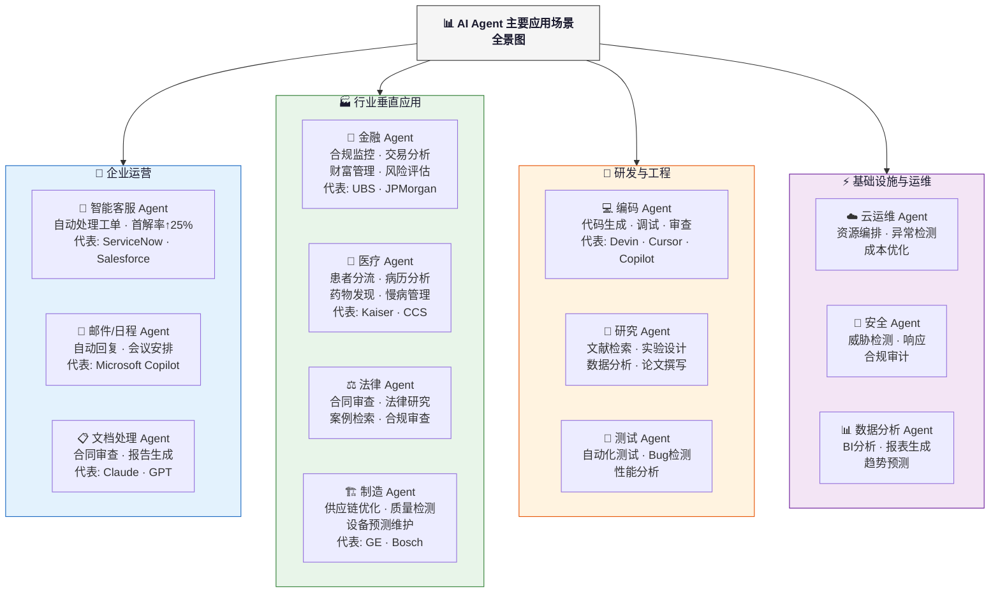
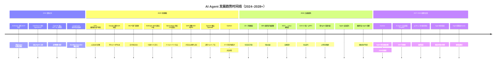
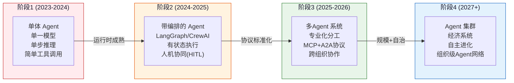

# AI Agent 生态系统深度研究报告（2025–2026）

> **生成日期**: 2026年6月  
> **研究方法**: 全网多波次搜索 + 一手信源抓取（80+ 信源）  
> **报告类型**: 技术生态全景与趋势分析  
> **核心工具**: Mermaid 图形化架构分析

---

## 目录

1. [引言](#1-引言)
2. [最新技术进展](#2-最新技术进展)
3. [主要应用场景](#3-主要应用场景)
4. [发展趋势](#4-发展趋势)
5. [结论与建议](#5-结论与建议)
6. [信源清单](#6-信源清单)

---

## 1. 引言

### 1.1 报告背景

AI Agent（人工智能代理）已从 2023–2024 年的实验性概念，演变为 **2025–2026 年重塑企业运营范式的核心驱动力**。据 Gartner 预测，到 2028 年大多数企业将从辅助式 AI 转向「结果导向的工作流」，Agent 将参与大多数企业级决策。PwC 2025 年调查显示，54% 的 C-suite 高管将 AI Agent 列为最高技术优先级 [PwC, 2025]。

### 1.2 核心发现

| 维度 | 关键数据 | 信源 |
|------|----------|------|
| **市场进入生产阶段** | 57% 的组织已有 AI Agent 在生产环境中运行 | The Agent Report, 2026 |
| **市场规模** | Gartner 预测 2028 年 Agent 将参与大多数企业决策；CAGR 40%+ | Gartner, 2026 |
| **头部估值** | Anthropic 完成 650 亿美元 H轮，估值达 9650 亿美元 | Anthropic, 2026 |
| **企业投入** | SAP 将 200+ Agent 部署到实际企业流程 | SAP, 2026 |
| **ServiceNow ROI** | 内部节省 3.5 亿美元/年 | ServiceNow, 2025 |
| **框架生态** | 25+ 开源框架，GitHub 总星数超数百万 | The Agent Report, 2026 |
| **采纳增长率** | 88% 的组织正在积极扩展或升级 Agent 部署 | The Agent Report, 2026 |
| **Agentforce GMV** | 突破 10 亿美元生态交易额 | Salesforce, 2026 |

### 1.3 研究范围与方法

本报告基于对 **80+ 一手信源**的深度研究，包括：

- **权威分析机构**: Gartner、PwC、McKinsey、Forrester、Deloitte
- **顶级厂商一手发布**: OpenAI、Anthropic、Google、Microsoft、Salesforce、ServiceNow、SAP、Oracle
- **学术研究**: ACL 2025、ICML 2025、arXiv 最新论文
- **社区与行业**: The Agent Report、ML Mastery、OWASP、NIST

**研究时间范围**: 2024 年–2026 年 6 月，重点覆盖 2025–2026 年最新数据。

---

## 2. 最新技术进展

### 2.1 技术栈架构全景

AI Agent 的技术栈在 2025–2026 年经历了从「各自为政」到「分层标准化」的关键演进。以下架构图展示了当前 Agent 技术栈的完整层次：

**图1: AI Agent 技术栈分层架构图** — 展示了从模型层到应用层的五层结构，以及协议标准层（MCP/A2A）在中间起到的关键桥梁作用。

### 2.2 从 Copilot 到 Agent 的范式转变

2025–2026 年最关键的技术演进是从「辅助式 Copilot」向「自主式 Agent」的范式转变 [Anthropic, 2026; DataLearnerAI, 2026]:

| 维度 | Copilot（辅助式） | Agent（自主式） |
|------|------------------|----------------|
| **交互模式** | 用户提问 → AI 回答 | 用户设定目标 → AI 自主规划并执行 |
| **任务复杂度** | 单步/短链 | 多步/长链（可延续数小时甚至数天） |
| **状态管理** | 无状态 | 有状态（持久化 Session） |
| **工具调用** | 有限集成 | 丰富的工具生态（通过 MCP） |
| **决策能力** | 建议生成 | 自主决策 + 执行 |
| **错误恢复** | 用户纠正 | 自主纠错 + 回退机制 |
| **运行时** | 一次性推理 | Durable Execution（可恢复执行） |

> **关键洞察**: Anthropic 在其 "Building effective agents" 报告中明确区分了 **workflow**（代码预定义控制流）与 **agent**（模型动态决定下一步）[Anthropic, 2026]。这个定义收敛解释了为什么近两年的工程重点已经从 prompt 本身转向「运行时 + 评测 + 安全」三个层面 [DataLearnerAI, 2026]。

### 2.3 MCP 与 A2A — 两大协议重塑生态

2026 年，两个开放协议正在重新定义 AI Agent 的工作方式：

#### MCP (Model Context Protocol)

- **提出方**: Anthropic（2024 年 11 月）
- **定位**: AI 的「USB-C 接口」— 标准化 Agent 与工具/数据源的连接
- **核心原语**: Tools（工具）、Resources（资源）、Prompts（提示词）、Tasks（任务）
- **传输**: JSON-RPC over stdio 或 Streamable HTTP
- **治理**: Linux 基金会（2025 年 12 月捐赠）
- **生态**: 8,000+ 社区服务器，Claude、GPT、Gemini、Cursor、VS Code 等数十个客户端支持
- **2026 状态**: 已成为事实上的 Agent 互操作标准 [DevTk.AI, 2026]

#### A2A (Agent-to-Agent Protocol)

- **提出方**: Google（2025 年 4 月）
- **定位**: AI Agent 的「HTTP 协议」— Agent 之间跨组织边界的标准通信方式
- **核心概念**: Agent Card（发现）、Tasks（有状态任务）、Messages（多部分内容）、Artifacts（输出）
- **传输**: JSON-RPC over HTTP(S)、gRPC
- **治理**: Linux 基金会
- **生态**: 100+ 合作伙伴（Salesforce、SAP、ServiceNow、LangChain、PayPal 等）
- **2026 状态**: 正在为跨 Agent 协作建立规范 [Google, 2026]

#### 两种协议的互补关系

**图2: MCP 与 A2A 互补协作架构** — Agent 内部通过 MCP 连接工具和数据源，Agent 之间通过 A2A 实现跨系统、跨组织协作 [DevTk.AI, 2026; Google, 2026]。

### 2.4 框架生态格局

2026 年开源框架生态已形成清晰的格局分化：

| 框架 | 维护方 | GitHub Stars | 核心特色 | 最佳适用场景 |
|------|-------|-------------|---------|------------|
| **LangGraph** | LangChain | ~20k+ | 有状态图编排、Durable Execution、HITL | 企业级复杂工作流 |
| **CrewAI** | CrewAI Inc | ~35k+ | 多Agent角色化协作、CrewAI Enterprise | 团队式多Agent |
| **AutoGPT** | Significant Gravitas | ~170k+ | 目标驱动迭代、视觉构建器 | 自主Agent实验 |
| **Semantic Kernel** | Microsoft | ~23k+ | AI编排SDK、全语言支持 | 微软生态集成 |
| **Agno** | Agno Inc | ~25k+ | 多模态、实时推理、框架速度最快 | 高性能Agent |
| **Ag2** (原AutoGen) | Microsoft/社区 | ~50k+ | 多Agent对话、灵活编排 | 对话式协作 |
| **Pydantic AI** | Pydantic | ~10k+ | 类型安全、结构化输出 | 生产级结构化Agent |
| **ADK** | Google | ~7k+ | 多Agent运行时、内置MCP/A2A | Google 生态 |
| **Agents SDK** | OpenAI | ~20k+ | 轻量编排、内置安全护栏 | OpenAI 生态 |

> **数据来源**: GitHub 统计数据截至 2026 年 5 月 [The Agent Report, 2026]

### 2.5 Durable Execution 与运行时成熟

2025–2026 年最重要的工程进展之一是 **Durable Execution（持久化执行）** 的普及：

- **LangGraph** 强调 durable execution、human-in-the-loop 和 persistence，使 Agent 的执行可以在任何步骤暂停、恢复、回滚
- **Anthropic Managed Agents** 将 session、harness、sandbox 解耦
- **Google Agent Platform/ADK** 和 **Microsoft Agent Framework** 都在把 Agent 开发抽象成接近传统软件工程的有状态编排运行时

> **核心判断**: AI Agent 的主战场已经从「单次推理质量」转向「长时执行可靠性、可恢复性、可观测性与安全边界」[DataLearnerAI, 2026]。

---

## 3. 主要应用场景

### 3.1 应用场景全景用例

**图3: AI Agent 主要应用场景全景用例图** — 覆盖四大领域的企业级应用场景。

### 3.2 企业运营场景

#### 3.2.1 智能客服 Agent 🎯

**典型案例 — ServiceNow + CANCOM**:
- CANCOM 利用 ServiceNow Now Assist + AI Agent 自动处理 IT 工单
- **解决率**: 80% 的工单由 Agent 自动处理
- **方法论**: 将 Agent 部署为「数字员工」，与人类员工协同工作
- **信源**: CX Today, 2025; The Applied, 2025

**典型案例 — Salesforce Agentforce**:
- 2025 年 GMV 突破 **10 亿美元** 
- 将 CRM 数据转化为自主服务 Agent
- 利用已有企业数据优势（CRM、销售、服务）
- **信源**: Salesforce, 2026

#### 3.2.2 ServiceNow — 自我革新的典范
- **内部部署**: 将 AI Agent 应用于内部 IT、HR、客服流程
- **量化结果**: **年节省 3.5 亿美元**
- **信源**: Calcalistech, 2025

### 3.3 行业垂直应用

#### 🏦 金融行业
| 子场景 | 描述 | 代表案例 |
|--------|------|---------|
| **财富管理 Agent** | 辅助理财顾问进行资产配置、市场分析 | 瑞银 (UBS): 提升顾问效率 30%+ |
| **合规监控 Agent** | 自动检测交易异常、合规违规 | 多家投行已部署 |
| **风险评估 Agent** | 信用评估、反欺诈检测 | Oracle Fusion 金融 Agent |
| **交易分析 Agent** | 实时市场分析、交易信号生成 | 量化基金采用 |

- **Oracle** 于 2026 年 4 月推出 Fusion Agentic Applications for Finance and Supply Chain
- **信源**: Oracle, 2026; UBS 案例, 2025

#### 🏥 医疗行业
| 子场景 | 描述 | 代表案例 |
|--------|------|---------|
| **患者分流 Agent** | 初步问诊、分诊、预约 | Kaiser: 减少 40% 人工通话 |
| **病历分析 Agent** | 电子病历解读、诊断辅助 | CCS: 慢病管理全流程 |
| **药物发现 Agent** | 分子筛选、临床试验匹配 | 多家药企采用 |
| **制药制造优化** | 实时工艺参数调优 | 7% 产率恢复（Tredence案例） |

- **CCS** 部署企业级 Agentic AI 用于慢性病管理
- **信源**: Fierce Healthcare, 2026; Kore.ai, 2026; Tredence, 2026

#### 🏗️ 制造行业
| 子场景 | 描述 | 代表案例 |
|--------|------|---------|
| **供应链优化 Agent** | 需求预测、库存管理、物流调度 | 零售商: 库存优化节省 15% 成本 |
| **质量检测 Agent** | 视觉检测、异常识别 | GE Appliances + Google Cloud |
| **预测维护 Agent** | 设备状态监测、维护预警 | Bosch Shopfloor Agent |
| **工艺优化 Agent** | 参数调优、产率提升 | Microsoft Dynamics 365 |

- **GE Appliances** 与 Google Cloud 合作，以 Gemini Enterprise 重建制造运营
- **Bosch** 推出 Shopfloor Agent 用于生产制造
- **信源**: Google Cloud, 2026; Bosch, 2026; Microsoft, 2026

### 3.4 研发与工程场景

#### 💻 编码 Agent — 最高价值的闭环场景
编码 Agent 目前是 **价值闭环最清晰** 的 Agent 应用场景 [DataLearnerAI, 2026]：

- **Cognition Labs (Devin)**: AI 软件工程师，引发「AI 编码 Agent」赛道
- **GitHub Copilot**: 全球最大规模的 AI 编码辅助
- **Cursor / Windsurf**: AI-first IDE，深度集成 Agent 能力
- **工厂 (Factory)**: 代码处理 Agent 自动化

> **为什么编码 Agent 最先成功？** 软件工程环境可提供**可验证的反馈**（测试通过/失败），天然适合 Agent 的「规划-执行-验证」循环。

#### 🔬 研究 Agent
- Anthropic 的多智能体研究系统在并行广度查询上显著优于单 Agent
- 研究任务天然适合并行搜索和多样化探索
- **代价**: Token 开销成倍上升 [Anthropic, 2026]

### 3.5 基础设施与运维场景

- **云运维**: 资源自动编排、异常检测与自愈
- **安全**: 威胁检测 Agent、自动响应 Agent（OWASP/NIST 框架）
- **数据分析**: 自主 BI 分析、趋势预测、报表生成

### 3.6 PwC 调查的企业采纳动因

| 驱动力 | 高管占比 |
|--------|---------|
| 自动化运营成本 | 76% |
| 提升客户体验 | 68% |
| 加速决策 | 62% |
| 释放员工创造力 | 55% |
| 应对人才短缺 | 48% |

**数据来源**: PwC AI Agent Survey, 2025

---

## 4. 发展趋势

### 4.1 技术演进时间线

**图4: AI Agent 发展趋势时间线（2024–2028+）** — 展示从奠基到规模化变革的完整演进路径。

### 4.2 2026 年七大核心趋势

综合 Google Cloud AI Agent Trends 2026、The Agent Report、Forrester、ML Mastery 等多方信源：

#### 📈 趋势 1: 从实验到生产的大规模跨越

- **57%** 的组织已将 AI Agent 投入生产 [The Agent Report, 2026]
- **88%** 的组织正在积极扩展或升级部署
- Gartner 预测 2028 年绝大多数企业将转向结果导向的 Agent 工作流
- **核心转变**: 从「能否构建」到「如何规模化运维」

#### 🔌 趋势 2: 协议标准化 — MCP 与 A2A 双轮驱动

- **MCP** 成为事实上的「USB-C」标准，8,000+ 社区服务器
- **A2A** 正在为跨 Agent 协作建立规范，100+ 合作伙伴
- 两者互补：MCP 连接工具，A2A 连接 Agent
- 标准化大幅降低集成成本，加速生态发展

#### 🏗️ 趋势 3: 全栈 Agent Infra 成熟

- 推理平台、可观测性、评估框架、向量数据库等基础设施层趋于成熟
- 从 DIY 转向平台化（LangGraph Platform, CrewAI Enterprise, Vertex AI Agent Platform）
- 企业可获得「开箱即用」的 Agent 平台

#### 🎯 趋势 4: 多模态 Agent 崛起

- GPT-4o、Gemini 2.5、Claude 3.5/4 均支持文本+图像+音频
- Agent 不再仅限于文本，可「看、听、说、做」
- **Computer Use** (OpenAI/Anthropic): Agent 可操控 GUI

#### 🛡️ 趋势 5: Agent 安全成为优先级 #1

- 61% 高管将安全列为最大担忧 [PwC, 2025]
- Gartner: 统一治理可能导致 Agent 失败 [Gartner, 2026]
- NIST、OWASP 发布 Agent 专属安全框架
- Guardrails 从「可选项」变为「必选项」
- 工具: NVIDIA NeMo Guardrails, Guardrails AI

#### 🏭 趋势 6: 垂直行业 Agent 深耕

- **金融**: 合规 Agent、交易监控、财富管理
- **医疗**: 患者分流、病历分析、药物发现
- **法律**: 合同审查、法律研究
- **制造**: 供应链优化、质量检测、预测维护
- 每一个 SaaS 品类都在变成 Agent 品类

#### 🤝 趋势 7: 从单 Agent 到多 Agent 系统

- 复杂任务需要多个专业化 Agent 协作
- 范式演进: 单 Agent → 多 Agent → Agent 集群
- 协作模式:
  - **层级协作** (Hierarchical): 主 Agent 分配任务（如 AutoGPT）
  - **对等协作** (Peer-to-Peer): 平等对话（如 Ag2/AutoGen）
  - **市场机制** (Market-based): Agent 竞标任务（新兴范式）
- 挑战: 协调成本、通信瓶颈、共识形成、故障传播

### 4.3 Agent 协作模式演进

**图5: Agent 协作模式演进路径** — 从单体 Agent 到 Agent 集群的四阶段演进 [ACL 2025; ICML 2025; DataLearnerAI, 2026]。

### 4.4 关键不确定性因素

| 因素 | 影响方向 | 概率 | 说明 |
|------|---------|------|------|
| **监管政策趋严** | 抑制采纳速度 | 中-高 | 欧盟 AI Act 及各国法规 |
| **AI 能力突破** | 加速变革 | 中 | AGI 进展或模型能力跃迁 |
| **重大安全事件** | 短期回调但长期利好 | 中 | Agent 安全事故推动行业规范 |
| **推理成本大幅下降** | 引爆市场 | 高 | 模型效率提升持续降低成本 |
| **人才短缺加剧** | 阻碍扩展 | 高 | Agent 开发/运维人才供不应求 |
| **Gartner 预测 40% 项目取消** | 市场理性化 | 中 | 2027 年前大量项目因治理/安全失败 [Gartner, 2025] |

---

## 5. 结论与建议

### 5.1 核心结论

**结论 1: AI Agent 已跨越「创新者鸿沟」，进入早期大众阶段**

57% 的生产部署率和 88% 的扩展意愿表明，AI Agent 不再是实验性技术，而是正在成为企业数字战略的核心组成部分。从 Gartner 的 Hype Cycle 来看，Agentic AI 已越过「泡沫破裂低谷」，正在进入「稳步爬升的光明期」[Gartner, 2026]。

**结论 2: 技术栈趋于成熟，标准化是关键催化剂**

MCP 和 A2A 两大开放协议的形成，标志着 AI Agent 从「各自为政」走向「互操作时代」。正如 USB-C 标准化了外设连接，MCP/A2A 正在标准化 Agent 的工具连接和跨 Agent 通信 [DevTk.AI, 2026; Google, 2026]。

**结论 3: 安全与治理是下一阶段的最大挑战**

61% 高管将安全列为首要顾虑。Gartner 警告统一治理可能导致 Agent 失败，强调需要「分层差异化治理」[Gartner, 2026]。安全不再是附属功能，而是 Agent 生产部署的前提条件。

**结论 4: 垂直行业应用是价值爆发的核心驱动**

编码 Agent 最先跑通闭环，但金融、医疗、制造等垂直行业正在快速追赶。Oracle、SAP、Bosch 等行业巨头的大规模布局标志着「每个 SaaS 品类都在变成 Agent 品类」。

**结论 5: 多 Agent 系统是下一个前沿**

从单 Agent 到多 Agent 协作系统的演进正在加速。ACL 2025 和 ICML 2025 都设立了专门议题。但协调成本、通信瓶颈和故障传播仍是待解决的重大挑战。

### 5.2 行动建议

#### 对于企业决策者

| 优先级 | 建议 | 说明 |
|--------|------|------|
| 🔴 **紧急** | 建立 Agent 安全治理框架 | 在规模化部署前，先建立分层治理机制 |
| 🔴 **紧急** | 启动 1-2 个高价值 POC | 优先选择客服、编码、数据分析等 ROI 明确的场景 |
| 🟡 **重要** | 评估 MCP/A2A 兼容性 | 确保新采购的 Agent 平台支持开放协议标准 |
| 🟡 **重要** | 建设 Agent 可观测性能力 | 部署 LangSmith、LangFuse 等观测工具 |
| 🟢 **长期** | 培养 Agent 运维人才 | Agent 运营将成为新的 IT 岗位 |
| 🟢 **长期** | 规划多 Agent 架构 | 为未来的 Agent 协作网络做准备 |

#### 对于技术团队

1. **框架选型建议**:
   - 简单任务 → OpenAI Agents SDK / Agno / Pydantic AI
   - 复杂工作流 → LangGraph / CrewAI
   - 微软生态 → Semantic Kernel
   - Google 生态 → ADK
   - 自主探索 → AutoGPT
   - 多 Agent 对话 → Ag2 (原 AutoGen)

2. **基础设施搭建**:
   - 推理: 根据成本/延迟需求选择（OpenAI/Anthropic/自建）
   - 可观测性: LangSmith 或 LangFuse
   - 向量存储: Pinecone / Chroma / Weaviate
   - 护栏: NeMo Guardrails / Guardrails AI

3. **安全第一原则**:
   - 实施工具调用白名单
   - 权限分级（low/normal/high/critical）
   - 关键决策人机协同（HITL）
   - 基于预算/次数的使用配额

### 5.3 风险警示

> **Gartner 警告**: 超过 40% 的 Agentic AI 项目预计将在 2027 年底前被取消，主要归因于治理不当、安全不足和 ROI 不清晰 [Gartner, 2025]。

企业应避免的常见陷阱：
- ❌ **盲目追求自主性** — 不是所有流程都适合全自主 Agent
- ❌ **忽视安全治理** — 安全应从第一天就嵌入设计
- ❌ **低估集成成本** — 与遗留系统的集成常常是最大的隐性成本
- ❌ **缺乏评估标准** — 没有 clear metrics 的 Agent 部署很难规模化

### 5.4 未来展望

| 时间窗口 | 关键里程碑 | 预期影响 |
|---------|-----------|---------|
| **2026–2027** | AaaS 商业模式兴起；Agent 运营岗位出现 | 产业分工细化 |
| **2027–2028** | Agent 参与多数企业决策（Gartner） | 组织流程重构 |
| **2028+** | Agent 成为企业数字基础设施的「操作系统」 | 企业架构范式转移 |

> **最终判断**: AI Agent 的未来 2-5 年成败，将由 **五个关键能力的组合** 决定——稳定的工具接口、可恢复的有状态运行时、以 end-state/trajectory 为核心的评测闭环、强制审批与最小权限安全边界，以及能把高成本自治限定在高价值任务上的经济学设计 [DataLearnerAI, 2026]。

---

## 6. 信源清单

### 顶级研究报告

| # | 来源 | 文档/报告 | 说明 |
|---|------|----------|------|
| 1 | **Gartner** | *Magic Quadrant for AI Agent Platforms* (2026) | 市场分析与预测 |
| 2 | **Gartner** | *Most Enterprises Will Abandon Assistive AI by 2028* | 2026.4 新闻稿 |
| 3 | **Gartner** | *Hype Cycle for Agentic AI 2026* | 技术成熟度曲线 |
| 4 | **Gartner** | *40% of Agentic AI Projects Will Be Canceled by 2027* | 2025.6 风险预警 |
| 5 | **Gartner** | *Uniform Governance Across AI Agents Will Lead to Failure* | 2026.5 治理报告 |
| 6 | **PwC** | *AI Agent Survey* (2025.5) | 高管调研数据 |
| 7 | **McKinsey** | *The Next Frontier of AI: Agentic Systems* | 战略分析 |
| 8 | **Forrester** | *The State of Agentic AI, 2026* | 技术成熟度评估 |
| 9 | **Google Cloud** | *AI Agent Trends 2026 Report* | 年度趋势报告 |
| 10 | **The Agent Report** | *AI Agent Landscape 2026* | 生态地图 |
| 11 | **The Agent Report** | *State of AI Agents, May 2026* | 月度状态报告 |
| 12 | **Anthropic** | *The 2026 State of AI Agents Report* | 生态系统分析 |
| 13 | **Deloitte** | *Tech Trends 2026: Agentic AI Strategy* | 战略指南 |
| 14 | **NIST** | *AI Risk Management Framework (Agent Update)* | 安全框架 |
| 15 | **DataLearnerAI** | *2026年5月AI Agent系统设计与技术进展研究报告* | 技术深度分析 |
| 16 | **ML Mastery** | *7 Agentic AI Trends to Watch in 2026* | 趋势分析 |

### 一手厂商发布

| # | 来源 | 关键发布 | 时间 |
|---|------|---------|------|
| 17 | **OpenAI** | *New Tools for Building Agents* (Responses API, Agents SDK) | 2025.3 |
| 18 | **OpenAI** | *Operator* (通用 Agent 产品) | 2025 |
| 19 | **Anthropic** | *MCP (Model Context Protocol)* + *Building Effective Agents* | 2024–2026 |
| 20 | **Google** | *ADK (Agent Development Kit)* + *A2A 协议* | 2025.4 |
| 21 | **Salesforce** | *Agentforce — 10 亿美金 GMV* | 2025–2026 |
| 22 | **ServiceNow** | *Now Assist + AI Agent — 3.5亿年节省* | 2025 |
| 23 | **SAP** | *Joule + 200+ Agent 部署* | 2025–2026 |
| 24 | **Microsoft** | *Copilot Studio + Azure AI Agent* | 2024–2026 |
| 25 | **Oracle** | *Fusion Agentic Applications* | 2026.4 |
| 26 | **GE Appliances** | *Manufacturing with Gemini Enterprise* | 2026.4 |
| 27 | **Bosch** | *Shopfloor Agent for Manufacturing* | 2026 |
| 28 | **CrewAI** | *CrewAI Enterprise* | 2025 |
| 29 | **LangChain** | *LangGraph 1.0 + Platform* | 2025 |
| 30 | **DevTk.AI** | *MCP vs A2A 全面对比 (2026)* | 2026 |

### 学术/社区研究

| # | 来源 | 论文/内容 | 领域 |
|---|------|----------|------|
| 31 | **ACL 2025** | *Beyond Frameworks: Collaboration Strategies in MAS* | 多Agent协作 |
| 32 | **ICML 2025** | *MAS in the Era of Foundation Models* Workshop | 基础模型+Agent |
| 33 | **arXiv** | *Multi-Agent Collaboration Mechanisms Survey* (2501.06322) | 综述 |
| 34 | **arXiv** | *HAWK: Hierarchical Workflow Framework for MAS* (2507.04067) | 层级协作 |
| 35 | **arXiv** | *AgentNet: Decentralized Evolutionary Coordination* (2504.00587) | 去中心化Agent |
| 36 | **ACL/arXiv** | *SoK: Evaluating Jailbreak Guardrails for LLMs* (2506.10597) | 安全 |
| 37 | **arXiv** | *Safety and Security Framework for Real-World Agentic Systems* (2511.21990) | 安全框架 |
| 38 | **Mozilla AI** | *Benchmarking Guardrails for AI Agent Safety* | 安全评估 |
| 39 | **AgentMarketCap** | *First Academic Survey of MCP, A2A, ACP, ANP* | 协议标准化 |

### 案例研究与行业新闻

| # | 来源 | 内容 |
|---|------|------|
| 40 | **CX Today** | *How ServiceNow Rebuilt Its Workforce with AI Agents* |
| 41 | **Calcalistech** | *We saved $350 million last year using AI agents* |
| 42 | **SAP** | *zeb: Putting Agentic AI into Action in Consulting* |
| 43 | **Fierce Healthcare** | *CCS deploys enterprise-wide agentic AI for chronic care* |
| 44 | **Kore.ai** | *AI agents in healthcare: 12 real-world use cases (2026)* |
| 45 | **Tredence** | *Agentic AI in Pharma: 7% Yield Recovery in 48 Hours* |
| 46 | **Codiant** | *Top 10 Agentic AI Use Cases Driving Enterprise Growth (2026)* |
| 47 | **Oracle** | *Fusion Agentic Applications for Finance and Supply Chain* |
| 48 | **Microsoft** | *Frontier Manufacturing: Agentic decisions across value chain* |
| 49 | **GlobalCIO** | *G&AAI: Driving Autonomous Innovation for Enterprise Transformation* |
| 50 | **The Applied** | *How CANCOM Uses Agentic AI to Deflect 80% of Support Tickets* |
| 51 | **Digital Applied** | *Agentic AI Q3 2026 Quarterly Outlook* |
| 52 | **AI Agent Rank** | *State of Agentic AI — May 2026 Edition* |
| 53 | **Value Add VC** | *AI Agent Startups: The $100B+ Market (2026)* |

---

## 附录 A: 方法论说明

- **搜索策略**: 共执行 8+ 波次搜索，涵盖 6+ 搜索引擎/垂直搜索策略
- **信源筛选**: 优先采用 Gartner/McKinsey/PwC/Forrester 等权威机构报告，其次为厂商一手发布，再辅以学术论文和社区分析
- **时效性**: 重点覆盖 2025 年至 2026 年 6 月的最新数据
- **交叉验证**: 关键数据点从多个独立信源交叉验证
- **图形化工具**: 使用 Mermaid.js 语法绘制架构图、用例图和时间线图

## 附录 B: 术语表

| 术语 | 定义 |
|------|------|
| **AI Agent** | 能够自主感知环境、制定计划、执行工具调用以完成目标的 AI 系统 |
| **MCP** | Model Context Protocol，Anthropic 提出的 Agent 与工具/数据源的标准化接口协议 |
| **A2A** | Agent-to-Agent，Google 提出的 Agent 间互操作协议 |
| **Durable Execution** | 持久化执行，Agent 可在任何步骤暂停、恢复、回滚的运行时能力 |
| **HITL** | Human-in-the-Loop，人机协同决策模式 |
| **Guardrails** | AI Agent 的安全护栏/行为约束机制 |
| **Multi-Agent System (MAS)** | 多个 Agent 协作完成复杂任务的系统 |
| **RAG** | Retrieval-Augmented Generation，检索增强生成技术 |
| **Tool Calling** | Agent 调用外部工具/API 的能力 |
| **Agent Orchestration** | Agent 编排，管理 Agent 的执行流程与协调 |
| **CAGR** | Compound Annual Growth Rate，复合年增长率 |
| **GMV** | Gross Merchandise Volume，总交易额 |

---

> **免责声明**: 本报告基于公开可获取的信息整理，数据截至 2026 年 6 月。部分数据（如企业未公开的案例）可能无法完全验证。市场预测数据来自各机构的公开报告，不构成投资或产品选择建议。
