# AI Agent 市场深度分析报告（2025-2035）

> **报告生成日期**：2025年  
> **数据来源**：Precedence Research, MarketsandMarkets, VentureBeat, Google Cloud, Microsoft, LangChain, Pinecone

---

## 目录

1. [执行摘要](#1-执行摘要)
2. [市场规模与增长预测](#2-市场规模与增长预测)
3. [核心技术栈分析：Python + LangChain + Pinecone](#3-核心技术栈分析python--langchain--pinecone)
4. [行业标杆案例](#4-行业标杆案例)
   - [4.1 金融行业](#41-金融行业)
   - [4.2 医疗健康](#42-医疗健康)
   - [4.3 电商零售](#43-电商零售)
5. [区域市场分析](#5-区域市场分析)
6. [竞争格局](#6-竞争格局)
7. [技术趋势展望](#7-技术趋势展望)
8. [风险与挑战](#8-风险与挑战)
9. [结论与建议](#9-结论与建议)

---

## 1. 执行摘要

AI Agent（人工智能代理）市场正处于爆发式增长阶段，正在从实验性应用快速走向大规模企业级部署。据 **Precedence Research** 最新数据，全球 AI Agent 市场规模预计从 2025 年的 **79.2 亿美元** 增长至 2035 年的 **2,946.6 亿美元**，年复合增长率（CAGR）高达 **43.57%**。

**核心发现：**

- 📈 **市场爆发**：2030 年市场规模预计达 526.2 亿美元（MarketsandMarkets），2035 年突破 2,946 亿美元
- 🏗️ **技术栈稳固**：**Python + LangChain + Pinecone** 形成 AI Agent 开发的核心铁三角
- 🏦 **金融先行**：金融服务业（BFSI）在 2025 年占据最大终端用户市场份额
- 🏥 **医疗加速**：临床文档、患者分诊、保险理赔自动化成为医疗 AI Agent 的核心场景
- 🛒 **电商规模化**：智能客服、库存优化、个性化推荐实现显著的 ROI

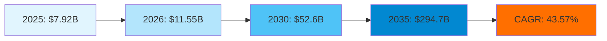

---

## 2. 市场规模与增长预测

### 2.1 全球市场规模概览

| 年份 | 市场规模（亿美元） | 关键里程碑 |
|------|-------------------|-----------|
| 2025 | 79.2 | 企业 AI Agent 采纳率快速上升 |
| 2026 | 115.5 | 多智能体系统进入主流 |
| 2027 | 169.0 | 垂直领域 Agent 爆发 |
| 2028 | 247.0 | Agent 间协作标准化 |
| 2029 | 361.0 | 自主决策 Agent 广泛应用 |
| 2030 | 526.2 | 超半数企业部署 AI Agent |
| 2035 | 2,946.6 | Agent 成为企业核心基础设施 |

### 2.2 按 Agent 系统类型的市场分解

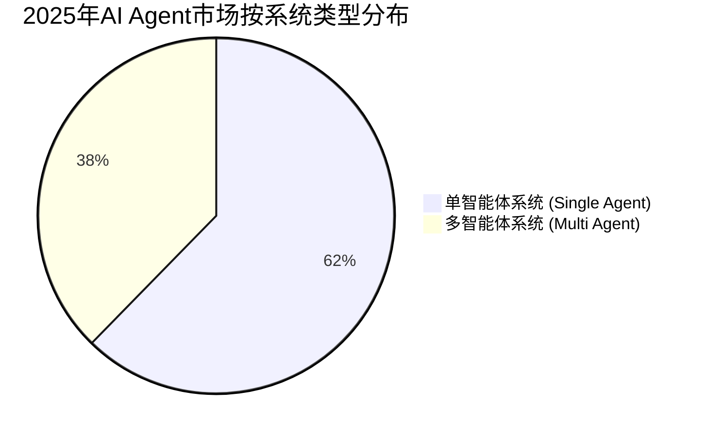

- **单智能体系统**：2025 年占据 **62.3%** 市场份额，适用于明确的、独立的任务场景
- **多智能体系统**：预计增长最快（CAGR 48.5%），多 Agent 协作可处理复杂工作流
- 企业正在从单 Agent 试点快速转向多 Agent 编排（Orchestration）架构

### 2.3 按产品类型分布

| 类型 | 2025年份额 | 增长前景 |
|------|-----------|---------|
| 即用型 Agent (Ready-to-Deploy) | 58.7% | 快速部署需求驱动 |
| 自建型 Agent (Build-Your-Own) | 41.3% | 预计 CAGR 18.4%，定制化需求强烈 |

### 2.4 按 Agent 角色分布

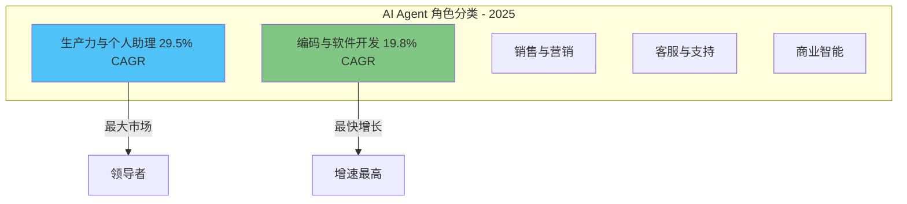

**关键洞察：**
- **生产力与个人助理** 是 2025 年最大细分市场，CAGR 29.5%
- **编码与软件开发** Agent 增速最高（CAGR 19.8%），GitHub Copilot 等工具引领变革
- **垂直行业 Agent** 预计 CAGR 达 **62.7%**，成为增长最快的产品类别

---

## 3. 核心技术栈分析：Python + LangChain + Pinecone

### 3.1 技术栈架构全景

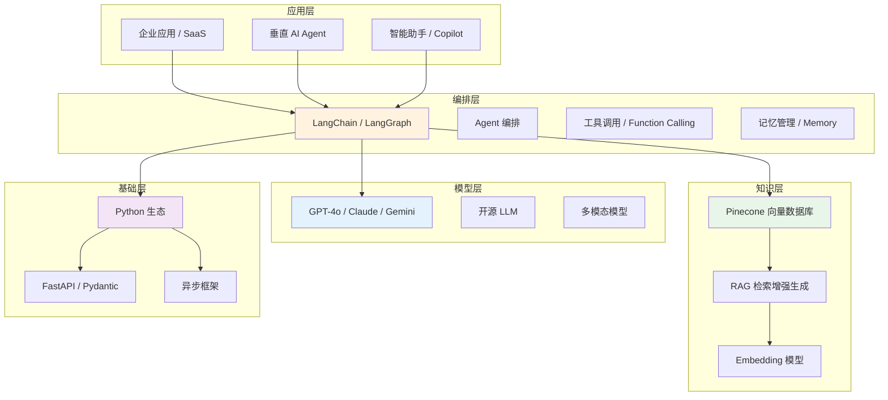

### 3.2 Python：AI Agent 的基因语言

Python 在 AI Agent 开发中的统治地位无可撼动：

- **生态优势**：PyTorch、Transformers、Sentence-Transformers 等核心库全部基于 Python
- **框架支持**：FastAPI（API 服务）、Pydantic（数据验证）、Asyncio（异步处理）构成坚实的后端基础
- **社区驱动**：2025 Stack Overflow 调查显示 Python 是 AI/ML 开发者首选语言
- **工具链成熟**：Poetry、UV 等现代包管理工具大幅提升开发效率

### 3.3 LangChain：Agent 编排的标准框架

LangChain 及其扩展 LangGraph 已成为 AI Agent 开发的业界标准：

| 组件 | 功能 | 重要性 |
|------|------|--------|
| **LangChain Core** | 链式调用、Prompt 管理、输出解析 | ⭐⭐⭐⭐⭐ |
| **LangGraph** | 有向图 Agent 编排、状态管理 | ⭐⭐⭐⭐⭐ |
| **Agent Executor** | 工具调用、循环推理 | ⭐⭐⭐⭐ |
| **Memory** | 会话记忆、实体记忆、摘要记忆 | ⭐⭐⭐⭐ |
| **Callbacks** | 监控、日志、追踪 | ⭐⭐⭐ |
| **LangSmith** | 调试、测试、评估 | ⭐⭐⭐⭐⭐ |

**LangGraph 的突破性设计：**

```python
# LangGraph Agent 工作流示意
graph = StateGraph(AgentState)

graph.add_node("reason", reasoning_agent)
graph.add_node("tools", tool_executor)
graph.add_node("reflect", reflection_agent)

graph.add_edge("reason", "tools")
graph.add_conditional_edges("tools", should_continue, {
    "continue": "reflect",
    "end": END
})
graph.add_edge("reflect", "reason")
```

LangGraph 通过有向图（Directed Graph）模型，使 Agent 能够：
- 实现复杂的多步推理循环
- 支持 Human-in-the-Loop 介入
- 具备条件路由和分支能力
- 内置流式输出和状态持久化

### 3.4 Pinecone：企业级向量检索基础设施

Pinecone 作为专为 AI 构建的向量数据库，在 RAG 架构中扮演关键角色：

| 特性 | 优势 |
|------|------|
| **Serverless 架构** | 无需管理基础设施，自动扩缩容 |
| **10ms 级延迟** | 毫秒级向量检索，满足实时场景 |
| **混合搜索** | 向量搜索 + 关键词搜索结合 |
| **命名空间隔离** | 多租户支持，数据安全隔离 |
| **LangChain 原生集成** | 无缝对接 LangChain 生态 |

**RAG + Agent 的典型流程：**

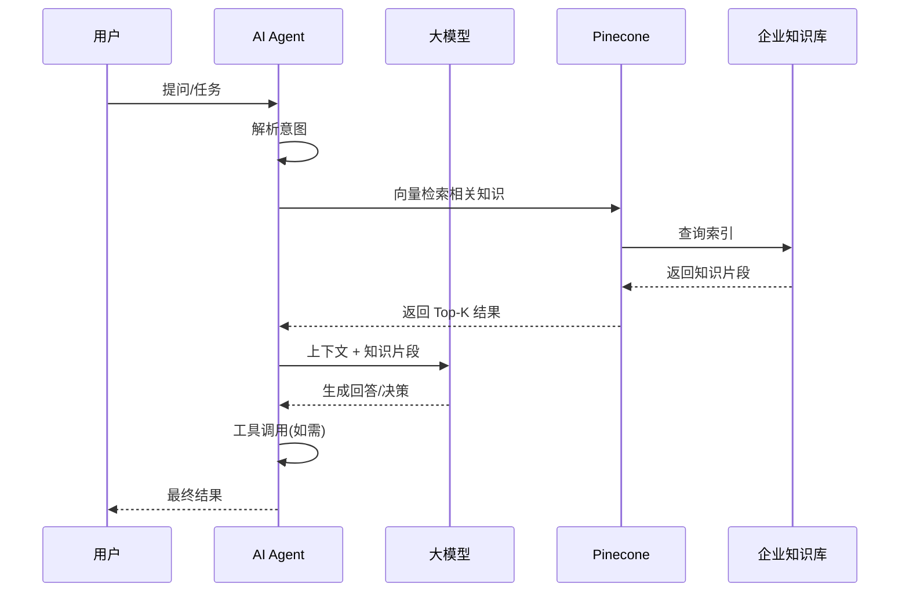

---

## 4. 行业标杆案例

### 4.1 金融行业

#### 案例一：Wells Fargo — Fargo AI 助手

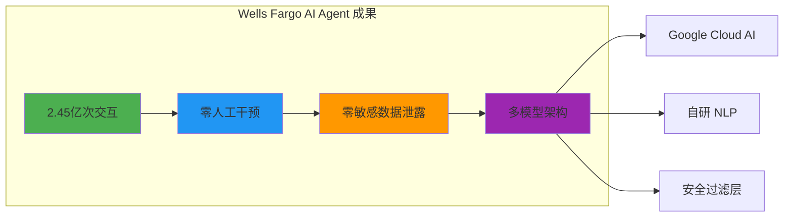

**核心数据：**
- **2.45 亿次客户交互** — 从 2,130 万次增长至 2.45 亿次，增长超 10 倍
- **零人工干预** — 完全自主处理客户请求，无需人工转接
- **零 PII 泄露** — 严格的数据安全架构确保客户隐私保护
- **多模型架构**：结合 Google Cloud AI 与自研 NLP 模型的混合方案

#### 案例二：Schroders — 多 Agent 金融分析研究助手

- **技术平台**：Google Vertex AI Agent Builder
- **核心能力**：
  - 多 Agent 协作进行复杂金融研究与分析
  - 自动聚合多源数据（市场数据、研报、财报）
  - 生成结构化投资分析报告
- **特色**：多 Agent 分别负责数据采集、分析、验证和报告生成

#### 案例三：PeterAI — 个性化投资顾问

- **类型**：多智能体投资咨询框架
- **功能**：基于用户风险偏好和市场数据，提供个性化的投资建议
- **技术栈**：Python + LangChain + 向量数据库

### 4.2 医疗健康

#### 案例四：环境 AI 临床文档 — 250万+ 次使用

根据 NEJM Catalyst 研究报告，AI Agent 在临床文档领域取得突破性进展：

| 指标 | 数据 |
|------|------|
| 使用次数 | 超 250 万次 |
| 主要应用 | 临床文档自动生成 |
| 成效 | 医生文书工作时间减少 50%+ |
| 医患互动 | 医生可更专注于患者交流 |

#### 案例五：Medtronic — AI Agent 节省 600 万美元

- **平台**：Teneo AI Agent
- **成果**：通过 AI Agent 客服自动化，年节省 **600 万美元** 运营成本
- **应用场景**：患者支持、设备咨询、预约管理

### 4.3 电商零售

#### 案例六：全球零售商 — Agentic AI 库存管理

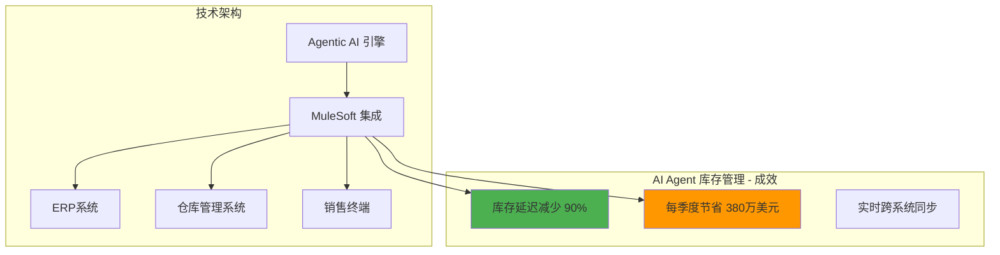

**成果数据：**
- **库存延迟减少 90%** — 实时库存同步与智能补货
- **每季度节省 380 万美元** — 减少库存积压和缺货损失
- **跨系统集成**：通过 MuleSoft 连接 ERP、WMS、POS 等系统

#### 案例七：Microsoft Store — 多专家智能助手

- **技术栈**：Semantic Kernel + Azure AI
- **多专家架构**：不同 Agent 分别负责产品推荐、技术支持、订单查询
- **成效**：显著提升用户自助服务率，降低客服人工成本

#### 案例八：FLO — AI 库存优化减少 12% 销售损失

- **场景**：时尚零售商的 AI 驱动需求预测与库存优化
- **成果**：缺货导致的销售损失降低 **12%**
- **技术**：AI 驱动的需求预测、库存分配和补货优化

---

## 5. 区域市场分析

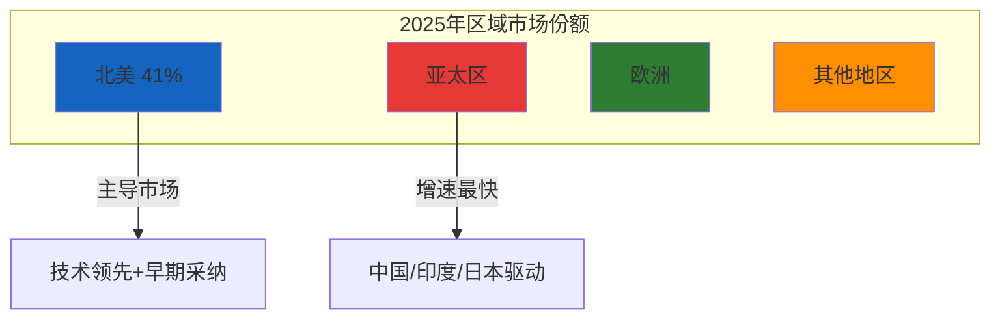

| 区域 | 2025年份额 | 关键特征 |
|------|-----------|---------|
| **北美** | ~41% | 技术领先、早期采纳、巨头主导 |
| **欧洲** | ~25% | 注重合规（GDPR）、稳健增长 |
| **亚太** | ~22% | **增速最快**，中国+印度+日本驱动 |
| **其他地区** | ~12% | 起步阶段，潜力巨大 |

**亚太区增长驱动力：**
- 🇨🇳 中国：百度、阿里、字节跳动大力投入 Agent 平台
- 🇮🇳 印度：IT 服务外包向 AI Agent 转型
- 🇯🇵 日本：制造业 AI Agent 自动化需求旺盛

---

## 6. 竞争格局

### 6.1 主要玩家矩阵

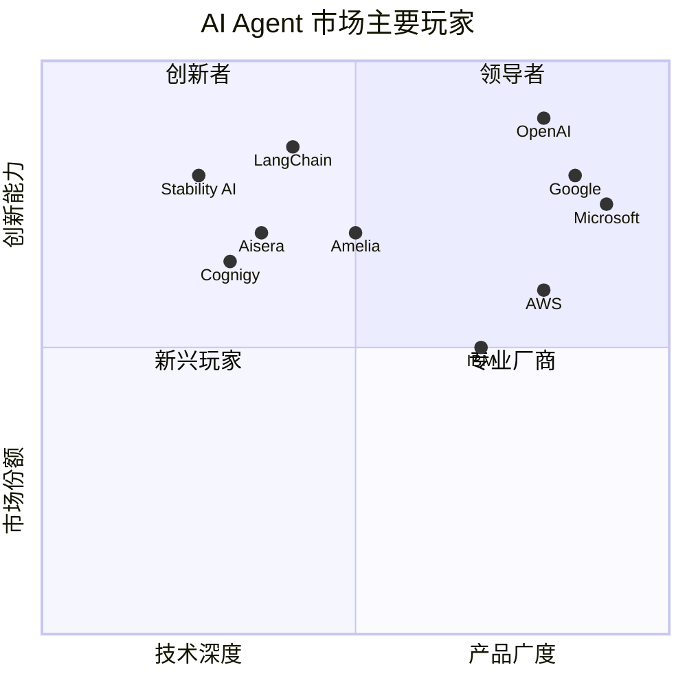

### 6.2 主要竞争者

| 公司 | 定位 | 核心产品 |
|------|------|---------|
| **OpenAI** | 模型+Agent 平台 | GPTs, Assistants API |
| **Google** | 全栈 Agent 平台 | Vertex AI Agent Builder, Gemini |
| **Microsoft** | 企业级 Agent 集成 | Copilot, Semantic Kernel, Azure AI |
| **AWS** | 云原生 Agent 服务 | Bedrock Agents, SageMaker |
| **IBM** | 企业级 watsonx | watsonx Orchestrate |
| **LangChain** | Agent 编排框架 | LangChain, LangGraph, LangSmith |
| **Amelia** | 企业对话 AI | 全栈 Agent 平台 |

---

## 7. 技术趋势展望

### 7.1 2025-2030 关键趋势

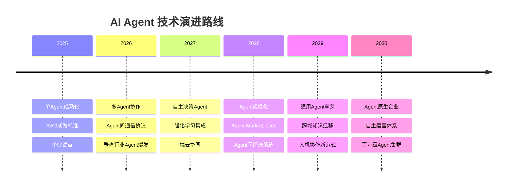

### 7.2 技术栈演进

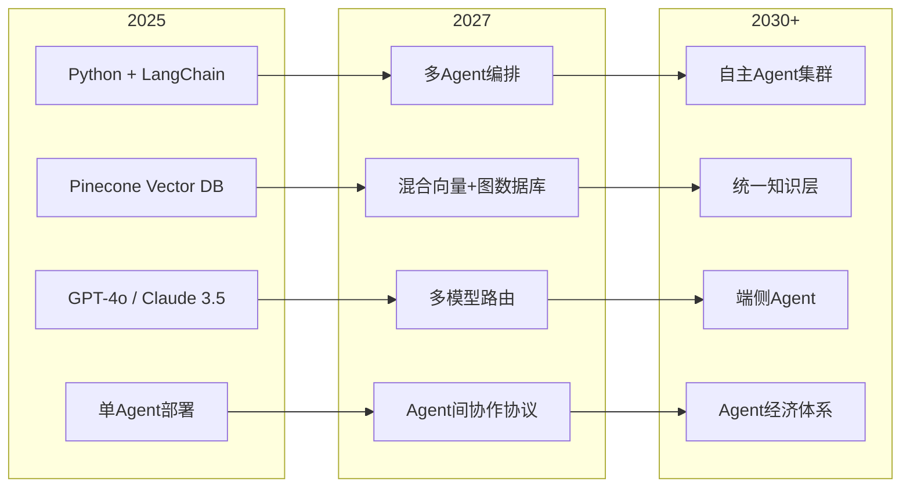

### 7.3 值得关注的新兴方向

1. **Agentic RAG** — Agent 自主决定何时检索、检索什么、如何使用检索结果
2. **多模态 Agent** — 将视觉、语音、文本能力融合到单一Agent中
3. **端侧 Agent** — 在手机、IoT 设备上运行轻量级 Agent
4. **Agent 安全** — 越狱防护、权限管控、审计追踪成为刚需
5. **Agent 经济** — Agent 间服务调用、自动协商、费用结算

---

## 8. 风险与挑战

### 8.1 技术挑战

| 挑战 | 描述 | 应对策略 |
|------|------|---------|
| **幻觉问题** | Agent 生成不准确信息 | RAG + 事实核查 Agent |
| **可解释性** | Agent 决策过程不透明 | Chain-of-Thought + 日志追踪 |
| **安全风险** | Prompt 注入、越狱攻击 | 多层防护 + 权限最小化 |
| **成本控制** | LLM API 调用成本高 | Agent 路由 + 缓存 + 模型蒸馏 |

### 8.2 监管与合规

- **欧盟 AI Act**：高风险 AI 系统需满足严格合规要求
- **数据隐私**：GDPR、CCPA 对 Agent 数据处理的约束
- **金融监管**：SEC、FINRA 对 AI 投资建议的合规要求
- **医疗合规**：HIPAA、FDA 对医疗 AI Agent 的审批

### 8.3 组织采纳挑战

- **人才缺口**：AI Agent 工程师、提示工程师、Agent 架构师供不应求
- **变革管理**：员工对 AI Agent 取代工作的担忧
- **ROI 衡量**：Agent 项目的投资回报量化困难
- **遗留系统集成**：与旧系统的对接成本高

---

## 9. 结论与建议

### 9.1 核心结论

1. **市场确定性高**：43.57% CAGR 表明 AI Agent 是确定性极高的增长赛道
2. **技术栈已趋成熟**：Python + LangChain + Pinecone 构成完整的技术三角
3. **行业渗透加速**：金融、医疗、电商已出现 ROI 明确的标杆案例
4. **多 Agent 是未来**：从单 Agent 到多 Agent 协作是不可逆的趋势
5. **安全合规是关键**：企业级部署必须先解决安全和合规问题

### 9.2 战略建议

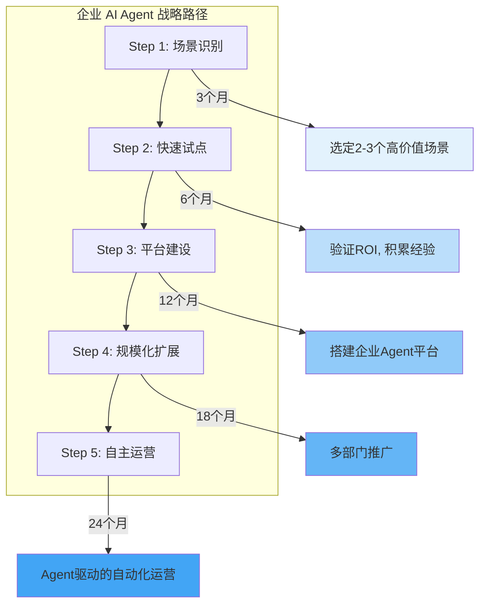

### 9.3 行动建议

| 优先级 | 行动项 | 预期成效 |
|--------|--------|---------|
| 🔴 高 | 建立 AI Agent 能力中心 | 统一技术栈和最佳实践 |
| 🔴 高 | 选择 2-3 个高 ROI 场景试点 | 快速证明价值 |
| 🟡 中 | 构建 RAG 知识基础设施 | 为 Agent 提供高质量知识来源 |
| 🟡 中 | 建立安全合规框架 | 确保 Agent 安全可控 |
| 🟢 低 | 探索多 Agent 协作架构 | 为未来规模化做准备 |
| 🟢 低 | 培养内部 Agent 开发团队 | 减少对外部供应商依赖 |

---

## 附录

### 附录 A：数据来源

| 来源 | 内容 |
|------|------|
| Precedence Research (2026) | 全球 AI Agent 市场规模预测 |
| MarketsandMarkets (2025) | AI Agent 市场按角色/行业/区域分析 |
| VentureBeat | Wells Fargo AI 助手案例 |
| Google Cloud Blog | Schroders 多 Agent 金融分析案例 |
| Microsoft Agent Framework | Microsoft Store 多专家 Agent 案例 |
| NEJM Catalyst | 医疗 AI 临床文档研究 |
| Accelirate | 零售库存 AI Agent 案例 |
| Pinecone / LangChain 文档 | 技术架构参考 |

### 附录 B：关键术语表

| 术语 | 定义 |
|------|------|
| **AI Agent** | 能自主感知环境、做出决策并采取行动的 AI 程序 |
| **RAG** | 检索增强生成，将外部知识注入 LLM 的技术 |
| **LangGraph** | LangChain 的有向图 Agent 编排框架 |
| **Multi-Agent** | 多智能体系统，多个 Agent 协作完成任务 |
| **Vector Database** | 向量数据库，存储和检索 Embedding 向量 |
| **Function Calling** | LLM 调用外部工具/API 的能力 |
| **CAGR** | 年复合增长率 |

---

> **免责声明**：本报告数据来源于公开市场研究机构，预测数据仅作参考。实际市场表现可能因技术发展、政策变化、经济环境等因素而有所不同。
