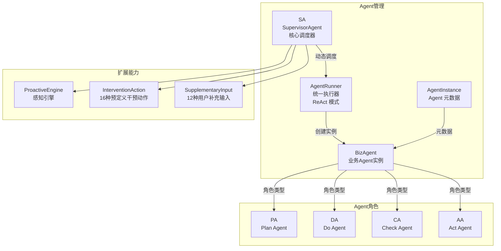
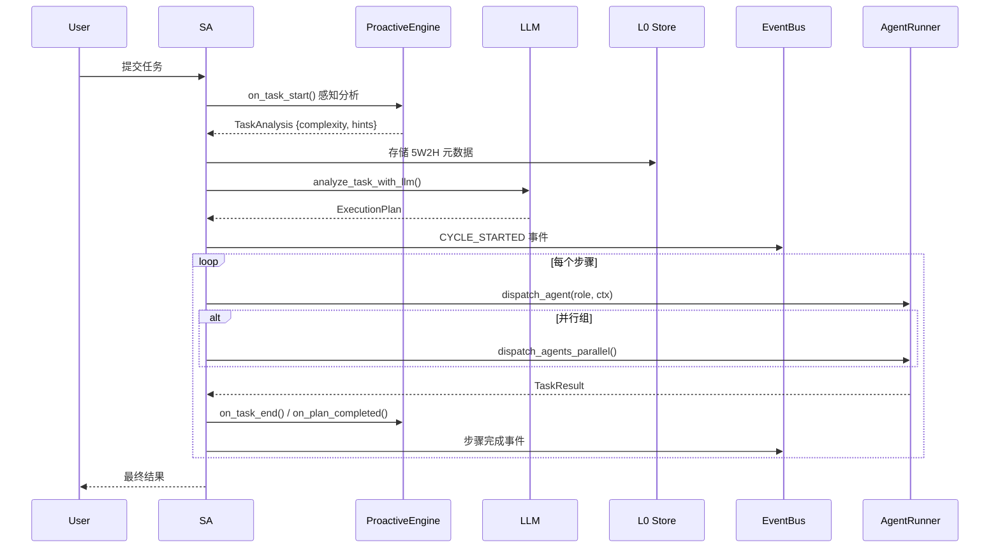
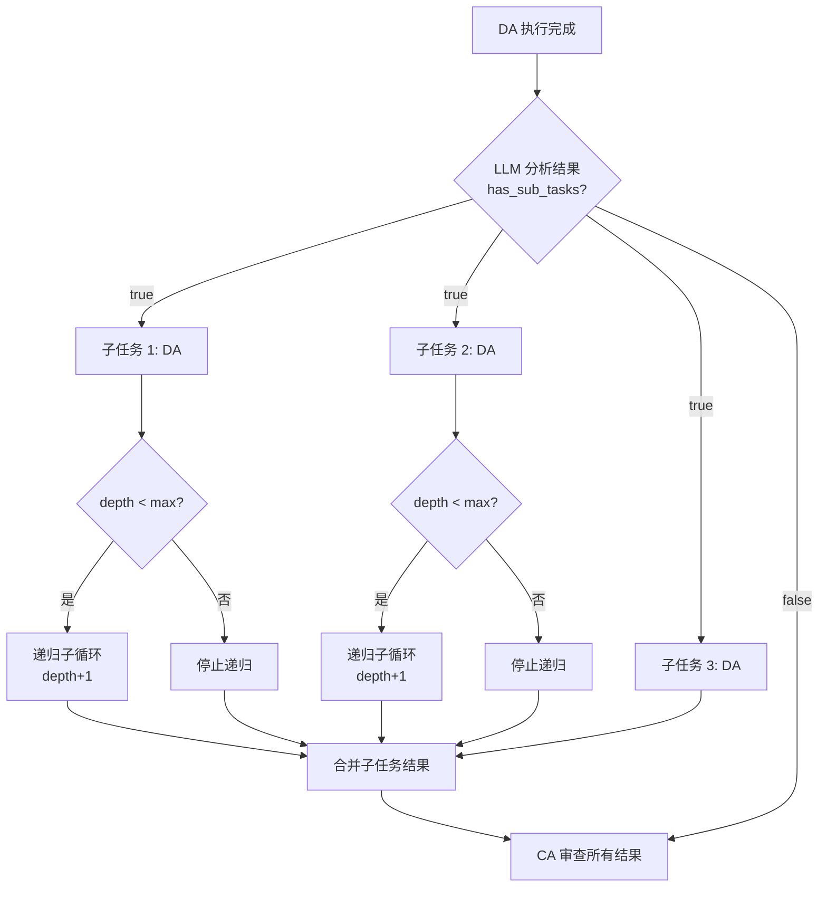
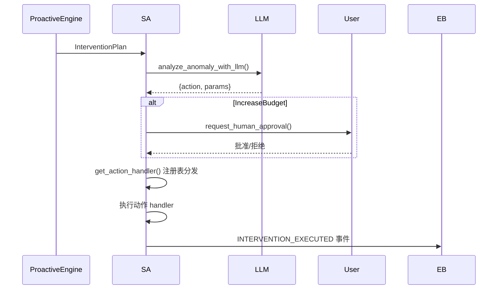
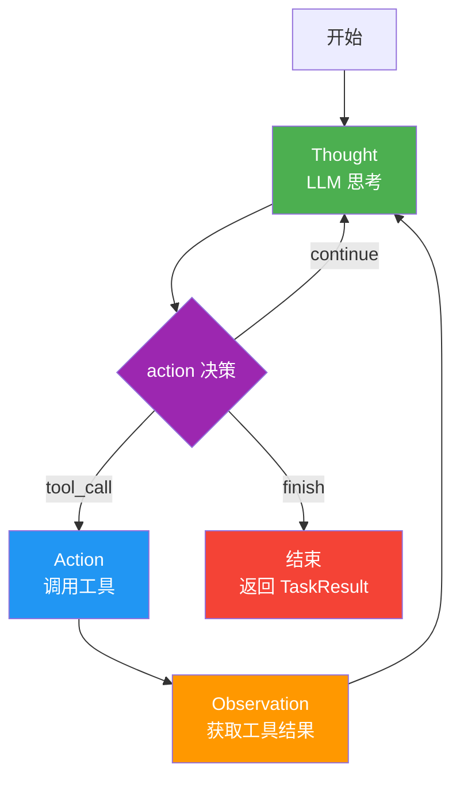
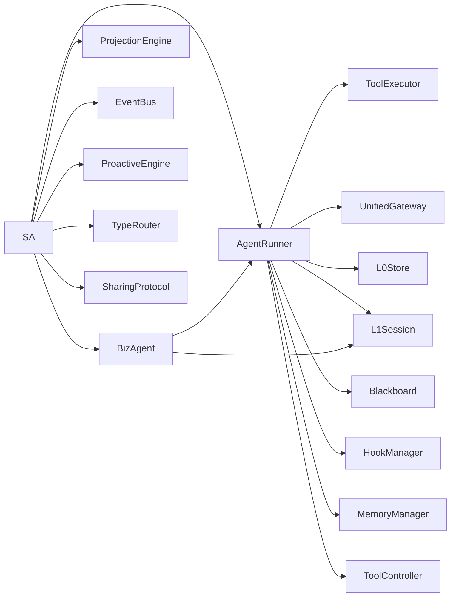

# 1. Agent 管理与调度

## 1.1 模块概览

Agent 管理与调度是系统的核心，负责动态决定 Agent 组合与流转。SA 根据任务类型动态调度 PA/DA/CA/AA，并集成了感知引擎、干预机制和用户补充输入处理。



## 1.2 核心组件

### 1.2.1 SupervisorAgent (SA)

**文件**: `src/core/sa.rs`  
**实现状态**: ✅ 完整

SA 是系统的核心调度器，根据任务类型**动态决定** Agent 组合与流转：

| 任务类型 | Agent 流转 | 说明 |
|---------|-----------|------|
| Instant | 仅 DA | 立即执行（极短输入） |
| Simple | 仅 DA | 简单查询直接执行 |
| Standard | PA → DA → CA → AA | 完整 PDCA |
| Complex | PA → DA → CA → AA | 带完整验证的复杂任务 |
| Exploratory | PA → [DA1, DA2, DA3] 并行 → CA → AA | 并行探索执行 |
| Emergency | DA → CA → AA | 跳过 PA 直接修复 |
| Recursive | PA → DA(微观 PDCA) → CA → AA | 递归分解子任务 |

**核心结构体**:

```rust
pub struct SupervisorAgent {
    runner: Arc<AgentRunner>,
    template_engine: Arc<TemplateEngine>,
    skills: Arc<SkillRegistry>,
    event_bus: Arc<EventBus>,
    event_receiver: Option<broadcast::Receiver<Event>>,
    active_cycles: HashMap<String, CycleState>,
    max_iterations: u32,
    perception: ProactiveEngine,
    sharing: Arc<SharingProtocol>,
    blackboard: Option<Arc<Blackboard>>,
    prefetch_engine: Option<Arc<PrefetchEngine>>,
    scheduler: Option<Arc<MemoryScheduler>>,
    type_router: TypeRouter,
    pending_approvals: Arc<tokio::sync::Mutex<HashMap<String, bool>>>,
    supplementary_inputs: HashMap<String, Vec<(String, String)>>,
}
```

**核心方法**:

| 方法 | 功能 |
|------|------|
| `process_task(task_iri, user_input)` | 处理用户任务入口（完整流程） |
| `start_cycle(user_input, task_iri)` | 启动新任务周期，调用感知引擎分析 |
| `analyze_task(user_input)` | 使用规则引擎分析任务类型和复杂度 |
| `analyze_task_with_llm(user_input, five_w2h, hints)` | 使用 LLM 生成详细执行计划 |
| `execute_plan(plan, task_iri, input, five_w2h, iri)` | 按计划调度 Agent 顺序/并行执行 |
| `dispatch_agent(role, ctx, cycle, plan_step)` | 调度单个 Agent（带 BizAgent 隔离） |
| `dispatch_agents_parallel(role, count, ...)` | 并行调度多个 Agent |
| `execute_intervention(plan, task_iri)` | 执行感知引擎的干预计划 |

**任务处理完整流程**:



### 递归分解任务

递归分解是 SA 调度模型的核心创新点，用于处理需要多步骤、多层次的复杂任务。

**触发关键词**：`重构`、`refactor`、`重写`、`迁移`、`拆分`、`逐步实现`、`端到端`、`从零搭建` 等

**递归深度限制**：

| 任务类型 | 最大递归深度 |
|---------|------------|
| Recursive | 3 层 |
| Complex | 2 层 |
| 其他 | 0（不递归） |

**核心方法**：`execute_recursive_sub_cycle()`

1. DA 执行成功后，将 DA 摘要发送给 LLM 进行子任务分解
2. LLM 返回 `has_sub_tasks` 和 `sub_tasks` 列表
3. 对每个子任务创建 `TaskContext` 并调度 DA 执行
4. 子任务执行成功后，递归检查是否需要更深层分解
5. 所有子任务结果合并后传递给 CA



### 干预动作系统

SA 集成了 5 类 16 个预定义干预动作，由 ProactiveEngine 触发后进行 LLM 分类决策执行：

| 类别 | 动作 | 说明 |
|------|------|------|
| **正常继续** | Continue / ContinueWithMonitor | 不做干预或加强监控 |
| **参数调整** | IncreaseRetry / IncreaseTimeout / ReduceComplexity / RestrictTools | 无需中断的参数调整 |
| **执行流调整** | SkipStep / RetryStep / Parallelize / SplitStep / InsertExtraStep | 需要中断的流程调整 |
| **资源与模式** | FallbackToShallow / EmergencyMode / IncreaseBudget / FreezeAndReport | 模式切换（IncreaseBudget 需人工确认） |
| **终止与升级** | AbortTask / NotifyHuman | 最后手段 |

**干预流程**：



### 用户补充输入处理

SA 支持在执行过程中接收用户补充输入，分为 4 类 12 个预定义动作：

| 类别 | 动作 | 说明 |
|------|------|------|
| **信息补充** | AddContext / RefineObjective / ProvideConstraint | 用户提供额外上下文 |
| **方向引导** | GuideDirection / PrioritizeStep / SuggestApproach | 用户指示方向 |
| **执行控制** | PauseExecution / ResumeExecution / SkipCurrentStep | 控制执行流 |
| **反馈纠正** | ConfirmDirection / CorrectApproach / AbortCurrentStep | 纠正错误 |

补充输入通过 `EventBus.USER_SUPPLEMENTARY_INPUT` 事件接收，SA 在步骤间检查并处理。

### 1.2.2 AgentRunner

**文件**: `src/core/agent_runner.rs`  
**实现状态**: ✅ 完整

统一 Agent 执行器，所有 PA/DA/CA/AA 共享同一个 `AgentRunner`，差异仅在于注入的提示词模板、工具白名单和最大轮次。采用 ReAct (Thought-Action-Observation) 执行模式。

**核心结构体**:

```rust
pub struct AgentRunner {
    pub gateway: Arc<UnifiedGateway>,
    pub skills: Arc<SkillRegistry>,
    pub blackboard: Arc<Blackboard>,
    pub l0_store: Arc<L0Store>,
    pub memory_manager: Arc<tokio::sync::Mutex<MemoryManager>>,
    pub templates: Arc<TemplateEngine>,
    pub tool_executor: Arc<RwLock<ToolExecutor>>,
    pub agent_settings: AgentSettings,
    pub hook_manager: Arc<HookManager>,
    pub projection: Arc<ProjectionEngine>,
    pub sharing: Arc<SharingProtocol>,
    pub emphasis_config: Option<EmphasisConfig>,
    pub event_bus: Option<Arc<EventBus>>,
    pub scheduler: Option<Arc<MemoryScheduler>>,
    pub prefetch_engine: Option<Arc<PrefetchEngine>>,
    pub unified_graph_store: Option<Arc<oxigraph::store::Store>>,
    pub tool_controller: Option<ToolController>,
    pub total_prompt_tokens: Arc<AtomicU64>,
    pub total_completion_tokens: Arc<AtomicU64>,
}
```

**核心方法**:

| 方法 | 功能 |
|------|------|
| `execute(agent, ctx)` | 执行 Agent 的 ReAct 循环 |
| `execute_with_biz_agent(agent, ctx, plan_step)` | 使用 BizAgent 隔离执行 |
| `build_system_prompt(agent, ctx)` | 构建 Agent 系统提示词 |
| `parse_llm_response(response)` | 解析 LLM 响应为 thought/content/summary |
| `route_tool_result(result, tool_name, call_id)` | 工具结果智能路由 |
| `set_event_bus(event_bus)` | 注入 EventBus 用于细粒度事件发射 |

**ReAct 执行循环**:



**Agent 轮次限制**（按角色动态调整）：

| 角色 | 最大轮次 | 说明 |
|------|---------|------|
| PA (Plan) | 8 | 调研类任务需要更多轮次 |
| DA (Do) | max_iterations | 不额外限制 |
| CA (Check) | 15 | 复杂任务审查需要足够轮次 |
| AA (Act) | 8 | 决策类任务需要足够轮次 |

**LLM 响应格式**：

```json
{
  "thought": "思考过程",
  "content": "正式回复内容",
  "summary": "摘要（不超过50字）",
  "action": "tool_call|finish|continue",
  "emphasis": []
}
```

**强调内容双重提取**：

| 提取方式 | 说明 |
|---------|------|
| LLM 提取 | 从 LLM 响应的 JSON 中解析 emphasis 字段 |
| 关键词匹配 | 扫描文本中的强调关键词（如 "必须"、"IMPORTANT" 等） |
| 配置驱动 | 通过 config.yaml emphasis 段配置提取方式和阈值 |

### 1.2.3 TaskContext

**文件**: `src/core/agent_runner.rs`  
**实现状态**: ✅ 完整

```rust
pub struct TaskContext {
    pub task_iri: String,
    pub objective: String,
    pub parent_task_iri: Option<String>,
    pub input_data: HashMap<String, Value>,
    pub constraints: HashMap<String, String>,
    pub max_iterations: u32,
    pub prev_agent_summary: Option<String>,
    pub original_task: Option<String>,
    pub completed_steps: Vec<String>,
    pub pending_steps: Vec<String>,
    pub five_w2h_iri: String,
    pub five_w2h_snapshot: Option<Task5W2H>,
}
```

TaskContext 在 Agent 间传递时，可承载 5W2H 快照、历史摘要和步骤状态。

### 1.2.4 TaskResult

```rust
pub struct TaskResult {
    pub task_iri: String,
    pub status: String,           // "success" | "failed" | "completed"
    pub summary: String,
    pub output: Option<Value>,
    pub jsonld_output: Option<Value>,
    pub artifacts: Vec<Value>,
    pub errors: Vec<String>,
    pub turn_count: u32,
    pub tool_call_count: u32,
    pub five_w2h_updates: Option<serde_json::Value>,
}
```

`five_w2h_updates` 字段支持 Agent 在执行过程中更新 5W2H 元数据。

### 1.2.5 5W2H 任务分析器

**文件**: `src/core/five_w2h.rs`
**实现状态**: ✅ 完整

使用 5W2H 方法论对任务进行结构化分析，支持渐进式填充和冻结归档。

**核心结构体**:

```rust
pub struct Task5W2H {
    pub what: String,
    pub why: WhyDetail,
    pub who: Option<WhoDetail>,
    pub when: Option<WhenDetail>,
    pub where_: Option<WhereDetail>,
    pub how: Option<HowDetail>,
    pub how_much: Option<HowMuchDetail>,
    pub dimension_meta: HashMap<String, DimensionMeta>,
    pub frozen: bool,
}
```

**维度明细结构**：

| 类型 | 关键字段 |
|------|---------|
| WhyDetail | description, success_criteria, priority |
| WhoDetail | requestor, assignees, stakeholders, required_role, access_level |
| WhenDetail | deadline, start_after, estimated_duration, timezone, reminder_before |
| WhereDetail | data_sources, execution_environment, target_repository, target_branch |
| HowDetail | plan_iri, preferred_skills, forbidden_tools, required_steps, dependencies |
| HowMuchDetail | token_budget, max_sub_agents, max_pdca_cycles, expected_quality, actual_cost |
| ActualCost | tokens_used, cycles_used, duration_secs |

**渐进式填充生命周期**：

| 阶段 | 填充维度 | 填充者 |
|------|---------|--------|
| Create | what, why | SA (LLM 提取) |
| Plan | who, when, how | PA |
| Do | where, how_much(partial) | DA |
| Check | how_much(actual) | CA |
| Act | freeze 归档 | SA |

**任务复杂度分类**：

```rust
pub enum TaskComplexity {
    Instant,      // 极短输入（<15字符无空格）
    Simple,       // 简单事实查询
    Standard,     // 标准任务（默认）
    Complex,      // 复杂任务
    Exploratory,  // 探索性任务（多并行DA）
    Emergency,    // 紧急修复（跳过PA）
    Recursive,    // 递归分解
}
```

复杂度通过关键词匹配规则自动分类，也支持 LLM 辅助分类。

### 1.2.6 BizAgent

**文件**: `src/core/biz_agent.rs`  
**实现状态**: ✅ 完整

业务 Agent 实例，每个 PA/DA/CA/AA 都是 BizAgent 的实例，支持创建子 Agent 进行并行处理。

```rust
pub struct BizAgent {
    agent_id: String,
    role: AgentRole,
    task_iri: String,
    session: L1Session,
    tools: Vec<String>,
    parent_id: Option<String>,
    children: Vec<String>,
    max_children: usize,
}
```

### 1.2.7 AgentInstance

**文件**: `src/core/agent_instance.rs`  
**实现状态**: ✅ 完整

Agent 元数据定义。

```rust
pub struct AgentInstance {
    pub agent_id: String,
    pub role: AgentRole,
    pub status: AgentStatus,
    pub task_iri: String,
    pub created_at: DateTime<Utc>,
    pub parent_id: Option<String>,
}

pub enum AgentRole { Plan, Do, Check, Act }
pub enum AgentStatus { Idle, Running, Completed, Failed }
```

## 1.3 模块依赖关系



## 1.4 执行事件系统

**文件**: `src/core/execution_event.rs`

SA 和 AgentRunner 通过 ExecutionEvent 系统向 EventBus 发射细粒度事件，支持 UI/监控实时展示：

| 事件类型 | 触发时机 | 用途 |
|---------|---------|------|
| PhaseChange | Agent 阶段切换 | 显示执行进度 |
| AgentStatus | Agent 状态变更 | 监控 Agent 健康 |
| LlmContent | LLM 流式响应 | 实时显示思考过程 |
| ToolCall | 工具调用开始 | 展示工具使用 |
| ToolResult | 工具调用结束 | 显示执行结果 |
| Thought | SA/Agent 思考 | TUI 推理展示 |
| TokenUsage | Token 消耗更新 | 预算监控 |
| Error | 错误发生 | 异常告警 |
| Completion | 任务完成 | 结果展示 |
