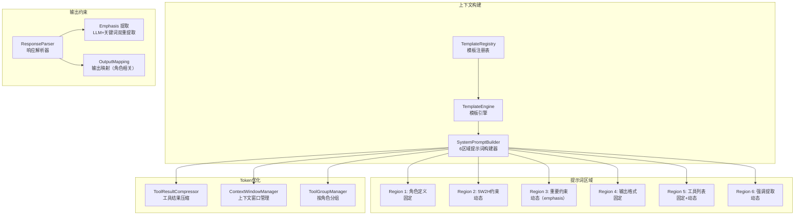
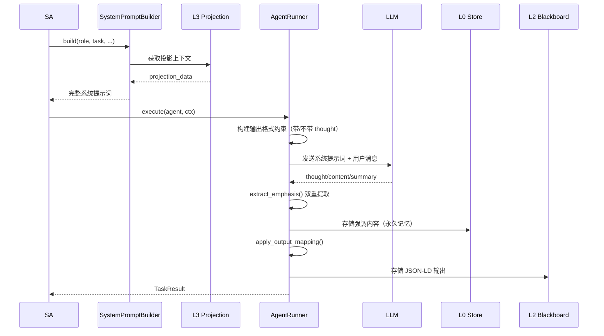

# 2. 上下文管理

## 2.1 模块概览

上下文管理负责构建和管理 Agent 的系统提示词、上下文注入、输出约束和 Token 优化。SystemPromptBuilder 使用 6 个区域构建提示词，配合模板引擎和输出映射确保 Agent 行为一致性。



## 2.2 核心组件

### 2.2.1 SystemPromptBuilder

**文件**: `src/core/system_prompt.rs`  
**实现状态**: ✅ 完整

系统提示词构建器，按照 6 个区域构建 Agent 的系统提示词。LLM 对最前面和最后的提示词记忆最深，因此固定区域放在最前面，动态区域按需放置。

**提示词区域设计**:

| 区域 | 类型 | 内容 | 说明 |
|------|------|------|------|
| Region 1 | 固定 | 角色定义 | PA/DA/CA/AA 的角色描述 |
| Region 2 | 动态 | 5W2H 约束 | 任务的 5W2H 元数据（目标、原因、约束等） |
| Region 3 | 动态 | 强调内容 | 从对话中提取的重要约束（emphasis） |
| Region 4 | 固定 | 输出格式 | JSON 格式约束（thought/content/summary/action/emphasis） |
| Region 5 | 固定+动态 | 工具列表 | 内置工具(固定) + 动态工具(按角色) |
| Region 6 | 动态 | 强调提取 | 配置驱动的 emphasis 提取提示词 |

**区域排序与构建**:

```rust
pub enum SystemPromptRegion {
    RoleDefinition,         // Region 1: order=1
    FiveW2HConstraints,    // Region 2: order=2
    EmphasizedConstraints, // Region 3: order=3
    OutputFormat,          // Region 4: order=4
    Tools,                 // Region 5: order=5
    ExtractionPrompt,      // Region 6: order=6
}
```

**核心方法**:

| 方法 | 功能 |
|------|------|
| `set_region(region, content)` | 设置指定区域的内容 |
| `get_region(region)` | 获取指定区域内容 |
| `build()` | 按 order 排序构建完整提示词 |
| `build_with_emphasis(items)` | 构建含强调内容的提示词 |

**系统提示词构建示例**:

```
# 角色
你是一个计划 Agent（PA）...

---
# 任务约束
- 目标: 分析 Q2 销售数据
- 原因: 提供库存规划依据
- 截止时间: 2026-05-20T18:00:00+08:00
- 成功标准: 输出地区增长对比图

---
# 重要约束
- 必须使用异步方式实现

---
# 输出格式
返回 JSON: {"content": "...", "summary": "...", "action": "tool_call|finish|continue", "emphasis": []}

---
# 工具
## 内置工具（固定）
- file_read: 读取文件
- grep_search: 搜索文件内容
...

## 动态工具（按需调整）
...

---
# 强调内容
## 强调内容提取
如果用户输入中包含强调性质的内容（如"必须"、"重要"等），请提取到 emphasis 字段
```

### 2.2.2 TemplateEngine

**文件**: `src/templates/template_engine.rs`  
**实现状态**: ✅ 完整

模板引擎，负责加载和管理 Agent 提示词模板，支持变量填充和递归目录扫描。

```rust
pub struct TemplateEngine {
    templates_dir: PathBuf,
    loaded_templates: HashMap<String, String>,
    schemas_dir: PathBuf,
}
```

**核心方法**:

| 方法 | 功能 |
|------|------|
| `new(templates_dir)` | 创建模板引擎 |
| `load_templates()` | 加载所有模板 |
| `render(template_name, variables)` | 渲染模板 |
| `get_template(name)` | 获取模板内容 |

模板使用 `{placeholder}` 语法进行变量替换。

### 2.2.3 AgentTemplate (JSON-LD)

**文件**: `src/templates/schemas/agent_template.rs`  
**实现状态**: ✅ 完整

标准化的 JSON-LD 模板结构，包含 @context、@type、系统提示词片段和输出映射。

```rust
pub struct AgentTemplate {
    pub context: String,           // JSON-LD @context
    pub id: String,                // 模板 IRI
    pub template_type: Vec<String>,  // @type 列表
    pub role: String,              // Agent 角色
    pub system_prompt: Vec<PromptSegment>,  // 提示词片段
    pub output_mapping: HashMap<String, String>,  // 输出映射
    pub skill_whitelist: Vec<String>,  // 工具白名单
}
```

### 2.2.4 PromptSegment

**文件**: `src/templates/schemas/prompt_segment.rs`  
**实现状态**: ✅ 完整

提示词片段，支持三种类型：

| 类型 | 说明 | 示例 |
|------|------|------|
| `Fixed` | 固定内容 | "你是计划Agent(PA)..." |
| `Variable` | 变量引用 | `{task_description}` |
| `Dynamic` | 动态生成 | `{available_skills}` |

### 2.2.5 LLM 响应格式约束

**文件**: `src/core/agent_runner.rs`  
**实现状态**: ✅ 完整

LLM 响应必须遵循 JSON 格式：

**带推理能力的模型**:
```json
{
  "thought": "思考/推理过程",
  "content": "正式回复内容",
  "summary": "摘要（不超过50字）",
  "action": "tool_call|finish|continue",
  "emphasis": []
}
```

**不带推理能力的模型**:
```json
{
  "content": "回复内容",
  "summary": "摘要（不超过50字）",
  "action": "tool_call|finish|continue",
  "emphasis": []
}
```

**模型适配**:
- 支持原生推理的模型（如 DeepSeek-R1）：thought 字段为推理链
- 不支持推理的模型：省略 thought 字段
- emphasis 字段：提取强调内容（由 config.yaml 中 emphasis 段配置）
- summary 限制 50 字以内

### 2.2.6 OutputMapping

不同角色的输出映射：

| 角色 | 本地字段 → 映射 IRI |
|------|-------------------|
| PA | plan → execution_plan, steps → plan_steps |
| DA | result → execution_result, artifacts → created_artifacts |
| CA | review → check_review, passed → check_passed |
| AA | decision → final_decision, action → recommended_action |

### 2.2.7 Emphasis 提取配置

**配置文件**: `config.yaml` 中 emphasis 段

```yaml
emphasis:
  enabled: true
  extraction_prompt: |
    ## 强调内容提取
    如果用户输入中包含强调性质的内容（如"必须"、"重要"、"不要忘记"、"关键"等），
    请将这些内容提取出来，放在 JSON 的 "emphasis" 字段中（字符串数组）。
  max_items: 50
  dedup_threshold: 0.85
```

提取方式：
1. **LLM 提取**：通过 Region 6 的强调提取提示词引导 LLM 生产 emphasis 字段
2. **关键词匹配**：扫描文本中的强调关键词（中英文共 20+ 个）
3. 两种结果合并后写入强调内容区域，确保重要信息不遗漏

## 2.3 Token 优化系统

### 2.3.1 ToolGroupManager

**文件**: `src/tools/tool_groups.rs`

按角色对工具进行分组，减少不必要的工具列表暴露：

```yaml
tool_groups:
  enabled: true
  roles:
    Plan:
      default: ["Core", "Search", "Knowledge", "System"]
      on_demand: ["Web", "Code", "Skill"]
    Do:
      default: ["Core", "Write", "Search", "Web", "Code", "Skill", "System"]
      on_demand: ["Knowledge"]
    Check:
      default: ["Core", "Search", "Knowledge", "System"]
      on_demand: ["Web", "Code"]
    Act:
      default: ["Core", "System"]
      on_demand: ["Search", "Knowledge"]
```

| 角色 | 默认分组 | 按需加载 |
|------|---------|---------|
| PA | Core, Search, Knowledge, System | Web, Code, Skill |
| DA | Core, Write, Search, Web, Code, Skill, System | Knowledge |
| CA | Core, Search, Knowledge, System | Web, Code |
| AA | Core, System | Search, Knowledge |

### 2.3.2 ToolResultCompressor

**文件**: `src/core/context_compressor.rs`

大工具结果的自动压缩：

```yaml
tool_result_compressor:
  enabled: true
  max_full_results: 2       # 最多保留 2 个完整结果
  max_summary_length: 200   # 摘要最大长度
  compression_trigger: 10   # 工具调用超过 10 次触发压缩
```

### 2.3.3 ContextWindowManager

**文件**: `src/core/context_compressor.rs`

上下文窗口管理：

```yaml
context_window:
  max_messages: 15          # 最大消息数
  max_tokens: 16000         # 最大 Token 数
  compression_ratio: 0.3    # 压缩比
  preserve_recent: 4        # 保留最近 N 条消息
```

### 2.3.4 Prompt 优化

```yaml
prompt_optimization:
  enabled: true
  use_layered_prompts: true     # 分层提示词
  store_specs_in_kg: true       # 规范存储在知识图谱中
```

## 2.4 上下文数据流



## 2.5 配置驱动

上下文的构建行为通过 `config.yaml` 控制：

| 配置项 | 影响 |
|-------|------|
| emphasis.enabled | 是否启用在 Region 6 注入强调提取提示词 |
| emphasis.extraction_prompt | Region 6 的提示词内容 |
| tool_groups.enabled | 是否按角色分组过滤工具列表 |
| tool_groups.roles.* | 各角色的默认/按需工具分组 |
| context_window.max_tokens | 上下文窗口 Token 上限 |
| context_window.max_messages | 最大消息保留数 |
| token_optimization.enabled | 是否启用所有 Token 优化功能 |
| prompt_optimization.use_layered_prompts | 是否使用分层提示词 |
