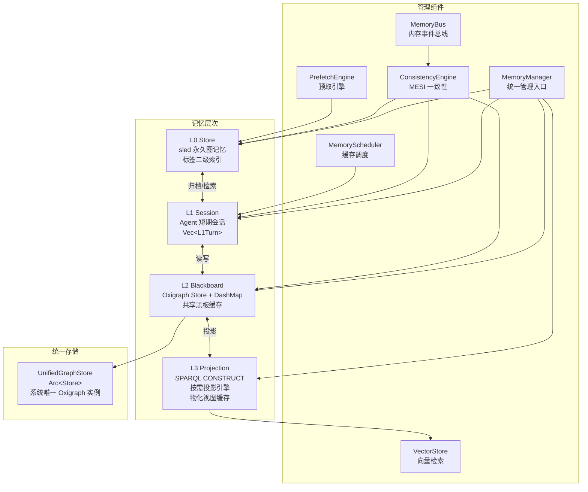
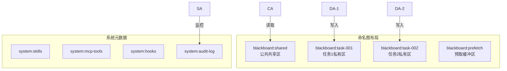
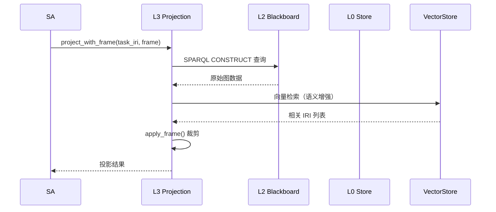
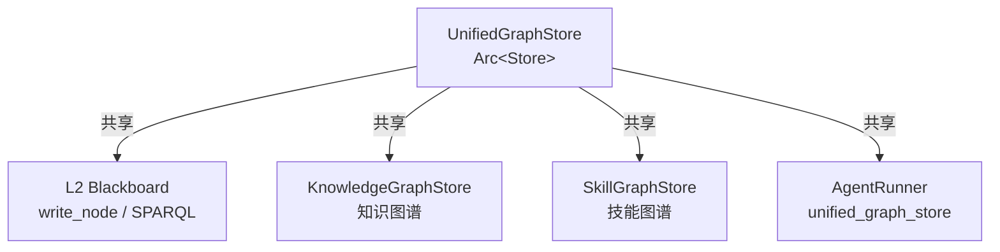
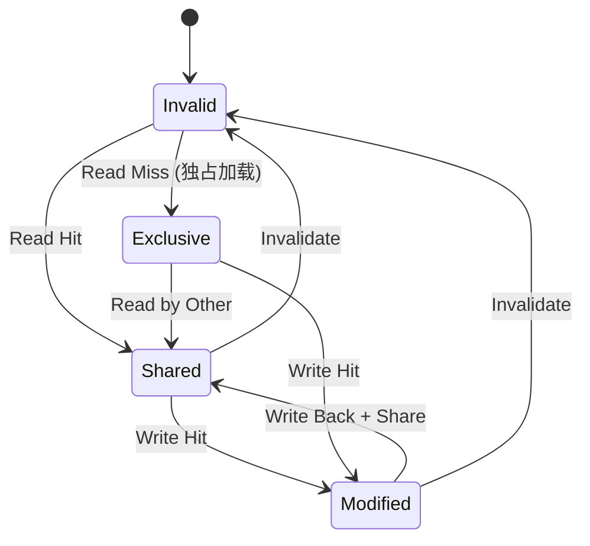
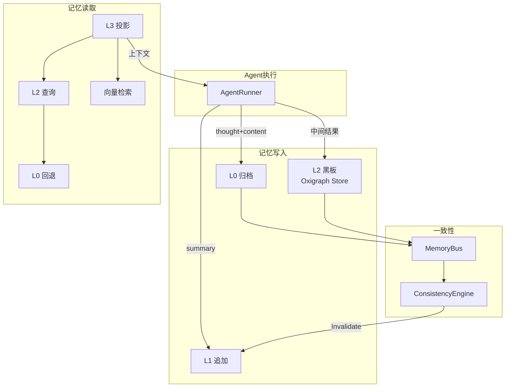

# 3. 记忆系统

## 3.1 模块概览

记忆系统采用四层分层架构，从永久图记忆到按需投影，实现 Token 预算的精细控制。所有层通过统一 Oxigraph 存储共享底层 RDF 图数据，通过命名图实现隔离。



## 3.2 各层详细设计

### 3.2.1 L0 Store — 永久图记忆

**文件**: `src/memory/l0_store.rs`  
**实现状态**: ✅ 完整  
**存储引擎**: sled (Rust 原生键值库，带标签二级索引和命名图索引)

L0 是系统的永久存储层，存储完整的 JSON-LD 图数据，支持实体对齐和 MESI 一致性状态。

**核心结构体**:

```rust
pub struct L0Entry {
    pub iri: String,
    pub content: String,
    pub importance: f32,
    pub access_count: u32,
    pub created_at: DateTime<Utc>,
    pub last_accessed: DateTime<Utc>,
    pub tags: Vec<String>,
    pub metadata: serde_json::Map<String, serde_json::Value>,
    pub mesi_state: MesiState,
    pub content_hash: String,
    pub named_graph: Option<String>,
    pub qdrant_point_id: Option<String>,
    pub jsonld_context: Option<String>,    // JSON-LD @context
    pub jsonld_types: Vec<String>,         // 多类型列表
}
```

**索引结构**:
- **主索引**: IRI → bincode 序列化的 L0Entry
- **标签索引**: `tag:{tag_name}` → 该标签下的 IRI 集合
- **命名图索引**: `graph:{graph_name}` → 该图下的 IRI 集合

**核心方法**:

| 方法 | 功能 |
|------|------|
| `store(iri, content)` | 存储条目 |
| `store_entry(entry)` | 存储完整 L0Entry（含标签索引更新） |
| `retrieve(iri)` | 检索条目 |
| `delete(iri)` | 删除条目和索引 |
| `search(query)` | 搜索条目 |
| `search_by_tags(tags)` | 按标签搜索 |
| `get_by_importance(min)` | 按重要性获取 |
| `query_by_type(type_iri)` | 按类型查询 |
| `store_jsonld_node(node)` | 存储 JSON-LD 节点 |
| `retrieve_jsonld_node(iri)` | 检索 JSON-LD 节点 |
| `merge_entries(existing, new)` | 合并相同 @id 节点 |

### 3.2.2 L1 Session — Agent 短期会话

**文件**: `src/memory/l1_session.rs`  
**实现状态**: ✅ 完整

L1 是 Agent 的短期会话记忆，存储当前对话的轮次信息，支持 Token 预算控制和淘汰策略。

```rust
pub struct L1Turn {
    pub role: String,
    pub summary: String,
    pub timestamp: DateTime<Utc>,
    pub l0_archive_iri: Option<String>,  // L0 归档 IRI
    pub embedding: Option<Vec<f32>>,      // 语义向量
}

pub struct L1Session {
    session_id: String,
    agent_id: String,
    agent_role: String,
    task_iri: String,
    turns: Vec<L1Turn>,
    token_budget: usize,
    current_tokens: usize,
    weak_refs: Vec<String>,              // 淘汰的 IRI 弱引用
    mesi_state: MesiState,               // MESI 缓存一致性状态
}
```

**淘汰策略**:

```
得分 = (1 / 距上次访问秒数) × 0.3 + (1 / 语义相关度) × 0.4 + token_cost × 0.3
得分越低越应被淘汰
```

### 3.2.3 L2 Blackboard — 共享黑板

**文件**: `src/memory/l2_blackboard.rs`  
**实现状态**: ✅ 完整  
**存储引擎**: Oxigraph Store + DashMap 节点缓存

L2 是所有 Agent 共享的黑板，基于统一 Oxigraph 存储，支持 SPARQL 读写和命名图隔离。

**核心结构体**:

```rust
pub struct Node {
    pub iri: String,
    pub json_ld: String,
    pub size: usize,
    pub created_at: DateTime<Utc>,
    pub created_by: Option<String>,
    pub tags: Vec<String>,
    pub node_type: Option<String>,
    pub dirty: bool,
    pub mesi_state: MesiState,
    pub parent_task: Option<String>,
    pub named_graph: Option<String>,
    pub jsonld_types: Vec<String>,
}

pub struct Blackboard {
    store: Arc<Store>,                    // 共享 Oxigraph 存储
    node_cache: DashMap<String, Arc<Node>>,  // 节点缓存
    task_nodes: RwLock<HashMap<String, Vec<String>>>,  // 任务→节点索引
    task_tree: RwLock<HashMap<String, TaskTreeNode>>,  // 任务树
    node_count: AtomicU64,
    total_bytes: AtomicU64,
    permission_matrix: PermissionMatrix,
}
```

**构造方式**:

```rust
// 创建独立存储
pub fn new() -> Result<Self, CoreError>

// 使用共享统一存储（推荐）
pub fn with_store(store: Arc<Store>) -> Result<Self, CoreError>
```

**核心方法**:

| 方法 | 功能 |
|------|------|
| `write_node(node_iri, json_ld, config)` | 写入节点（含权限检查 + 大小校验） |
| `write_node_to_graph(node_iri, json_ld, graph_name, config)` | 写入指定命名图 |
| `read_node(iri)` | 读取节点 |
| `query(sparql)` | SPARQL 查询 |
| `query_graph(graph_name, sparql)` | 查询指定命名图 |
| `query_by_types(types)` | 多类型查询 |
| `query_nodes(task_iri)` | 查询任务的所有节点 |
| `write_batch_to_graphs(nodes)` | 批量写入不同命名图 |
| `gc_completed_tasks()` | 自动垃圾回收 |
| `check_permission(role, graph, perm)` | 权限检查 |

**权限强制执行**:

L2 Blackboard 在 `write_node()` 中强制执行权限检查。`system` 角色拥有完全访问权限，其他角色按权限矩阵配置检查，权限拒绝时返回 `CoreError::PermissionDenied`。

**命名图隔离**:



### 3.2.4 L3 Projection — 投影引擎

**文件**: `src/memory/l3_projection.rs`  
**实现状态**: ✅ 完整

L3 是按需投影引擎，根据 Agent 角色和 Token 预算生成定制化的上下文视图。

```rust
pub struct ProjectionEngine {
    blackboard: Arc<Blackboard>,
    max_size: usize,
    frames: HashMap<String, ProjectionFrame>,
    materialized_cache: RwLock<HashMap<String, MaterializedView>>,
    vector_store: Option<Arc<VectorStore>>,
}
```

**预定义投影模板**:

| 模板名 | 用途 | 包含属性 |
|--------|------|---------|
| `summary_only` | SA 全局态势感知 | summary, status |
| `pa_init` | PA 初始化 | summary, objective, constraints |
| `da_input` | DA 输入 | plan, subtasks, resources |
| `ca_review` | CA 审查 | results, validation_rules |
| `aa_decision` | AA 决策 | review_results, alternatives |
| `reference_only` | 最小引用 | 仅 @id |

**缓存失效机制**:

| 方法 | 功能 |
|------|------|
| `invalidate_for_node(node_iri)` | 使依赖指定节点的所有缓存视图失效 |
| `invalidate_for_nodes(node_iris)` | 批量失效 |
| `cleanup_invalid()` | 清理已失效的缓存条目 |

失效流程：
1. L2 数据写入时通过 MemoryBus 发布 Invalidate 事件
2. L3 监听事件，调用 `invalidate_for_node()` 标记相关缓存为无效
3. 下次投影请求时自动重新生成物化视图

**Frame 驱动投影**:



## 3.3 UnifiedGraphStore — 统一存储

**文件**: `src/memory/unified_graph.rs`  
**实现状态**: ✅ 完整

系统中唯一的 Oxigraph Store 实例，各模块通过 Arc 共享，通过命名图隔离数据域。

```rust
pub struct UnifiedGraphStore {
    store: Arc<Store>,
}

impl UnifiedGraphStore {
    pub fn new() -> Result<Self, Box<dyn std::error::Error>>;
    pub fn store(&self) -> Arc<Store>;  // 获取底层 Store 的 Arc 引用
    pub fn ref_count(&self) -> usize;   // 引用计数诊断
}
```

**共享模型**:



## 3.4 辅助组件

### 3.4.1 MemoryBus — 内存事件总线

**文件**: `src/memory/memory_bus.rs`  
**实现状态**: ✅ 完整

**事件类型**:
| 事件 | 触发条件 | 处理动作 |
|------|---------|---------|
| `Invalidate(iri)` | L0 数据被修改 | 使所有 L1 缓存行无效 |
| `WriteBack(iri)` | L1 脏数据需回写 | 将 L1 数据写回 L0 |
| `Evict(iri)` | L1 超出 Token 预算 | 淘汰低优先级缓存行 |
| `Prefetch(iri)` | 预测即将访问 | 提前加载到 L2 |
| `Sync(iri, layer)` | 层间同步请求 | 同步指定层的数据 |

**批量操作**:
| 方法 | 功能 |
|------|------|
| `publish_invalidate(iri, scope)` | 单节点缓存失效 |
| `publish_invalidate_batch(iris, scope)` | 批量缓存失效 |
| `publish_with_priority(iri, scope, priority)` | 带优先级的事件发布 |

### 3.4.2 ConsistencyEngine — MESI 一致性

**文件**: `src/memory/consistency_engine.rs`  
**实现状态**: ✅ 完整



### 3.4.3 VectorStore — 向量检索

**文件**: `src/memory/vector_store.rs`  
**实现状态**: ✅ 完整

支持多种 Embedding 服务提供商：

| 提供商 | 配置键 | 说明 |
|--------|--------|------|
| Ollama | `ollama` | 本地 Ollama 服务（默认） |
| OneAPI | `oneapi` | OpenAI 兼容 API |
| Fallback | `fallback` | 随机向量兜底 |

### 3.4.4 PrefetchEngine — 预取引擎

**文件**: `src/memory/prefetch_engine.rs`  
**实现状态**: ✅ 完整

基于访问模式的主动预取，提前加载可能需要的数据到 L2。SA 在执行计划时调用 `prefetch.on_intent_change()` 进行预取。

### 3.4.5 MemoryScheduler — 缓存调度

**文件**: `src/memory/scheduler.rs`  
**实现状态**: ✅ 完整

L1 缓存调度器，管理 Token 预算和淘汰策略。可注入 MemoryManager 实现统一管理。

### 3.4.6 MemoryManager — 统一管理器

**文件**: `src/memory/memory_manager.rs`  
**实现状态**: ✅ 完整

```rust
pub struct MemoryManager {
    l0: Arc<L0Store>,
    l2: Arc<Blackboard>,
    projection: Arc<ProjectionEngine>,
    config: CoreConfig,
    sessions: HashMap<String, L1Session>,
    scheduler: Option<Arc<MemoryScheduler>>,
    l1_active_count: AtomicU64,
}
```

**核心方法**:

| 方法 | 功能 |
|------|------|
| `new(l0, l2, projection, config)` | 创建 MemoryManager |
| `with_scheduler(l0, l2, projection, config, scheduler)` | 创建带 Scheduler 的实例 |
| `create_session(agent_id, role, task_iri)` | 创建 L1 session |
| `track_session(session)` | 注册 session 到管理器 |
| `get_session(session_id)` | 获取 session |
| `projection()` | 获取 ProjectionEngine 引用 |

## 3.5 数据流全景


