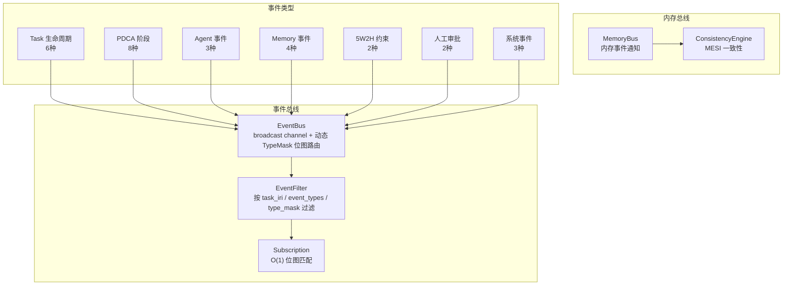
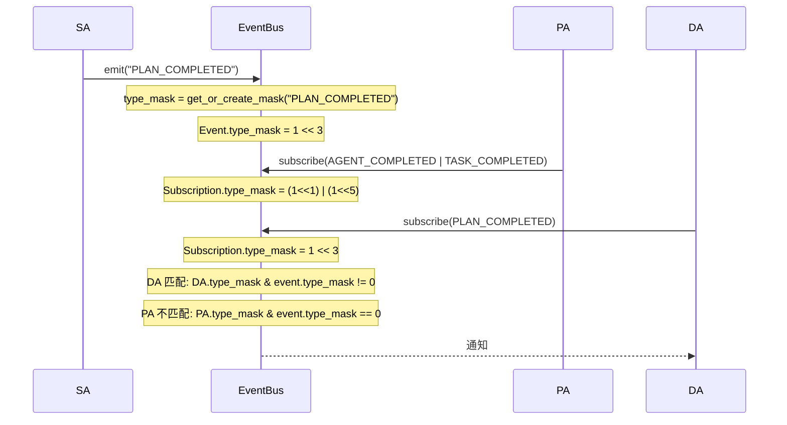
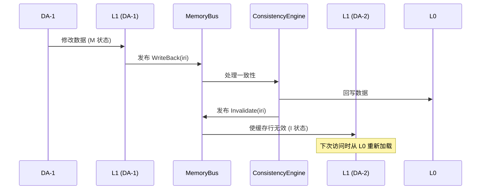
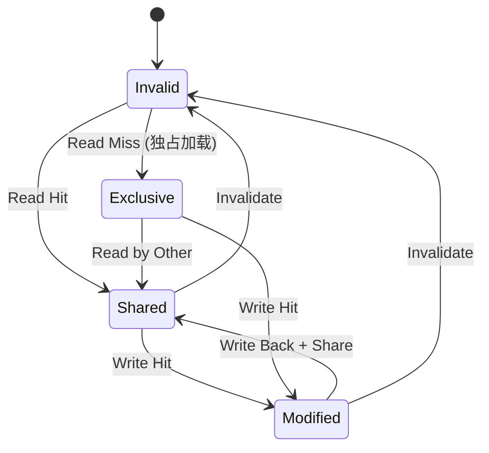
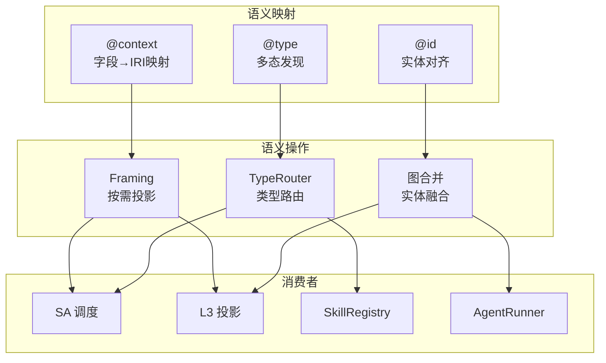

# 4. 总线系统

## 4.1 模块概览

总线系统是 Agent OS 的通信基础设施，包含事件总线和内存总线两个核心组件。事件总线负责 Agent 间的事件通知（动态 TypeMask 位图路由），内存总线负责记忆层间的一致性协调。



## 4.2 EventBus — 事件总线

**文件**: `src/core/event_bus.rs`  
**实现状态**: ✅ 完整

基于 broadcast channel + 动态 TypeMask 位图路由的高效事件总线。

### 核心设计

**TypeMask 动态位图路由**:

每种事件类型在首次注册时被分配一个唯一的 bit 位，通过 HashMap 维护类型到位图的映射。匹配时通过 AND 运算实现 O(1) 过滤。

```rust
pub struct TypeMask {
    masks: HashMap<String, u64>,  // 类型名 → 位图
    next_bit: u32,                // 下一个可用 bit
}

impl TypeMask {
    pub fn get_or_create_mask(&mut self, type_name: &str) -> u64;
    pub fn combine_masks(&self, types: &[String]) -> u64;
    pub fn get_mask(&self, type_name: &str) -> Option<u64>;
}
```

TypeMask 支持最多 64 种事件类型（u64 位宽）。

### EventType 枚举

```rust
pub enum EventType {
    // Task lifecycle
    TaskCreated, TaskStarted, TaskCompleted, TaskFailed, TaskArchived,
    
    // PDCA phase events
    PlanStarted, PlanCompleted, DoStarted, DoCompleted,
    CheckStarted, CheckCompleted, ActStarted, ActCompleted,
    
    // Node events
    NodeCreated, NodeUpdated, NodeDeleted,
    
    // Agent events
    AgentStarted, AgentCompleted, AgentError,
    
    // System events
    CycleIteration, ThresholdExceeded, InterventionRequired,
    
    // Memory events
    MemoryInvalidate, MemoryWriteBack, MemoryPrefetch, MemoryLoad,
    
    // 5W2H constraint events
    DeadlineApproaching, BudgetExceeded,
    
    // Human approval events
    HumanApprovalRequired, HumanApprovalResult,
    
    // User supplementary input
    UserSupplementaryInput,
    
    // Custom
    Custom(String),
}
```

### 优先级机制

```rust
#[derive(Debug, Clone, Copy, PartialEq, Eq, PartialOrd, Ord)]
pub enum EventPriority {
    Low = 0,
    Normal = 1,
    High = 2,
    Critical = 3,
}
```

| 优先级 | 值 | 适用场景 |
|--------|-----|---------|
| Low | 0 | 日志、统计等 |
| Normal | 1 | 常规 Agent 事件（默认） |
| High | 2 | 任务状态变更、重要数据更新 |
| Critical | 3 | 系统错误、紧急修复通知 |

### 核心结构体

```rust
pub struct EventBus {
    sender: broadcast::Sender<Event>,
    event_count: AtomicU64,
    subscriber_count: AtomicU64,
    type_mask: std::sync::Mutex<TypeMask>,
}

pub struct Event {
    pub event_id: String,
    pub task_iri: String,
    pub event_type: String,
    pub source_agent_iri: String,
    pub payload: String,
    pub payload_json_ld: String,
    pub timestamp: DateTime<Utc>,
    pub sequence: u64,
    pub type_mask: u64,
    pub priority: EventPriority,
}

pub struct Subscription {
    pub subscriber_id: String,
    pub type_mask: u64,
    pub scope_iri: Option<String>,
    pub event_types: Vec<String>,
}

pub struct EventFilter {
    pub task_iri: Option<String>,
    pub event_types: Vec<String>,
    pub source_agent: Option<String>,
    pub type_mask: u64,
}
```

### 核心方法

| 方法 | 功能 |
|------|------|
| `new(capacity)` | 创建事件总线 |
| `emit(task_iri, type, source, payload)` | 发布 Normal 优先级事件 |
| `emit_with_priority(task_iri, type, source, payload, priority)` | 发布指定优先级事件 |
| `subscribe()` | 订阅所有事件 |
| `subscribe_with_filter(subscription)` | 带过滤的订阅 |
| `register_type(type_name)` | 注册类型到位图路由 |
| `get_combined_mask(types)` | 获取多个类型的组合位图 |
| `spawn_consumer(types, handler)` | 启动后台异步消费者 |

### 事件匹配 O(1) 流程



### 异步消费者

EventBus 支持 `spawn_consumer` 方法启动后台 tokio 任务处理事件：

```rust
bus.spawn_consumer(
    vec!["PLAN_COMPLETED".to_string(), "DO_COMPLETED".to_string()],
    |event| async move {
        // 异步处理事件
    }
);
```

## 4.3 MemoryBus — 内存事件总线

**文件**: `src/memory/memory_bus.rs`  
**实现状态**: ✅ 完整

内存事件总线，负责跨层内存一致性通知。

**事件类型**:

| 事件 | 触发条件 | 处理动作 |
|------|---------|---------|
| `Invalidate(iri)` | L0 数据被修改 | 使所有 L1 缓存行无效 |
| `WriteBack(iri)` | L1 脏数据需回写 | 将 L1 数据写回 L0 |
| `Evict(iri)` | L1 超出 Token 预算 | 淘汰低优先级缓存行 |
| `Prefetch(iri)` | 预测即将访问 | 提前加载到 L2 |
| `Sync(iri, layer)` | 层间同步请求 | 同步指定层的数据 |

**批量操作**:

| 方法 | 功能 |
|------|------|
| `publish_invalidate(iri, scope)` | 单节点缓存失效 |
| `publish_invalidate_batch(iris, scope)` | 批量缓存失效（合并为单次事件） |
| `publish_with_priority(iri, scope, priority)` | 带优先级的事件发布 |

**一致性保证流程**:



## 4.4 ConsistencyEngine — MESI 一致性

**文件**: `src/memory/consistency_engine.rs`  
**实现状态**: ✅ 完整



## 4.5 JSON-LD 语义层

**文件**: `src/jsonld/`  
**实现状态**: ✅ 完整

JSON-LD 语义层提供了数据总线的语义互操作能力，是连接所有模块的"统一数据总线"。

**核心组件**:

| 组件 | 文件 | 功能 |
|------|------|------|
| Context | `jsonld/context.rs` | @context 语义映射 |
| Types | `jsonld/types.rs` | @type 多态定义 |
| Utils | `jsonld/utils.rs` | IRI 工具函数 |
| Framing | `jsonld/framing.rs` | 按需投影裁剪 |
| TypeRouter | `jsonld/type_router.rs` | 类型路由决策 |

**语义总线架构**:


