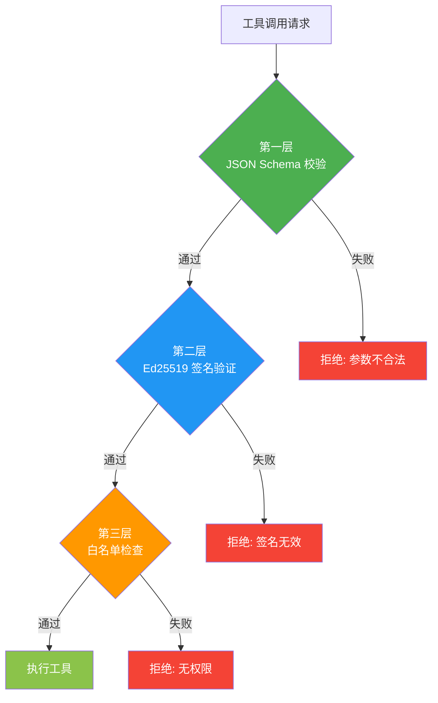
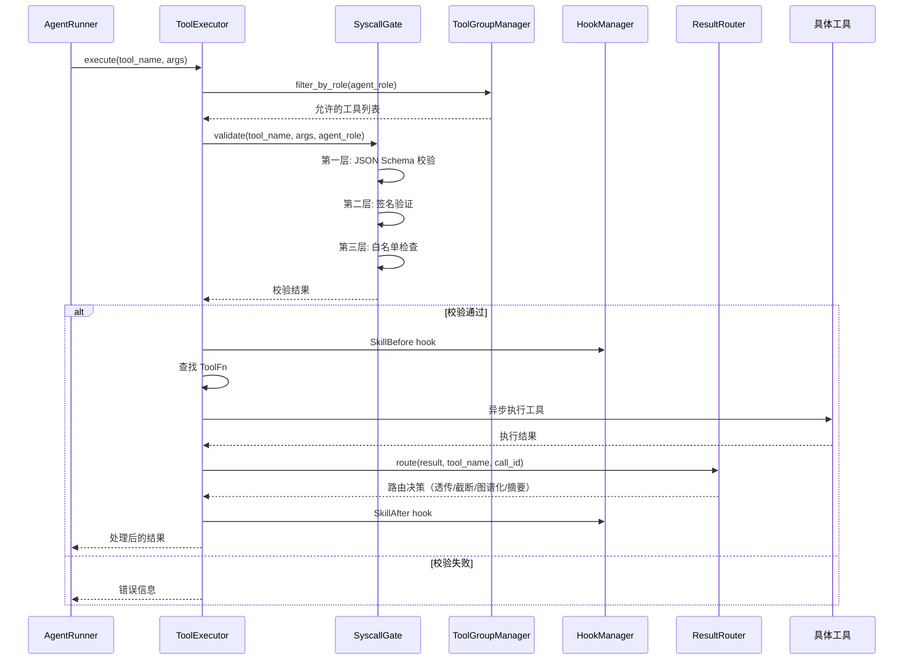

# 5. 工具系统

## 5.1 模块概览

工具系统是 Agent 与外部世界交互的接口，包含内置工具、Skills、MCP、Hooks、共享管理、知识图谱工具、结果路由和 Token 优化。

```mermaid
graph TB
    subgraph 工具执行
        TE["ToolExecutor<br/>统一执行入口<br/>(Arc&lt;dyn Fn&gt; 异步闭包)"]
        KG_STORE["kg_store<br/>Arc&lt;Mutex&lt;KGStore&gt;&gt;<br/>字段注入（非全局静态）"]
        UGS["unified_graph_store<br/>Arc&lt;Store&gt;"]
    end

    subgraph 内置工具
        BASH["Bash<br/>命令执行"]
        FILE_OPS["FileOps<br/>文件操作"]
        SEARCH["grep_search<br/>glob_search"]
        WEB["WebSearch<br/>WebFetch"]
        RAG["rag_search<br/>rag_index"]
        KNOWLEDGE["knowledge_list<br/>knowledge_search"]
    end

    subgraph 知识图谱工具
        KE["knowledge_extract<br/>LLM 知识抽取"]
        KQ["knowledge_query<br/>SPARQL 查询"]
        KS["kg_search<br/>模糊搜索"]
        KN["knowledge_neighbors<br/>邻居遍历"]
        KI["knowledge_import_json<br/>JSON 导入"]
        KEC["knowledge_extract_code<br/>代码 AST 提取（增量）"]
        OR["ontology_register<br/>本体注册"]
        KB["knowledge_bridge<br/>知识桥接"]
    end

    subgraph 结果路由
        RR["ResultRouter<br/>智能路由"]
        GF["GraphifyEngine<br/>图谱化"]
        SM["Summary<br/>智能截断"]
        MT["MicroToolGenerator<br/>微工具生成"]
    end

    subgraph Skills系统
        SR["SkillRegistry<br/>技能注册"]
        SD["SkillMeta<br/>技能元数据"]
        SDISC["三级渐进式披露"]
    end

    subgraph MCP协议
        MC["MCPClient<br/>MCP 客户端"]
        MS["MCPServer<br/>MCP 服务"]
        MPROTO["JSON-RPC 协议"]
    end

    subgraph Hooks系统
        HM["HookManager<br/>钩子管理"]
        HP["HookPoint<br/>20个钩子点"]
        HC["HookContext<br/>钩子上下文"]
    end

    subgraph Token优化
        TGC["ToolGroupManager<br/>按角色分组"]
        TRC["ToolResultCompressor<br/>工具结果压缩"]
        CWM["ContextWindowManager<br/>上下文窗口"]
    end

    TE --> BASH & FILE_OPS & SEARCH & WEB & RAG & KNOWLEDGE
    TE --> KE & KQ & KS & KN & KI & KEC & OR & KB
    TE --> RR
    RR --> GF & SM & MT
    TE --> SR
    TE --> MC
    TE --> HM
    TE --> KG_STORE
    TE --> UGS
    TE --> TGC & TRC & CWM
```



## 5.2 核心组件

### 5.2.1 ToolExecutor — 工具执行器

**文件**: `src/tools/tool_executor.rs`
**实现状态**: ✅ 完整

统一工具执行入口，负责工具查找、参数校验和执行。

**核心类型**:

```rust
// 异步 ToolFn — 所有工具处理器统一签名
type ToolFn = Arc<dyn Fn(Value) -> Pin<Box<dyn Future<Output = Result<Value, String>> + Send>> + Send + Sync>;
```

**关键设计变更历程**：

| 变更 | 旧设计 | 新设计 | 原因 |
|------|--------|--------|------|
| ToolFn 类型 | `fn(&Value) -> Result<Value, String>` | `Arc<dyn Fn(Value) -> Pin<Box<dyn Future<...>>> + Send + Sync>` | 支持异步闭包捕获 store |
| KG 存储位置 | `static KG_STORE: OnceCell<Mutex<KnowledgeGraphStore>>` | `ToolExecutor.kg_store: Arc<Mutex<KnowledgeGraphStore>>` | 消除全局静态，修复并行测试竞争 |
| 工具注册 | 函数指针直接传入 | 闭包通过 `Arc` 包装传入（sync_tool/sync_tool_ref） | 知识图谱工具需捕获 `kg_store` |

**核心结构体**:

```rust
pub struct ToolExecutor {
    tools: HashMap<String, ToolFn>,
    tool_descriptions: Vec<ToolDescription>,
    kg_store: Arc<Mutex<KnowledgeGraphStore>>,
}
```

**PA 角色工具白名单**：

Plan Agent 仅允许使用只读工具：
```
file_read, file_list, glob_search, grep_search,
WebSearch, WebFetch, ToolSearch,
rag_search, knowledge_list, knowledge_search, kg_search,
knowledge_extract_code
```

**核心方法**:

| 方法 | 功能 |
|------|------|
| `execute(tool_name, args)` | 异步执行工具调用 |
| `list_tools()` | 列出所有可用工具 |
| `get_tool_schema(name)` | 获取工具参数 Schema |
| `tool_definitions_for_role(role)` | 按角色过滤工具定义 |
| `register(name, desc, params, handler, roles)` | 注册工具（泛型，接受闭包） |

### 5.2.2 SkillRegistry — 技能注册

**文件**: `src/tools/skill_registry.rs`
**实现状态**: ✅ 完整

```rust
pub struct SkillMeta {
    pub iri: String,
    pub name: String,
    pub description: String,
    pub version: String,
    pub input_schema: Value,
    pub output_schema: Value,
    pub disclosure_level: DisclosureLevel,
    pub dependencies: Vec<String>,
    pub signature: Option<String>,
    pub input_mapping: HashMap<String, String>,
    pub output_mapping: HashMap<String, String>,
    pub skill_types: Vec<String>,
}
```

**三级渐进式披露**:

| 级别 | 暴露信息 | 适用场景 |
|------|---------|---------|
| Basic | 名称、描述 | Agent 初次扫描 |
| Schema | + 输入输出 Schema | Agent 选择工具 |
| Full | + 依赖、签名、映射 | Agent 执行工具 |

**默认技能**:

| 技能 | 类型 | 语义能力 |
|------|------|---------|
| file_read | IO | FileOperation, ReadOperation |
| file_write | IO | FileOperation, WriteOperation |
| http_request | Network | HTTPOperation, RemoteOperation |
| llm_chat | AI | LLMOperation, ChatOperation |
| code_execute | Execution | CodeExecution, SandboxOperation |
| jsonld_validate | Validation | ValidationOperation, JSONLDOperation |

### 5.2.3 MCPClient — MCP 协议客户端

**文件**: `src/tools/mcp_client.rs`
**实现状态**: ✅ HTTP 传输已实现

MCP (Model Context Protocol) 客户端，通过 JSON-RPC 协议与外部工具服务通信。

**支持的传输方式**:

| 类型 | 配置 | 说明 | 状态 |
|------|------|------|------|
| Stdio | `McpStdioServerConfig` | 本地进程通信 | ⬜ |
| HTTP | `McpRemoteServerConfig` | HTTP 远程调用 | ✅ |
| SSE | `McpRemoteServerConfig` | Server-Sent Events | ⬜ |
| WebSocket | `McpWebSocketServerConfig` | WebSocket 通信 | ⬜ |
| ManagedProxy | `McpManagedProxyConfig` | 托管代理 | ⬜ |
| SDK | `McpSdkConfig` | SDK 集成 | ⬜ |

**MCP 消息格式**:

```json
{
  "jsonrpc": "2.0",
  "method": "tools/call",
  "params": {
    "name": "tool_name",
    "arguments": { ... }
  },
  "id": 1
}
```

### 5.2.4 HookManager — 钩子系统

**文件**: `src/tools/hooks.rs`
**实现状态**: ✅ 完整（含执行控制）

**20 个钩子点**:

| 钩子点 | 触发时机 | 用途 |
|--------|---------|------|
| `AgentBeforeStart` | Agent 启动前 | 初始化检查 |
| `AgentAfterComplete` | Agent 完成后 | 结果处理 |
| `AgentOnError` | Agent 出错时 | 错误处理 |
| `SkillBefore` | 工具调用前 | 参数校验 |
| `SkillAfter` | 工具调用后 | 结果审计 |
| `L0BeforeStore` | L0 存储前 | 数据验证 |
| `L0AfterRetrieve` | L0 检索后 | 数据增强 |
| `L1BeforeEvict` | L1 淘汰前 | 数据归档 |
| `L2BeforeWrite` | L2 写入前 | 权限检查 |
| `L2AfterRead` | L2 读取后 | 缓存更新 |
| `L3BeforeProject` | L3 投影前 | 模板选择 |
| `L3AfterProject` | L3 投影后 | 结果裁剪 |
| `PlanBeforeCreate` | 计划创建前 | 约束注入 |
| `PlanAfterCreate` | 计划创建后 | 计划验证 |
| `CheckBeforeReview` | 审查前 | 标准加载 |
| `CheckAfterReview` | 审查后 | 问题标记 |
| `DecisionBefore` | 决策前 | 选项评估 |
| `DecisionAfter` | 决策后 | 执行跟踪 |
| `SystemBeforeInit` | 系统初始化前 | 配置加载 |
| `SystemAfterInit` | 系统初始化后 | 健康检查 |

### 5.2.5 SyscallGate — 系统调用门

**文件**: `src/core/syscall_gate.rs`
**实现状态**: ✅ 三层校验完整



**三层校验**:

| 层级 | 校验内容 | 实现状态 |
|------|---------|---------|
| 第一层 | JSON Schema 参数校验 | ✅ 完成 |
| 第二层 | Ed25519 数字签名验证（ring） | ✅ 完成 |
| 第三层 | Agent 工具白名单检查（PA 只读白名单） | ✅ 完成 |

## 5.3 内置工具

### 5.3.1 文件操作工具

| 工具 | 功能 |
|------|------|
| file_read | 读取文件内容 |
| file_write | 写入文件内容 |
| file_list | 列出目录内容 |
| file_delete | 删除文件 |
| file_exists | 检查文件是否存在 |
| mkdir | 创建目录 |

### 5.3.2 搜索工具

| 工具 | 功能 |
|------|------|
| grep_search | 正则搜索文件内容（支持 context/head_limit/offset 等参数） |
| glob_search | Glob 模式匹配文件名 |

### 5.3.3 Embedding 服务

**文件**: `src/memory/vector_store.rs`

支持多种 Embedding 服务提供商：

| 提供商 | 配置键 | 说明 |
|--------|--------|------|
| Ollama | `ollama` | 本地 Ollama 服务（默认） |
| OneAPI | `oneapi` | OpenAI 兼容 API |
| Fallback | `fallback` | 随机向量兜底 |

### 5.3.4 RAG 工具

| 工具 | 功能 |
|------|------|
| rag_search | 语义搜索文档 |
| rag_index | 索引文档到向量存储 |

### 5.3.5 知识图谱工具

| 工具 | 功能 | PA 可用 |
|------|------|---------|
| knowledge_extract | LLM 从文本抽取实体和关系 | ✅ |
| knowledge_query | SPARQL SELECT 查询 | ✅ |
| kg_search | 模糊搜索实体 | ✅ |
| knowledge_neighbors | 1-3 跳邻居遍历 | ✅ |
| knowledge_import_json | JSON 数据映射为图谱节点 | ❌ |
| ontology_register | 注册自定义本体术语 | ❌ |
| knowledge_bridge | 创建知识-技能桥接 | ❌ |
| knowledge_extract_code | tree-sitter 代码 AST 提取（增量） | ✅ |

## 5.4 工具调用流程



## 5.5 Token 优化系统

### 5.5.1 ToolGroupManager

**文件**: `src/tools/tool_groups.rs`

按角色对工具进行分组，减少不必要的工具列表暴露：

| 角色 | 默认分组 | 按需加载 |
|------|---------|---------|
| PA | Core, Search, Knowledge, System | Web, Code, Skill |
| DA | Core, Write, Search, Web, Code, Skill, System | Knowledge |
| CA | Core, Search, Knowledge, System | Web, Code |
| AA | Core, System | Search, Knowledge |

### 5.5.2 ToolResultCompressor

**文件**: `src/core/context_compressor.rs`

大工具结果的自动压缩，配置路径 `config.yaml`:

```yaml
tool_result_compressor:
  enabled: true
  max_full_results: 2
  max_summary_length: 200
  compression_trigger: 10
```

### 5.5.3 ContextWindowManager

```yaml
context_window:
  max_messages: 15
  max_tokens: 16000
  compression_ratio: 0.3
  preserve_recent: 4
```

## 5.6 OnceLock 竞争问题修复

### 问题描述

原实现使用全局静态 `OnceCell<Mutex<KnowledgeGraphStore>>` 存储知识图谱数据，导致并行测试时数据互相干扰。

### 修复方案

```rust
// 新实现
type ToolFn = Arc<dyn Fn(Value) -> Pin<Box<dyn Future<Output = Result<Value, String>> + Send>> + Send + Sync>;

pub struct ToolExecutor {
    tools: HashMap<String, ToolFn>,
    tool_descriptions: Vec<ToolDescription>,
    kg_store: Arc<Mutex<KnowledgeGraphStore>>,  // 字段注入
    unified_graph_store: Option<Arc<Store>>,     // 统一 Oxigraph 存储
}
```

**关键变更**：
- `KG_STORE` 从全局静态 → `ToolExecutor` 字段
- `ToolFn` 从函数指针 → `Arc<dyn Fn>` 异步闭包
- 知识图谱工具通过闭包捕获 `kg_store` Arc 引用
- 每个 `ToolExecutor` 实例拥有独立存储
- 支持通过 `unified_graph_store` 共享统一 Oxigraph 存储
