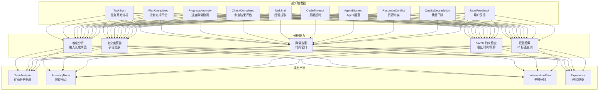
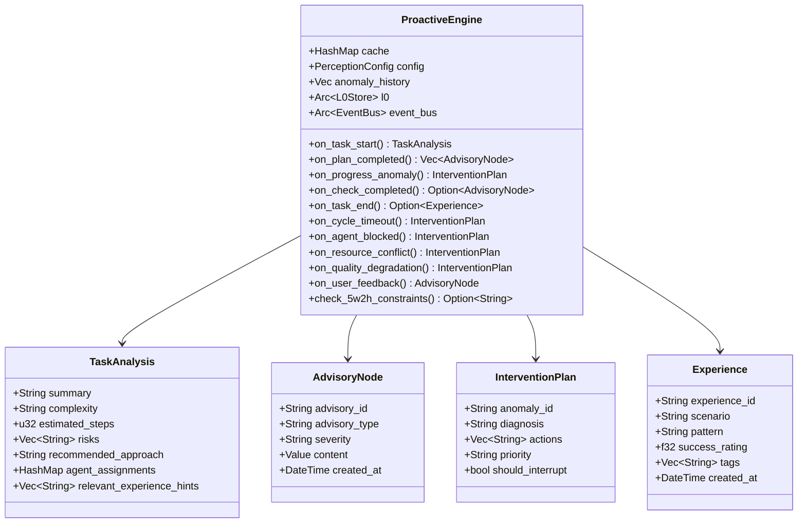
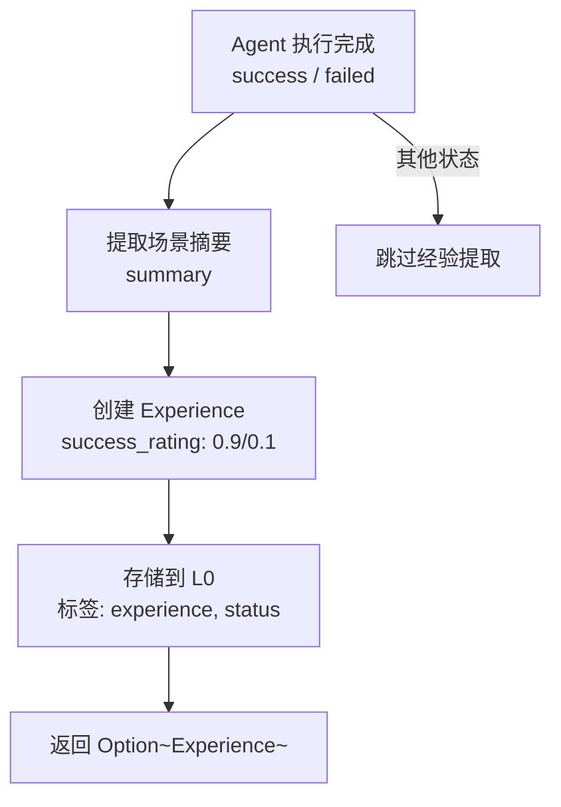
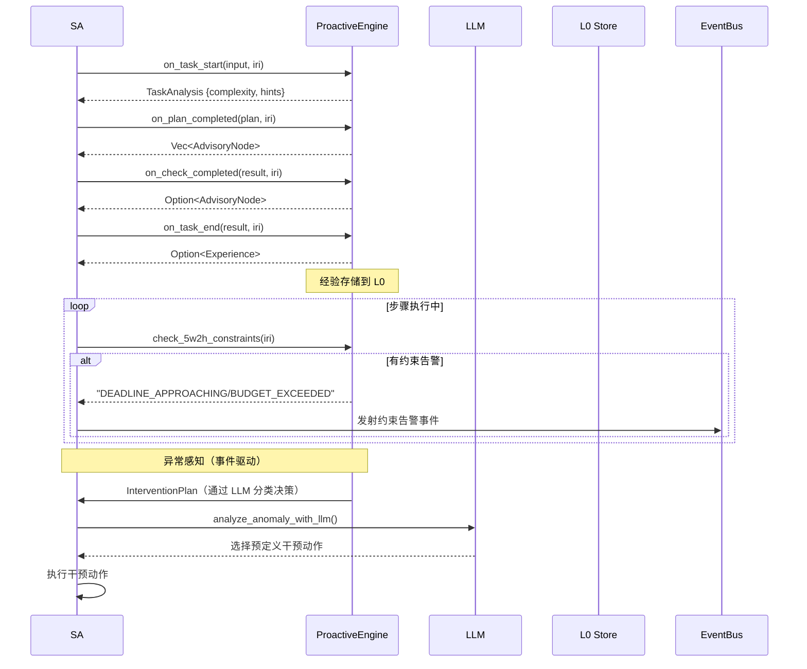

# 6. 感知系统

> 基于 ProactiveEngine 的主动感知引擎，监控任务执行过程并在异常时触发干预

## 6.1 模块概览

感知系统是 Agent OS 的"神经系统"，在任务执行的各个关键节点主动感知状态，发现异常时生成干预计划供 SA 决策执行。系统集成了 10 种感知触发器、缓存去重、5W2H 约束检查和经验提取功能。



## 6.2 核心组件

### 6.2.1 ProactiveEngine

**文件**: `src/perception/proactive_engine.rs`  
**实现状态**: ✅ 完整

主动感知引擎，负责在任务执行关键节点进行感知分析。

**核心结构体**:

```rust
pub struct ProactiveEngine {
    cache: HashMap<String, (DateTime<Utc>, Value)>,  // 分析结果缓存
    config: PerceptionConfig,                          // 感知配置
    anomaly_history: Vec<(String, DateTime<Utc>)>,     // 异常历史（去重）
    l0: Arc<L0Store>,                                  // 永久存储（经验查询）
    event_bus: Arc<EventBus>,                          // 事件总线
}
```

**数据类型的层次关系**:



### 6.2.2 PerceptionConfig

```rust
pub struct PerceptionConfig {
    pub cache_ttl_seconds: i64,           // 缓存 TTL（默认 300s）
    pub cache_max_entries: usize,         // 最大缓存条目（默认 1000）
    pub anomaly_dedup_window_seconds: i64, // 异常去重窗口（默认 60s）
    pub simple_input_threshold: usize,    // 简单任务输入阈值（默认 50）
    pub medium_input_threshold: usize,    // 中等任务输入阈值（默认 200）
    pub simple_steps: u32,                // 简单任务步骤数（默认 1）
    pub medium_steps: u32,                // 中等任务步骤数（默认 3）
    pub complex_steps: u32,               // 复杂任务步骤数（默认 5）
    pub complex_subtask_threshold: usize, // 复杂子任务告警阈值（默认 5）
}
```

**配置来源**: 通过 `PerceptionConfig::from_settings()` 从 `config.yaml` 加载：

```yaml
perception:
  enabled: true
  triggers:
    - TaskStart
    - PlanCompleted
    - ProgressAnomaly
    - CheckCompleted
    - TaskEnd
  cache_ttl_seconds: 300
  cache_max_entries: 1000
  anomaly_dedup_window_seconds: 60
  simple_input_threshold: 50
  medium_input_threshold: 200
  cycle_timeout_secs: 300
  max_iterations_before_alert: 10
  error_rate_threshold: 0.5
```

## 6.3 感知触发器详解

### 6.3.1 PerceptionTrigger 枚举

```rust
pub enum PerceptionTrigger {
    TaskStart,          // 任务开始 — 复杂度分析 + 经验检索
    PlanCompleted,      // 计划完成 — 子任务数检查
    ProgressAnomaly,    // 进度异常 — 去重窗口内检测重复异常
    CheckCompleted,     // 审查完成 — 审查失败告警
    TaskEnd,            // 任务结束 — 经验提取
    CycleTimeout,       // 周期超时 — 执行超时干预
    AgentBlocked,       // Agent 阻塞 — 健康检测
    ResourceConflict,   // 资源冲突 — 队列/延迟分析
    QualityDegradation, // 质量下降 — 回滚信号
    UserFeedback,       // 用户反馈 — 反馈日志
}
```

### 6.3.2 TaskStart — 任务开始分析

**方法**: `on_task_start(user_input, task_iri) -> Result<TaskAnalysis>`

在 SA 启动新任务周期时调用，执行：

1. **复杂度分析**：根据输入长度判断复杂度
   - 输入 < `simple_input_threshold`（50）→ `simple`
   - 输入 < `medium_input_threshold`（200）→ `medium`
   - 输入 ≥ `medium_input_threshold` → `complex`

2. **经验检索**：从 L0 查询标签为 `experience` 的历史记录，筛选与当前任务相关的前 5 条，注入 `relevant_experience_hints`

3. **缓存**：分析结果缓存在 `cache` 中，TTL 内重复请求直接返回缓存

```rust
fn analyze_task(&self, user_input: &str) -> TaskAnalysis {
    let input_len = user_input.len();
    let (complexity, steps) = if input_len < self.config.simple_input_threshold {
        ("simple".to_string(), self.config.simple_steps)
    } else if input_len < self.config.medium_input_threshold {
        ("medium".to_string(), self.config.medium_steps)
    } else {
        ("complex".to_string(), self.config.complex_steps)
    };

    TaskAnalysis {
        summary: user_input.chars().take(100).collect(),
        complexity,
        estimated_steps: steps,
        risks: /* complex 时提示大范围风险 */,
        recommended_approach: /* simple→direct_da, medium→standard_pdca, complex→recursive_pdca */,
        agent_assignments: {plan: "PA", execute: "DA", check: "CA", act: "AA"},
        relevant_experience_hints: Vec::new(),
    }
}
```

### 6.3.3 PlanCompleted — 计划完成评估

**方法**: `on_plan_completed(plan, task_iri) -> Vec<AdvisoryNode>`

在 PA 完成计划制定后调用，检查：

- 子任务数是否超过 `complex_subtask_threshold`（5）
- 超过时生成 `complexity_warning` 类型的 AdvisoryNode（severity: medium），建议并行化

### 6.3.4 ProgressAnomaly — 进度异常检测

**方法**: `on_progress_anomaly(anomaly, task_iri) -> InterventionPlan`

在 SA 执行过程中检测到进度异常时调用：

1. **去重检查**：在 `anomaly_dedup_window_seconds`（60s）内相同描述的异常只处理一次
2. 返回 `InterventionPlan`，建议 "重新评估计划" 和 "考虑额外资源"
3. 标记 `should_interrupt: true`

### 6.3.5 CheckCompleted — 审查结果评估

**方法**: `on_check_completed(check_result, task_iri) -> Option<AdvisoryNode>`

在 CA 完成审查后调用：

- 检查 `verdict` 字段是否为 `"fail"`
- 审查失败时生成 severity: `high` 的 AdvisoryNode，包含详细审查结果

### 6.3.6 TaskEnd — 经验提取

**方法**: `on_task_end(task_result, task_iri) -> Option<Experience>`

在 Agent 执行完成（success 或 failed）后调用：

1. 从 task_result 的 `summary` 字段提取场景描述
2. 创建 Experience 对象，`success_rating` 为 0.9（成功）或 0.1（失败）
3. 将经验存储到 L0，标签包含 `["experience", "task:{iri}", "status:{status}"]`

### 6.3.7 CycleTimeout — 周期超时

**方法**: `on_cycle_timeout(cycle_id, task_iri, elapsed_secs) -> InterventionPlan`

在任务周期超过超时阈值时调用：

- 返回 `InterventionPlan`（priority: critical, should_interrupt: true）
- 建议 "延长超时" 和 "检查 Agent 健康"

### 6.3.8 AgentBlocked — Agent 阻塞

**方法**: `on_agent_blocked(agent_id, task_iri) -> InterventionPlan`

在 Agent 健康检测发现阻塞时调用：

- 返回 `InterventionPlan`（priority: high, should_interrupt: true）
- 建议 "重启 Agent" 和 "注入辅助消息"

### 6.3.9 ResourceConflict — 资源冲突

**方法**: `on_resource_conflict(conflict, task_iri) -> InterventionPlan`

在检测到资源竞争时调用：

- 返回 `InterventionPlan`（priority: medium, should_interrupt: false）
- 建议 "排队冲突请求" 和 "通知 SA"

### 6.3.10 QualityDegradation — 质量下降

**方法**: `on_quality_degradation(degradation, task_iri) -> InterventionPlan`

在输出质量下降时调用：

- 返回 `InterventionPlan`（priority: high, should_interrupt: true）
- 建议 "回滚到上一个检查点" 和 "使用不同方法重试"

### 6.3.11 UserFeedback — 用户反馈

**方法**: `on_user_feedback(feedback, task_iri) -> AdvisoryNode`

在收到用户明确反馈时调用：

- 返回 AdvisoryNode（type: user_feedback, severity: medium）
- 完整保留用户反馈内容

## 6.4 5W2H 约束检查

**方法**: `check_5w2h_constraints(five_w2h_iri) -> Option<String>`

从 L0 加载 5W2H 节点，检查约束条件：

**截止时间检查**：
- 从 `task:when/task:deadline` 读取截止时间
- 从 `task:when/task:reminderBefore` 读取提醒提前量（ISO8601 时长格式，如 `"PT1H"`）
- 当前时间距截止时间小于提醒提前量 → `"DEADLINE_APPROACHING"`
- 当前时间超过截止时间 → `"DEADLINE_EXCEEDED"`

**预算检查**：
- 从 `task:howMuch/task:tokenBudget` 读取 Token 预算
- 从 `task:howMuch/task:actualCost/tokensUsed` 读取实际使用量
- 使用量 > 预算的 80% → `"BUDGET_EXCEEDED"`

**ISO8601 时长解析**：

```rust
fn parse_iso8601_duration(s: &str) -> Option<chrono::Duration> {
    // 解析 "PT1H30M" 格式
    // 支持 H（小时）、M（分钟）、S（秒）
}
```

## 6.5 缓存与去重机制

### 结果缓存

- `cache`: `HashMap<String, (DateTime<Utc>, Value)>`
- 缓存 Key 格式：`"{trigger}:{context}"`（如 `"task_start:iri://task/001"`）
- TTL：`cache_ttl_seconds`（默认 300 秒）
- 达到 `cache_max_entries`（默认 1000）时执行 LRU 淘汰

```rust
fn is_cached(&self, key: &str) -> bool {
    // 检查缓存有效性（TTL 内）
}

fn evict_cache(&mut self) {
    // 超出 max_entries 时淘汰过期和最早的缓存
}
```

### 异常去重

- `anomaly_history`: `Vec<(String, DateTime<Utc>)>`
- 去重窗口：`anomaly_dedup_window_seconds`（默认 60 秒）
- 相同描述的异常在窗口内重复出现时返回 `already_handled`（不执行干预）
- 历史记录保留 `anomaly_dedup_window_seconds × 2` 后清理

```rust
fn on_progress_anomaly(&mut self, anomaly: &Value, task_iri: &str) -> InterventionPlan {
    // 去重检查
    if self.anomaly_history.iter().any(|(d, t)| {
        d == desc && now.signed_duration_since(*t).num_seconds() < self.config.anomaly_dedup_window_seconds
    }) {
        return InterventionPlan { /* already_handled */ };
    }
    // 记录新异常
    self.anomaly_history.push((desc.to_string(), Utc::now()));
    // 返回真实干预计划
}
```

## 6.6 经验提取流程



经验在 L0 中的存储格式：

```json
{
  "@id": "iri://experience/{id}",
  "@type": "Experience",
  "scenario": "任务摘要内容",
  "pattern": "task_{status}",
  "success_rating": 0.9,
  "tags": ["experience", "task:{task_iri}", "status:{status}"]
}
```

后续任务开始时，`on_task_start()` 通过 `search_by_tags(["experience"])` 查询相关经验，利用内容关键词匹配筛选 Top-5。

## 6.7 与 SA 的集成

感知系统与 SA 的集成发生在以下环节：



SA 通过 `perception` 字段持有 `ProactiveEngine` 实例，在 `process_task()`、`execute_plan()` 和 `dispatch_agent()` 中适时调用感知方法。
