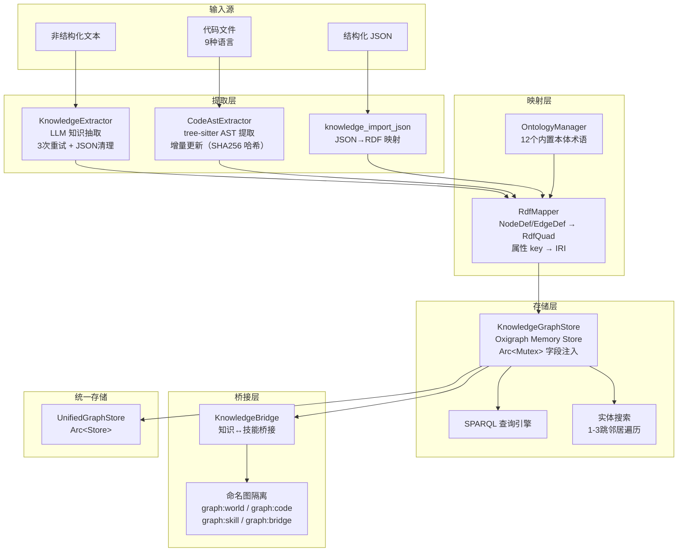
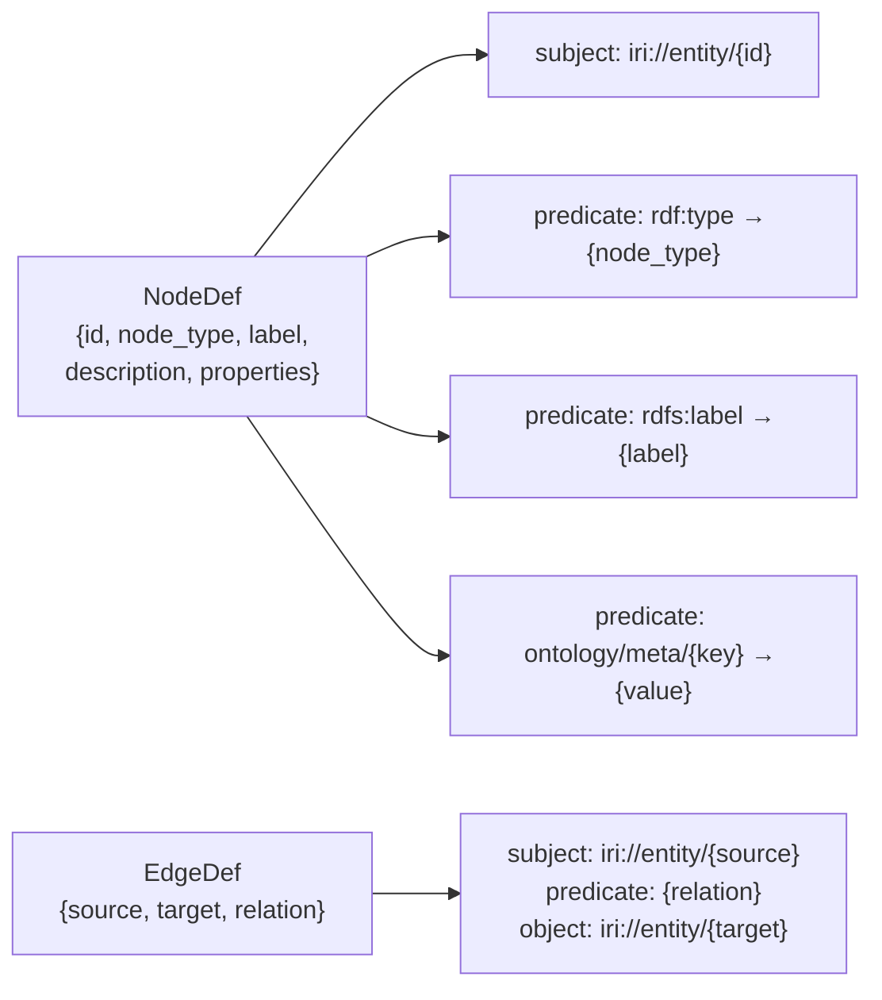
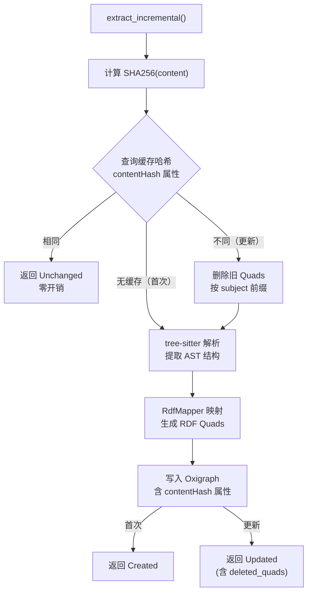

# 7. 知识图谱系统

> 基于 Oxigraph RDF 存储的知识图谱引擎，支持 LLM 知识抽取、代码 AST 提取、SPARQL 查询和知识桥接

## 模块架构



## 核心组件

### KnowledgeGraphStore — 图谱存储

基于 Oxigraph Memory Store 的 RDF 图存储，通过 `Arc<Mutex>` 字段注入消除了全局静态依赖。

```rust
pub struct KnowledgeGraphStore {
    store: Store,              // Oxigraph 内存存储
    default_graph: String,     // 默认命名图 "graph:world"
}
```

**核心方法**：

| 方法 | 说明 |
|------|------|
| `write_quads(quads, graph)` | 批量写入 RDF Quads（SPARQL INSERT） |
| `delete_quads_for_source(source, graph)` | 按文件来源删除关联 Quads |
| `delete_quads_by_subject_prefix(prefix, graph)` | 按 subject IRI 前缀批量删除 |
| `query_sparql(sparql, named_graph)` | 执行 SPARQL SELECT 查询 |
| `search_entities(keyword, entity_type)` | 模糊搜索实体（大小写不敏感） |
| `get_neighbors(entity_id, depth)` | 1-3 跳邻居遍历 |

### RdfMapper — RDF 映射引擎

将内部类型映射为标准 RDF Quads：



**属性 key IRI 转换规则**：
- 含 `/`、`#`、`:` 的 key → 直接使用（已是完整 IRI）
- 其他 key → 自动加前缀 `https://agentos.ontology/meta/`
- 例如：`contentHash` → `https://agentos.ontology/meta/contentHash`

### CodeAstExtractor — 代码 AST 提取

基于 tree-sitter 的代码结构提取，支持 9 种编程语言：

| 语言 | 提取实体 | 提取关系 |
|------|----------|----------|
| Rust | fn/struct/enum/trait/impl/use | calls/implements |
| Python | def/class/import | calls/inherits |
| JS/TS/TSX | function/class/method/import/interface/type | calls/inherits |
| Go | func/method/type/import | calls |
| Java | class/interface/method/import | calls/inherits/implements |
| C/C++ | function/class/struct/include | calls |

**增量更新机制**（三层策略）：



| 层级 | 策略 | 开销 |
|------|------|------|
| L1 哈希跳过 | SHA256 不变 → 完全跳过 | 零 |
| L2 文件级替换 | 按 subject 前缀删除 + 重写 | 低 |
| L3 tree-sitter 增量 | 传入 old_tree 加速解析 | 极低 |

```rust
pub enum IncrementalResult {
    Unchanged,
    Created { entity_count: usize, relation_count: usize, quad_count: usize },
    Updated { entity_count: usize, relation_count: usize, quad_count: usize, deleted_quads: usize },
}
```

### KnowledgeExtractor — LLM 知识抽取

通过 LLM API 从非结构化文本中抽取实体和关系：

- **3 次重试机制**：LLM 偶发不返回有效 JSON
- **JSON 清理**：去除 markdown 代码块标记、截断过长响应
- **JSON Schema 校验**：验证抽取结果格式
- **领域过滤**：可选 domain 参数限定抽取范围

### OntologyManager — 本体管理

12 个内置本体术语：

| 类型 | IRI | 标签 |
|------|-----|------|
| Class | `ontology:Person` | 人物 |
| Class | `ontology:Organization` | 组织 |
| Class | `ontology:Concept` | 概念 |
| Class | `ontology:Event` | 事件 |
| Class | `ontology:Product` | 产品 |
| Class | `ontology:Project` | 项目 |
| Property | `ontology:worksFor` | 任职于 |
| Property | `ontology:manages` | 管理 |
| Property | `ontology:dependsOn` | 依赖于 |
| Property | `ontology:hasSkill` | 具有技能 |
| Property | `ontology:applicableIn` | 适用于 |
| Property | `ontology:bridge/hasSkill` | 桥接：拥有技能 |
| Property | `ontology:bridge/applicableIn` | 桥接：适用于 |
| Property | `ontology:bridge/relatedTo` | 桥接：相关 |

### KnowledgeBridge — 知识桥接

管理知识图谱实体与技能之间的桥接关系：

| 关系类型 | IRI | 说明 |
|---------|-----|------|
| HasSkill | `ontology:bridge/hasSkill` | 实体拥有某技能 |
| ApplicableIn | `ontology:bridge/applicableIn` | 实体适用于某场景 |
| RelatedTo | `ontology:bridge/relatedTo` | 实体与技能相关 |

## 命名图隔离策略

| 命名图 | 用途 | 写入来源 |
|--------|------|----------|
| `graph:world` | 通用知识（LLM 抽取） | `knowledge_extract` |
| `graph:code` | 代码结构知识 | `knowledge_extract_code` |
| `graph:skill` | 技能图谱 | `SkillGraphStore` |
| `graph:ontology` | 本体定义 | `ontology_register` |
| `graph:bridge` | 知识-技能桥接 | `knowledge_bridge` |

## 注册的工具

| 工具名 | 说明 | PA 可用 |
|--------|------|---------|
| `knowledge_extract` | LLM 从文本抽取实体和关系 | ✅ |
| `knowledge_query` | SPARQL SELECT 查询 | ✅ |
| `kg_search` | 模糊搜索实体 | ✅ |
| `knowledge_neighbors` | 1-3 跳邻居遍历 | ✅ |
| `knowledge_import_json` | JSON 数据映射为图谱节点 | ❌ |
| `ontology_register` | 注册自定义本体术语 | ❌ |
| `knowledge_bridge` | 创建知识-技能桥接 | ❌ |
| `knowledge_extract_code` | tree-sitter 代码 AST 提取（增量） | ✅ |

## 关键设计决策

1. **OnceCell → Arc\<Mutex\> 字段注入**：`KnowledgeGraphStore` 不再使用全局静态 `OnceCell`，而是作为 `ToolExecutor` 的字段通过 `Arc<Mutex>` 共享

2. **ToolFn 异步闭包化**：工具处理器从同步函数指针改为 `Arc<dyn Fn(Value) -> Pin<Box<dyn Future<...>>>>`，支持异步操作和闭包捕获

3. **属性 key IRI 规范化**：所有属性 key 自动转换为完整 IRI，确保 SPARQL 语法合法性

4. **增量更新而非全量替换**：代码文件变化时，先删除旧 Quads 再写入新 Quads，SHA256 哈希跳过不变文件

5. **UnifiedGraphStore 共享**：支持通过 `UnifiedGraphStore` 共享底层 Oxigraph Store，各模块通过命名图隔离
