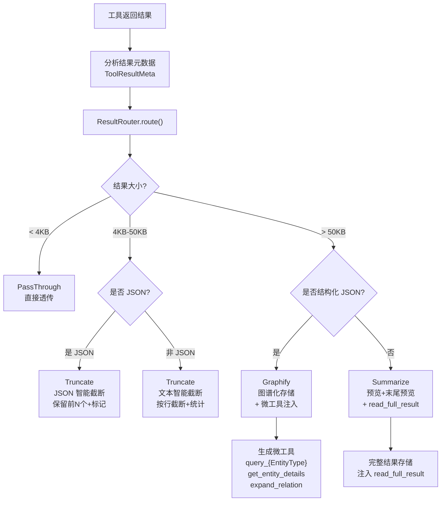
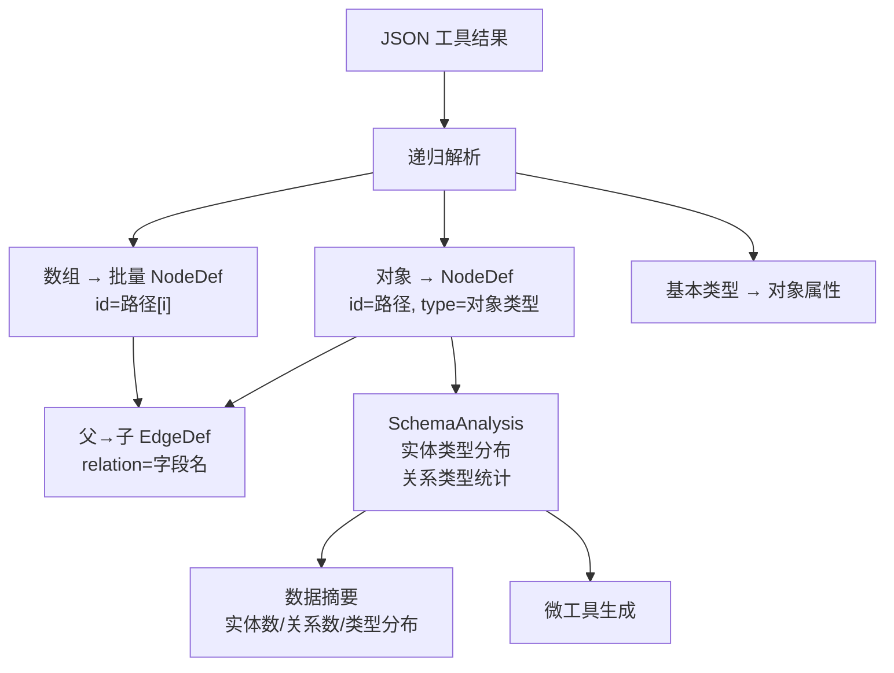
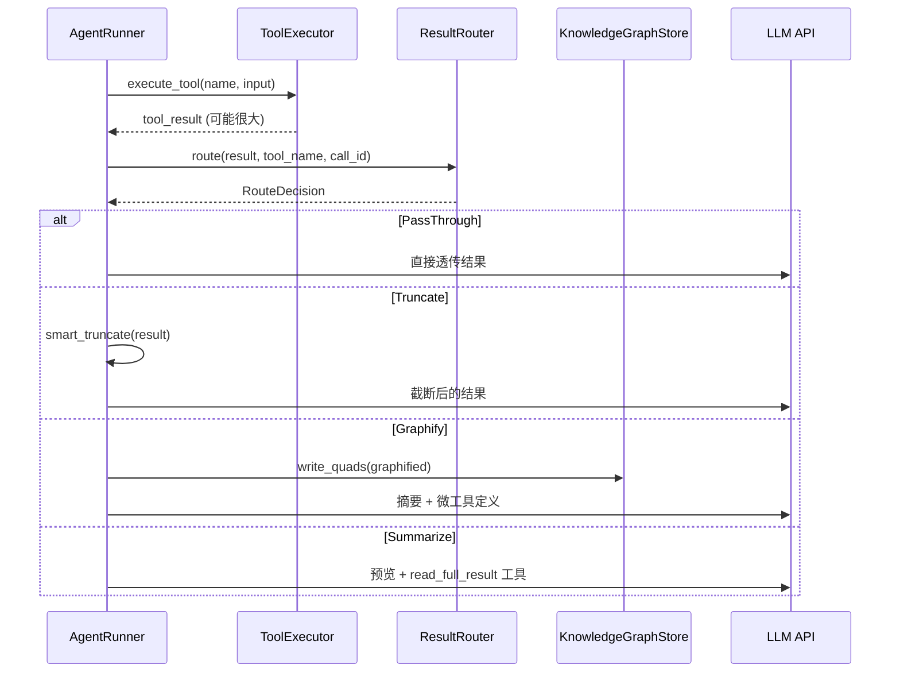

# 8. 工具结果智能路由

> 当工具返回大结果时，自动选择最优处理策略，避免 Token 浪费

## 问题背景

LLM Agent 执行工具调用时，工具可能返回大量数据（如目录列表、搜索结果、代码文件内容）。直接将大结果塞入 LLM 上下文会导致：
- Token 消耗剧增
- 关键信息被淹没
- API 调用可能超限

## 路由决策流程



## 核心组件

### ResultRouter — 路由决策引擎

```rust
pub struct ResultRouter {
    settings: ToolResultRouterSettings,
}

pub enum RouteDecision {
    PassThrough,
    Truncate { max_chars: usize },
    Graphify { call_id: String, graph_name: String },
    Summarize { call_id: String, preview_size: usize },
}
```

### ToolResultRouterSettings

**配置文件**: `config.yaml` 中 `tool_result_router` 段

```yaml
tool_result_router:
  enabled: true
  threshold_small: 2048          # 小结果阈值（字节），小于此值直接透传
  threshold_large: 8192          # 大结果阈值（字节），超过此值考虑图谱化
  preview_size: 2000             # 摘要预览大小
  max_graph_entities: 500        # 图谱化最大实体数
  max_micro_tools: 5             # 最大微工具数
  sparql_query_timeout_ms: 100   # SPARQL 查询超时
  auto_cleanup: true             # 自动清理过期图谱
```

| 参数 | 默认值 | 说明 |
|------|--------|------|
| `threshold_small` | 2048 | 透传阈值（字节） |
| `threshold_large` | 8192 | 截断/图谱化阈值（字节） |
| `preview_size` | 2000 | 摘要预览大小 |
| `max_graph_entities` | 500 | 图谱化最大实体数 |
| `max_micro_tools` | 5 | 最大微工具数 |

### 智能截断策略

**JSON 截断**（`smart_truncate_json`）：
- 识别 JSON 数组 → 保留前 N 个元素 + `[截断: 共 M 个, 保留 N 个]`
- 识别 JSON 对象 → 保留前 N 个 key + 截断标记
- 非 JSON → 退回文本截断

**文本截断**（`smart_truncate_text`）：
- 按行截断，保留完整行
- 统计总行数和保留行数
- UTF-8 字符边界安全处理

### GraphifyEngine — 图谱化引擎

将 JSON 工具结果递归解析为知识图谱节点：



**SchemaAnalysis** 输出：
- `entity_types: Vec<(String, usize)>` — 实体类型及计数
- `relation_types: Vec<String>` — 关系类型列表
- `total_entities / total_relations` — 总计

### MicroToolGenerator — 微工具生成

根据图谱化结果动态生成查询工具，注入 LLM 上下文：

| 微工具类型 | 名称模式 | 说明 |
|-----------|---------|------|
| EntityTypeQuery | `query_{EntityType}` | 按实体类型查询 |
| EntityDetails | `get_entity_details` | 获取实体详情 |
| RelationTraversal | `expand_relation` | 遍历关系 |
| FullTextRead | `read_full_result` | 读取完整存储结果 |

```rust
pub enum MicroToolType {
    EntityTypeQuery { entity_type: String, graph_name: String },
    EntityDetails { graph_name: String },
    RelationTraversal { graph_name: String },
    FullTextRead { storage_key: String },
}
```

## 集成到 AgentRunner

工具结果路由在 `AgentRunner.route_tool_result()` 中自动执行：



## UTF-8 安全处理

所有截断操作都确保在字符边界进行：

```rust
fn safe_slice(s: &str, max_len: usize) -> &str {
    if max_len >= s.len() { return s; }
    let mut end = max_len;
    while end > 0 && !s.is_char_boundary(end) {
        end -= 1;
    }
    &s[..end]
}
```
