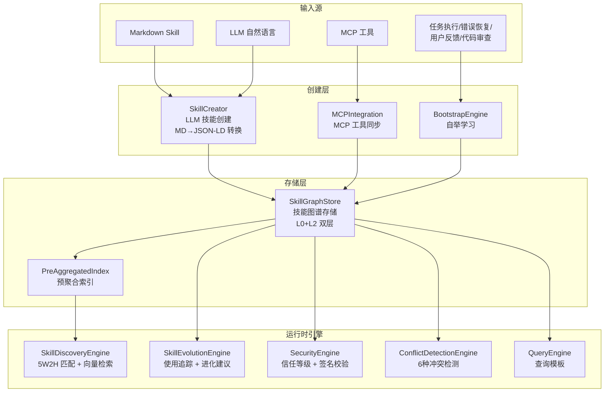
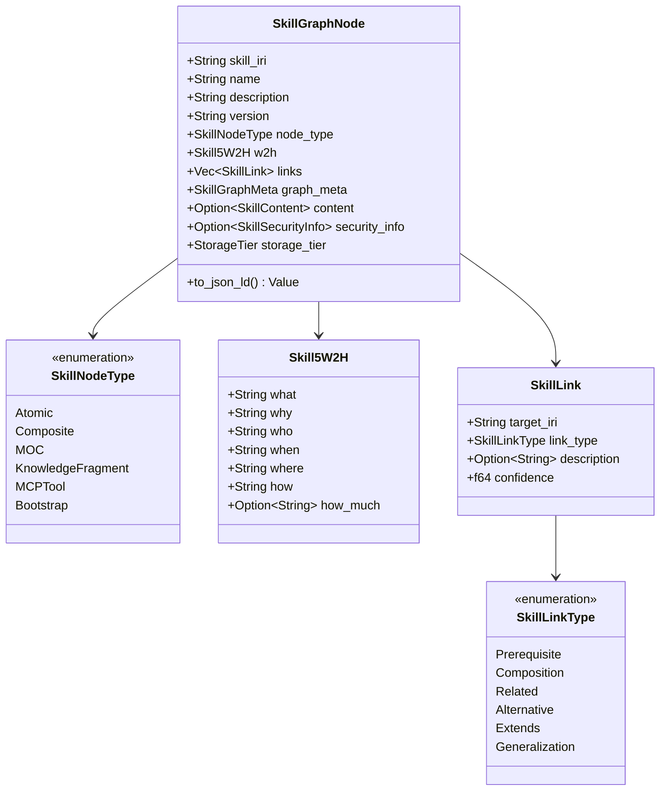
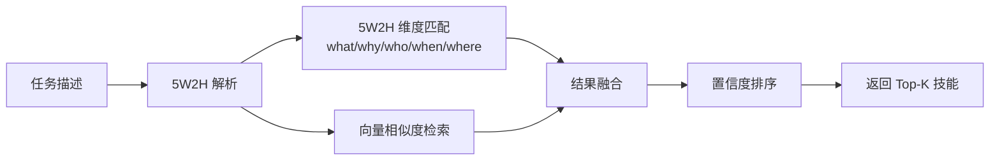
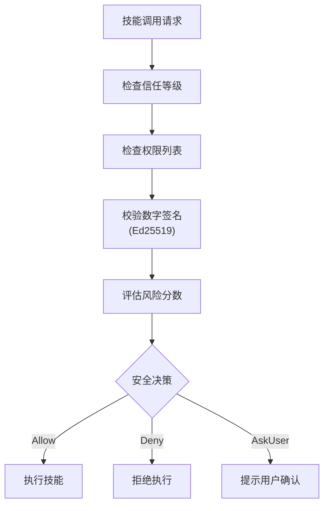
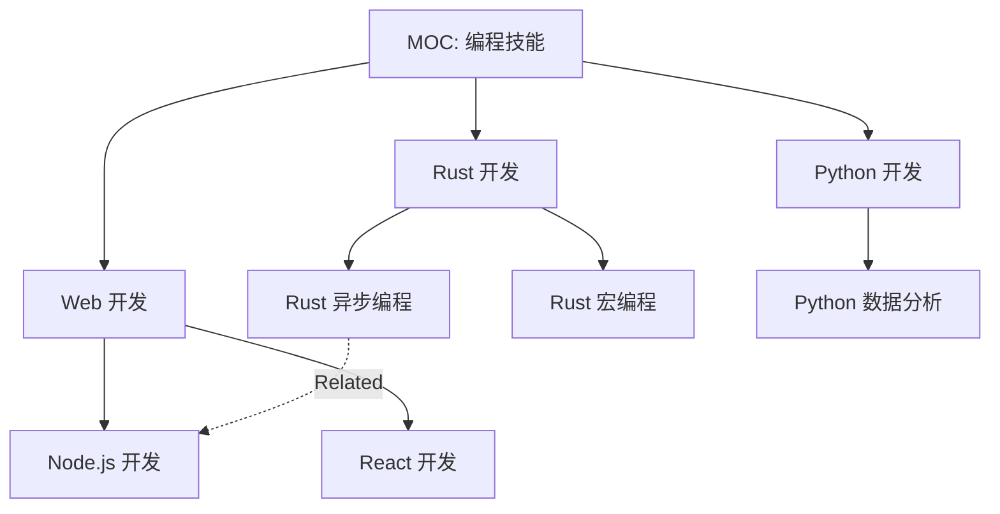
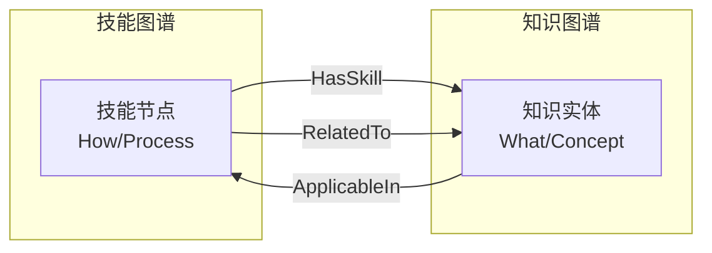

# 9. 技能图谱系统

> 基于 JSON-LD 的技能知识图谱，支持 5W2H 描述、技能发现、进化、冲突检测和自举学习

## 模块架构

**源文件目录**: `src/skill_graph/`（12 个模块）

## 模块文件清单

| 文件 | 组件 | 说明 |
|------|------|------|
| `types.rs` | SkillGraphNode, SkillNodeType, SkillLink, Skill5W2H | 核心类型定义 |
| `graph_store.rs` | SkillGraphStore | 技能图谱存储（L0 + L2） |
| `index.rs` | PreAggregatedIndex | 预聚合索引 |
| `discovery.rs` | SkillDiscoveryEngine | 5W2H 技能发现引擎 |
| `evolution.rs` | SkillEvolutionEngine | 技能进化引擎 |
| `conflict.rs` | ConflictDetectionEngine | 冲突检测引擎 |
| `security.rs` | SecurityEngine | 安全引擎 |
| `skill_creator.rs` | SkillCreator | LLM 技能创建 |
| `bootstrap.rs` | BootstrapEngine | 自举学习 |
| `mcp_integration.rs` | MCPIntegration | MCP 工具同步 |
| `query_templates.rs` | QueryEngine | 查询模板 |

## 核心类型

### SkillGraphNode — 技能节点

### 存储层级

| 层级 | 类型 | 说明 |
|------|------|------|
| `L0Permanent` | sled | 永久存储，核心技能 |
| `L1Session` | 内存 | 会话级临时技能 |
| `L2Blackboard` | Oxigraph | 共享黑板，跨 Agent 可见 |
| `L3Projection` | SPARQL | 按需投影 |

## 引擎详解

### SkillDiscoveryEngine — 技能发现

基于 5W2H 维度匹配和向量检索的技能发现：

**文件**: `src/skill_graph/discovery.rs`

### SkillEvolutionEngine — 技能进化

追踪技能使用情况，生成进化建议：

**文件**: `src/skill_graph/evolution.rs`

| 进化建议类型 | 说明 |
|-------------|------|
| `AddLink` | 添加新的技能关联 |
| `UpdateSuccessRate` | 更新成功率 |
| `CreateFragment` | 创建知识碎片 |
| `Deprecate` | 标记废弃 |
| `Merge` | 合并相似技能 |
| `Split` | 拆分过大的技能 |

### ConflictDetectionEngine — 冲突检测

**文件**: `src/skill_graph/conflict.rs`

6 种冲突类型：

| 冲突类型 | 说明 |
|---------|------|
| `Resource` | 资源竞争冲突 |
| `Dependency` | 依赖版本冲突 |
| `Permission` | 权限冲突 |
| `Semantic` | 语义定义冲突 |
| `Temporal` | 时序冲突 |
| `Version` | 版本冲突 |

### SecurityEngine — 安全引擎

**文件**: `src/skill_graph/security.rs`

### SkillCreator — LLM 技能创建

**文件**: `src/skill_graph/skill_creator.rs`

支持两种创建模式：

1. **自然语言创建**：用户描述需求 → LLM 生成 JSON-LD Skill 定义
2. **Markdown 转换**：读取 skill.md → LLM 转换为 JSON-LD 格式

### BootstrapEngine — 自举学习

**文件**: `src/skill_graph/bootstrap.rs`

从运行时经验中自动学习新技能：

| 学习来源 | 说明 |
|---------|------|
| 任务执行 | 成功执行的任务模式 |
| 错误恢复 | 修复错误的策略 |
| 用户反馈 | 用户显式指导 |
| 代码审查 | 代码改进建议 |
| 知识抽取 | 从文档中提取 |

**操作类型**：
- `Learn` — 创建新技能或增强现有技能
- `Reduce` — 简化过于复杂的技能

### MCPIntegration — MCP 工具同步

**文件**: `src/skill_graph/mcp_integration.rs`

将 MCP 工具自动同步为技能图谱中的技能节点。

## MOC 导航

MOC（Map of Content）节点作为技能图谱的导航入口：

## 与知识图谱的关系

技能图谱和知识图谱是互补的双层架构：

| 维度 | 技能图谱 | 知识图谱 |
|------|---------|---------|
| 存储 | L0 sled + L2 Oxigraph | Oxigraph Memory（`Arc<Mutex>`） |
| 命名图 | `graph:skill` | `graph:world` / `graph:code` |
| 描述 | 5W2H 结构化 | RDF Quads |
| 发现 | 5W2H 匹配 + 向量检索 | SPARQL + 模糊搜索 |
| 进化 | 使用追踪 + 进化建议 | 增量更新（SHA256） |
