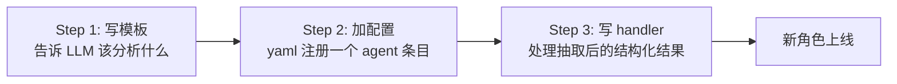
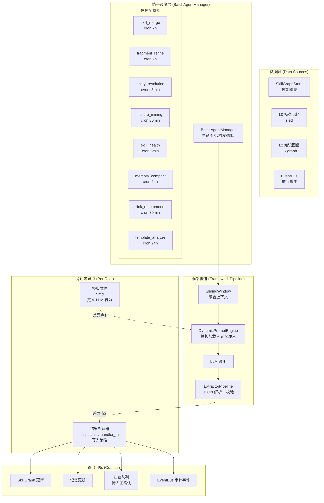
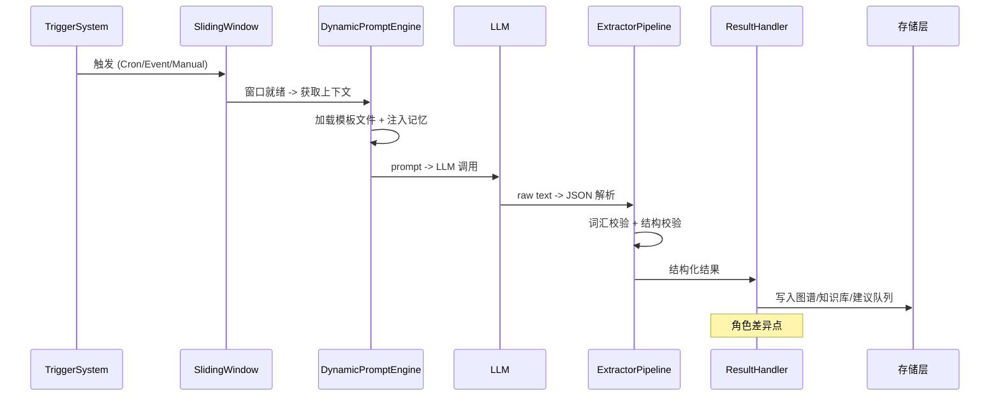

# Batch Agent 后台智能整理系统设计

> 利用 LLM 能力对技能图谱、知识记忆、执行痕迹进行后台批量整理，持续提升系统智能性

## 1. 设计目标与核心理念

### 现状

Gliding Horse Agent OS 已有：

- **技能图谱**：7,500+ LOC 动态语义网络，6 类链接类型，Learn/Reduce 自举学习，冲突检测
- **五层记忆**：MESI 一致性协议的 L0→L3 层次化存储
- **执行引擎**：PDCA 循环 + 10 类感知触发器
- **Batch Agent 框架**：滑动窗口 + 模板引擎 + 抽取管道 + 知识持久化（Phase 1-5 已完成）

### 缺口

LLM 的后台整理能力未被充分利用。技能合并/拆分/质量评估、知识碎片提炼、跨会话记忆整合、失败模式挖掘等场景仍依赖简单规则或人工确认。

### 核心理念：模板即角色

**不同"角色"不是不同的代码实现。** 8 个整理角色全部是同一个 `BatchAgentManager` 的配置实例。角色间的唯一差异是：

```
角色 = 1 个配置文件条目 + 1 个模板文件 + 1 个结果处理器函数
         ↑ 框架配置          ↑ 行为定义(LLM)     ↑ 结果写入逻辑
```

框架复用关系：

| 组件 | 复用方式 |
|------|----------|
| `BatchAgentManager` | 全复用 — 管理所有角色的注册/启动/停止 |
| `SlidingWindow` | 全复用 — 每个角色独立实例，参数不同 |
| `TriggerSystem` | 全复用 — Cron/EventCount/Manual，配置不同 |
| `DynamicPromptEngine` | 全复用 — 根据 template_name 加载对应模板 |
| `ExtractorPipeline` | 全复用 — LLM 调用 + JSON 解析 |
| `OutputValidator` | 全复用 — 词汇表校验 |
| `ContextCollector` | 全复用 — 记忆注入 |
| **模板文件 (Template)** | **角色差异点 #1** — 定义 LLM 在什么角色下分析什么 |
| **结果处理器 (Handler)** | **角色差异点 #2** — 抽取结果如何写入图谱/知识库 |

### 扩展一个新角色：只需 3 步



无需改框架代码、无需加模块、无需重新编译。

---

## 2. 整体架构



### 2.1 调度策略

| 周期 | 角色 | 触发方式 | 数据量级 |
|------|------|----------|----------|
| 5min | SkillHealthAgent | Cron | O(50) 技能 |
| 5min | EntityResolutionAgent | Cron | O(100) 实体 |
| 30min | FailureMineAgent | EventCount | O(50) 失败记录 |
| 30min | LinkRecommendAgent | Cron | O(200) 技能对 |
| 2h | SkillMergeAgent | Conflict 事件 | O(10) 冲突对 |
| 2h | FragmentRefineAgent | Cron | O(20) 碎片 |
| 24h | MemoryCompactAgent | Cron | O(1000) L0 条目 |
| 24h | TemplateAnalyzeAgent | Cron | O(100) 模板调用 |

```mermaid
gantt
    title Batch Agent 整理周期调度
    dateFormat  HH:mm
    axisFormat  %H:%M
    
    section 高频 (每 5 分钟)
    技能健康巡检           :active, a1, 00:00, 5min
    实体解析               :a2, 00:05, 5min
    
    section 中频 (每 30 分钟)
    失败模式挖掘           :b1, 00:00, 30min
    链路推荐               :b2, 00:30, 30min
    
    section 低频 (每 2 小时)
    技能合并评估           :c1, 00:00, 120min
    知识碎片提炼           :c2, 00:00, 120min
    
    section 每日 (每 24 小时)
    记忆整合压缩           :d1, 00:00, 24h
    模板效果分析           :d2, 00:00, 24h
```



### 2.2 统一的配置模板

所有 8 个角色共用相同的配置结构——**仅字段值不同**：

```yaml
batch_agents:
  - name: skill_merge_agent
    description: "分析语义相似的技能并建议合并"
    enabled: true
    window_type: Hybrid { max_messages: 20, max_seconds: 7200 }
    triggers:
      - trigger_type: Cron
        params: { expression: "0 */2 * * *" }
      - trigger_type: EventCount
        params: { event_type: "CONFLICT_DETECTED", threshold: 3 }
    # ↓ 这是角色差异点 #1 — 对应一个模板文件
    prompt_template_name: batch/skill_merge
    business_domain: "skill_graph_maintenance"
    entity_types:
      item_label: "技能"
      type_iri: "skill:Skill"
    relation_types:
      item_label: "合并建议"
      type_iri: "skill:MergeSuggestion"
      default_confidence: 0.6
    inject_user_reminders: true
    inject_context_summary: true
    inject_related_entities: true

  - name: failure_mine_agent
    description: "从执行事件中挖掘失败模式"
    triggers:
      - trigger_type: Cron
        params: { expression: "*/30 * * * *" }
    # ↓ 不同的角色 = 不同的模板
    prompt_template_name: batch/failure_mining
    business_domain: "failure_analysis"
    # ... 其他字段与上面结构相同，值不同
```

---

## 3. 统一执行流程

每个角色无论是什么"身份"，触发时都走完全相同的管道：



---

## 4. 八大角色

每个角色以下面的结构描述：

```
模板：    定义 LLM 行为（差异点 #1）
预过滤：  交给 LLM 前，代码先行过滤（减少 token 消耗）
输出：    模板要求 LLM 输出的 JSON 结构
结果处理器：解析 JSON 后执行的操作（差异点 #2）
```

### 4.1 技能合并专家 (SkillMergeAgent)

**模板**—定义 LLM 要分析的内容和输出格式：

```markdown
你是一个技能合并分析专家。分析以下两个技能的相似度并给出合并建议。

## 技能 A
- 名称: {{skill_a.name}}
- 描述: {{skill_a.description}}
- 5W2H: {{skill_a.w2h_json}}
- 标签: {{skill_a.tags}}
- 步骤数: {{skill_a.step_count}}
- 成功率: {{skill_a.success_rate}}
- 使用次数: {{skill_a.usage_count}}

## 技能 B（同上结构）

请输出 JSON:
{
  "should_merge": bool,
  "confidence": 0.0~1.0,
  "merge_strategy": "keep_both|replace_a_with_b|create_composite|deprecate_b",
  "composite_name": "合并后的名称",
  "composite_description": "合并描述",
  "reasoning": "分析理由"
}
```

**预过滤**：只处理 `ConflictDetectionEngine` 标记为 `SemanticDuplicate` 且相似度 > 0.7 的技能对。

**结果处理器**（差异点 #2）：

```
confidence > 0.85:
  merge_strategy == "create_composite" → SkillGraphStore::create_composite_skill()
  merge_strategy == "replace_a_with_b" → SkillGraphStore::update_skill()
  merge_strategy == "deprecate_b"      → SkillGraphStore::deprecate_skill()
  → emit(BATCH_SKILL_MERGE_APPLIED)

0.6 ~ 0.85: 写入建议队列（待人工确认）
< 0.6:      丢弃
```

### 4.2 知识碎片提炼 (FragmentRefineAgent)

**模板**—目标：将原始失败模式提炼为结构化解决方案：

```markdown
你是一个知识提炼专家。将以下原始失败模式提炼为可重用的知识。

原始问题: {{problem}}
原始建议: {{recommendation}}
发现者: {{discoverer}}
关联技能: {{attached_skill}}

请输出 JSON:
{
  "refined_problem": "精炼后的问题描述",
  "root_cause": "根本原因分析",
  "generalized_pattern": "泛化的适用场景",
  "solution_steps": ["步骤1", "步骤2"],
  "related_skills": ["iri://skills/..."],
  "confidence": 0.0~1.0,
  "requires_human_review": bool
}
```

**预过滤**：只处理最近 24h 内的新碎片，排除已有 generalized_pattern 的。

**结果处理器**：

```
confidence > 0.85 && !requires_human_review:
  → 写入 L2 知识图谱 + 建立 Related 链接
otherwise:
  → 写入建议队列
```

### 4.3 实体解析/合并 (EntityResolutionAgent)

**预过滤**（纯代码，减少 LLM 调用）：

```rust
fn get_candidates(new: &ExtractedEntity) -> Vec<Entity> {
    // SPARQL: 按 label 模糊匹配
    // string_similarity Jaccard 过滤 > 0.3
    // 最多返回 5 个候选
}
```

**模板**—判断两个实体是否同一真实世界对象：

```markdown
实体 A: {{entity_a.label}} ({{entity_a.description}})
实体 B: {{entity_b.label}} ({{entity_b.description}})

请输出 JSON:
{
  "same_entity": bool,
  "confidence": 0.0~1.0,
  "target_iri": "确认的 IRI",
  "reasoning": "判断理由",
  "properties_to_merge": ["field1", "field2"]
}
```

**结果处理器**：

```
same_entity && confidence > 0.85: 写入 owl:sameAs → L2，emit 审计事件
same_entity && confidence ≤ 0.85: 写入 conflict 队列
!same_entity:                     跳过
```

### 4.4 失败模式挖掘 (FailureMineAgent)

**预过滤**：EventBus 拉取最近 24h 的 `TASK_FAILED` / `CYCLE_FAILED` 事件，按 error_code 分组统计。

**模板**—批量分析失败模式：

```markdown
过去 24 小时共检测到 {{total_failures}} 次失败，分组如下：
{{#each groups}}
- error: {{error_code}}, 次数: {{count}}, 占比: {{percentage}}%
{{/each}}

请输出 JSON:
{
  "patterns": [
    {
      "error_signature": "错误签名",
      "frequency": 数值,
      "trend": "increasing|stable|decreasing",
      "root_cause": "根因",
      "suggested_action": "建议措施",
      "affected_skills": ["skill_iri"],
      "confidence": 0.0~1.0
    }
  ],
  "summary": "总结"
}
```

**结果处理器**：

```
每个 pattern:
  → 不存在相同签名碎片且 confidence > 0.7 → create_fragment()
  → 高频模式（top 20%）→ 同时生成 AdvisoryNode
```

### 4.5 技能健康巡检 (SkillHealthAgent)

**预过滤**：`SkillEvolutionEngine::analyze_skill_health()` 筛选健康度 < 0.6 的技能，再送 LLM。

**模板**：

```markdown
技能名称: {{skill.name}}
成功率: {{success_rate}} ({{usage_count}} 次)
已知失败模式: {{failure_modes}}
链接数: {{links_count}}

请输出 JSON:
{
  "health_grade": "A|B|C|D",
  "issues": ["问题1"],
  "suggested_actions": ["建议1"],
  "affected_skills": ["iri"],
  "priority": "low|medium|high"
}
```

**结果处理器**：

```
health_grade == "D": 写入建议队列（优先处理）
health_grade == "C" && priority == "high": 写入建议队列
otherwise: 记录审计日志
```

### 4.6 记忆整合压缩 (MemoryCompactAgent)

**分层策略**（大多数不需要 LLM）：

| 类型 | 处理方式 | LLM? |
|------|----------|------|
| `emphasis` 标签 | 保留高 importance | 否 |
| 过期会话 (>7天) | 摘要后删除 | 是 |
| `skill_graph` 条目 | 跳过（SkillGraph 管理） | 否 |
| 重复内容 (hash 相同) | 直接去重 | 否 |
| 低访问条目 | 评估是否保留 | 是 |

### 4.7 链路推荐 (LinkRecommendAgent)

**两阶段预过滤**：

```
阶段 1 (代码): suggest_links() 标签相似度 + UsageRecord 共现分析 → top-10 候选
阶段 2 (LLM):  评估阶段 1 候选的语义相关性
```

### 4.8 模板效果分析 (TemplateAnalyzeAgent)

**纯统计分析**，监听 `BATCH_EXTRACTION_COMPLETED` 事件聚合 KPI：

```yaml
template_name: batch/skill_merge
avg_confidence: 0.76
avg_parse_success: 0.92
failure_reasons: {"JSON parse error": 8, "Missing fields": 3}
```

结果 → 报告写入建议队列，供开发者参考优化模板。

---

## 5. 扩展一个新角色：3 步完整示例

> 假设需求：每周检查一次技能描述是否过时，自动建议更新。

### Step 1: 写模板文件

```markdown
# templates/prompts/batch/description_stale_check.md
你是一个技能维护专家。检查以下技能描述是否过时。

技能名称: {{skill.name}}
当前描述: {{skill.description}}
最近使用次数: {{usage_count}}
最后成功时间: {{last_success_time}}

请输出 JSON:
{
  "is_stale": bool,
  "confidence": 0.0~1.0,
  "suggested_update": "建议的新描述",
  "reasoning": "判断理由"
}
```

### Step 2: 加配置条目

```yaml
batch_agents:
  - name: description_stale_check_agent
    description: "检查技能描述是否过时"
    enabled: true
    triggers:
      - trigger_type: Cron
        params: { expression: "0 6 * * 1" }
    prompt_template_name: batch/description_stale_check
    business_domain: "skill_graph_maintenance"
```

### Step 3: 写结果处理器

```rust
// src/batch/handlers/mod.rs
fn dispatch_handler(agent_name: &str, result: Value) -> Result<(), BatchError> {
    match agent_name {
        "skill_merge_agent" => handle_skill_merge(result),
        "failure_mine_agent" => handle_failure_mine(result),
        // ... 已有 8 个角色
        
        "description_stale_check_agent" => {
            if result["is_stale"].as_bool()? && result["confidence"].as_f64()? > 0.8 {
                let iri = result["skill_iri"].as_str()?;
                let new_desc = result["suggested_update"].as_str()?;
                skill_graph_store.update_description(iri, new_desc)?;
            }
            Ok(())
        }
        _ => Ok(()),
    }
}
```

**完成。无需加模块、无需改编译、无需重启框架。**

---

## 6. 与现有系统的集成

### 6.1 EventBus 新事件类型

```rust
pub enum EventType {
    // ... 已有
    BatchSkillMergeSuggested,
    BatchSkillMergeApplied,
    BatchFragmentRefined,
    BatchEntityResolved,
    BatchEntityMergeConflict,
    BatchFailurePatternDetected,
    BatchHealthReportGenerated,
    BatchMemoryCompacted,
    BatchLinkRecommended,
    BatchLinkApplied,
    BatchTemplateAnalysisReady,
}
```

### 6.2 配置扩展

```yaml
batch:
  maintenance_agents:
    skill_merge:
      enabled: true
      schedule: "0 */2 * * *"
      min_confidence_auto_apply: 0.85
    fragment_refine:
      enabled: true
      schedule: "0 */2 * * *"
      batch_size: 50
    entity_resolution:
      enabled: true
      schedule: "*/5 * * * *"
      max_candidates: 5
    failure_mining:
      enabled: true
      schedule: "*/30 * * * *"
      lookback_hours: 24
    skill_health:
      enabled: true
      schedule: "*/5 * * * *"
      llm_analysis_threshold: 0.6
    memory_compact:
      enabled: true
      schedule: "0 3 * * *"
      max_items_per_run: 500
    link_recommend:
      enabled: true
      schedule: "*/30 * * * *"
      max_suggestions_per_run: 20
    template_analyze:
      enabled: true
      schedule: "0 4 * * *"
      lookback_hours: 168
```

### 6.3 SkillGraphStore 新增接口

```rust
// 所有角色共享的扩展接口
impl SkillGraphStore {
    pub fn bulk_read_skills(&self, iris: &[&str]) -> Vec<SkillGraphNode>;
    pub fn create_composite_skill(&self, name: &str, children: &[String]) -> Result<...>;
    pub fn deprecate_skill(&self, iri: &str, reason: &str) -> Result<(), BatchError>;
    pub fn batch_add_links(&self, links: &[BulkLinkInput]) -> Result<usize, BatchError>;
}
```

---

## 7. 风险与缓解

| 风险 | 缓解 |
|------|------|
| LLM 调用延迟导致后台堆积 | 所有调用设 30s 超时 + 重试队列，单次最多 50 次 LLM 调用 |
| 自动合并误引入错误 | 仅 confidence > 0.85 自动应用，其余进建议队列 |
| L0 压缩误删记忆 | 先标记删除，观察 7 天后再物理删除 |
| 角色间重复处理 | 基于 content_hash + 60s 窗口去重 |
| LLM token 费用激增 | 预过滤（代码先筛掉 80% 不需要 LLM 的场景）+ 调度频控 |
