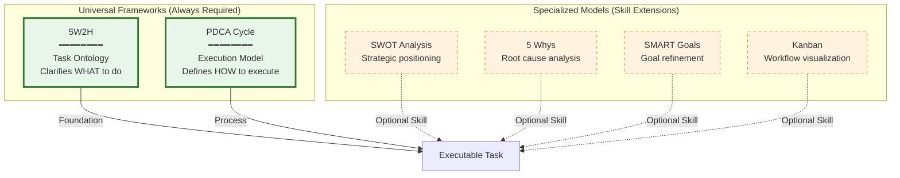
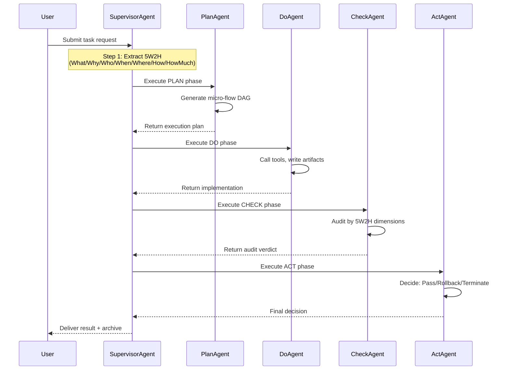
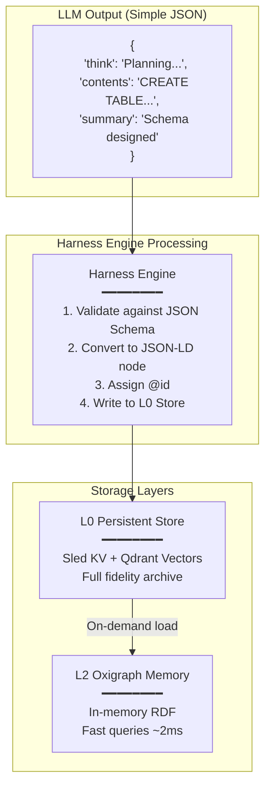
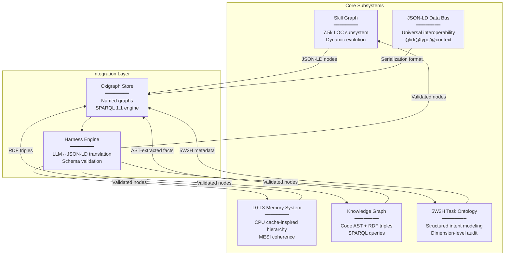
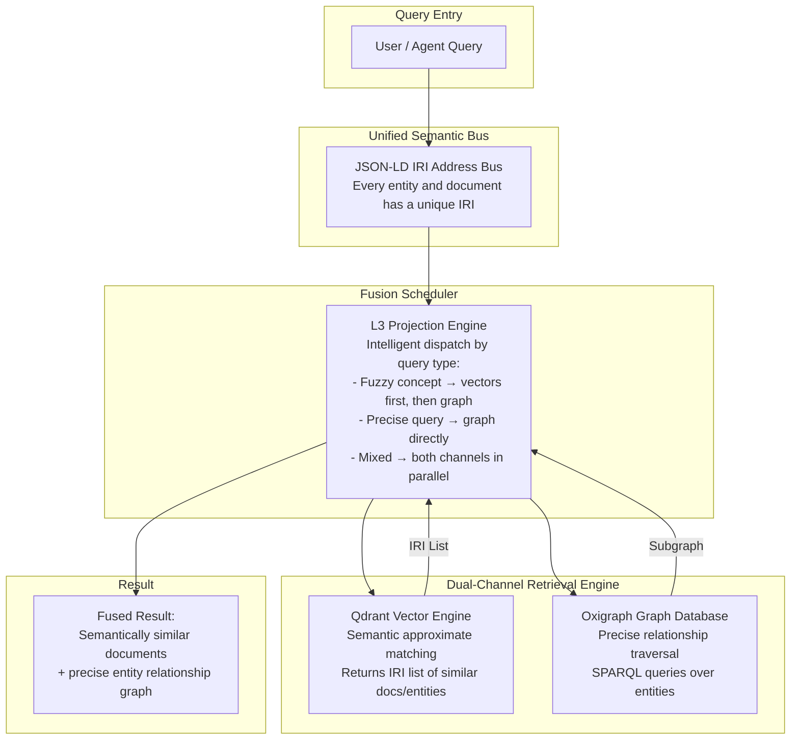

# Core Design Philosophy: 5W2H, JSON-LD & Universal Knowledge Graph

## Document Purpose

This document provides in-depth explanations of three foundational design decisions in Gliding Horse Agent OS that complement the main README.md. These concepts are critical to understanding why the system is architected the way it is.

---

## 1. Why 5W2H + PDCA: The Universal Frameworks for All Executable Work

### 1.1 Two Pillars of Structured Execution

Gliding Horse Agent OS is built on **two universal frameworks** that are essential for handling any task:

1. **5W2H (What, Why, Who, When, Where, How, How Much)** - The **Task Ontology**
   - Answers: "What exactly needs to be done?"
   - Purpose: Clarifies intent, constraints, and success criteria
   - Timing: Applied at **task initialization** phase

2. **PDCA Cycle (Plan-Do-Check-Act)** - The **Execution Model**
   - Answers: "How do we systematically execute and improve?"
   - Purpose: Provides iterative execution with continuous feedback
   - Timing: Applied throughout **task lifecycle**



**Why Both Are Irreplaceable:**

```
Any Executable Task = 5W2H (Intent Clarity) + PDCA (Systematic Execution)
```

| Framework | Role | Without It... |
|-----------|------|---------------|
| **5W2H** | Defines **WHAT** needs to be done | Ambiguous goals → misaligned expectations |
| **PDCA** | Defines **HOW** to execute iteratively | Chaotic implementation → no quality control |

**The Complete Workflow:**



### 1.2 5W2H: The Task Ontology

5W2H captures the complete essence of any executable work. If you cannot clearly articulate all 7 dimensions, the task is **inherently unexecutable**.

**Why 5W2H is Irreplaceable:**

| Dimension | Question It Answers | Consequence if Missing |
|-----------|-------------------|----------------------|
| **What** | What needs to be done? | No clear objective → aimless execution |
| **Why** | Why is this important? | No motivation/priority → low engagement |
| **Who** | Who is responsible? | Accountability gap → nobody owns it |
| **When** | When must it be completed? | No deadline → perpetual procrastination |
| **Where** | Where does it happen? | Context ambiguity → wrong environment |
| **How** | How will it be executed? | No method → chaotic implementation |
| **How Much** | What resources are available? | Budget overrun → project failure |

Ambiguity in any dimension leads to:
- Misaligned expectations between stakeholders
- Resource misallocation (time, budget, personnel)
- Inability to measure success or failure
- Failed audits and accountability gaps

### 1.3 PDCA: The Generalized Execution Model

Unlike traditional management PDCA, Gliding Horse implements a **generalized computational PDCA** that adapts to task complexity:

**Seven Complexity Levels:**

| Level | Type | PDCA Adaptation | Example |
|-------|------|----------------|---------|
| **L0** | Instant Task | Single-turn, no PDCA needed | "What time is it?" |
| **L1** | Simple Task | Single PDCA cycle | "Write a Python script" |
| **L2** | Standard Task | Full PDCA with structured audit | "Analyze Q2 sales data" |
| **L3** | Complex Project | Multi-agent parallel Do phase | "Build REST API + tests" |
| **L4** | Exploratory Task | Parallel DAs with divergent strategies | "Research optimal tech stack" |
| **L5** | Recursive Task | Subtasks spawn child PDCA cycles | "Refactor entire codebase" |
| **L6** | Emergency Mode | Skip Plan, immediate Do-Check loop | "Fix production bug NOW" |

**Key Innovation**: The Supervisor Agent dynamically selects the appropriate PDCA mode based on **5W2H metadata analysis**, not rigid templates. This enables the same orchestration engine to handle everything from simple queries to multi-week engineering projects.

### 1.4 Specialized Models as Skill Extensions

In Gliding Horse Agent OS, specialized models like SWOT, 5 Whys, or SMART are implemented as **reusable Skills** within the Skill Graph system. They are invoked when the 5W2H metadata indicates their applicability:

```json
{
  "task:5W2H": {
    "what": "Analyze market competition",
    "why": "Identify strategic positioning opportunities",
    "how": {
      "preferredSkills": ["skill:swot-analysis", "skill:porter-five-forces"]
    }
  }
}
```

This design ensures:
1. **Consistency**: Every task has the same structural foundation (5W2H + PDCA)
2. **Extensibility**: Specialized analysis methods are pluggable skills
3. **Auditability**: Each dimension can be independently verified by CA
4. **Pattern Recognition**: Historical tasks with similar 5W2H profiles trigger relevant skill recommendations

---

## 2. JSON-LD Simplified Usage: Bridging LLM and Knowledge Graph

### 2.1 The Challenge

LLMs are not proficient at generating complex JSON-LD structures. They excel at producing natural language and simple JSON objects. However, the system requires JSON-LD for:
- Global entity identity (`@id`)
- Semantic typing (`@type`)
- Field name normalization (`@context`)
- Depth control for token budgets

### 2.2 Our Solution: Hybrid Approach with Harness Engine

We use a **translation layer** (Harness Engine) that converts simple LLM outputs into JSON-LD nodes:



### 2.3 LLM Response Structure (Optimized for Storage Efficiency)

```json
{
  "think": "Analyzing user request for database schema design...",
  "contents": "CREATE TABLE users (id UUID PRIMARY KEY, email VARCHAR(255) UNIQUE NOT NULL);",
  "summary": "Database schema for user table with UUID primary key and unique email constraint"
}
```

**Why This Three-Field Structure?**

| Field | Purpose | Storage Strategy | Retrieval Pattern |
|-------|---------|-----------------|-------------------|
| **think** | Chain-of-thought reasoning | Archived to L0 | Debugging / traceability |
| **contents** | Full detailed output | Archived to L0 | Page fault resolution |
| **summary** | Concise abstract | Indexed in L2 | Quick context overview |

**Storage and Retrieval Mechanism:**

```
Step 1: LLM produces think/contents/summary
  → All three fields archived to L0 with @id: "memory:session-001/block-042"
  → summary also indexed in L2 for quick access

Step 2: Agent needs context for next turn
  → L2 returns summary (~50 tokens) for lightweight context
  → L1 context window stays small

Step 3: User asks for details ("Show me the full SQL")
  → System detects need for full content
  → Triggers "page fault": loads contents from L0 via IRI reference
  → Returns complete SQL statement

Result: L1/L2 stay lean, full fidelity preserved in L0, on-demand loading via IRI
```

**Analogy to CPU Virtual Memory:**

| Concept | CPU Architecture | Gliding Horse Memory |
|---------|-----------------|---------------------|
| Working Set | RAM (fast, limited) | L2 Oxigraph (fast, ~2ms) |
| Page Table | Virtual→Physical mapping | IRI references |
| Page Fault | Disk → RAM load | L0 → L2 load |
| Swap Space | Disk storage | L0 Sled + Qdrant |

This design achieves:
- ✅ **Performance**: L2 in-memory queries at ~2ms latency
- ✅ **Scalability**: L0 disk-backed storage with unlimited capacity
- ✅ **Token Economy**: Summary-based L1/L2 context keeps token usage minimal
- ✅ **Traceability**: Full think/contents preserved in L0 for debugging
- ✅ **Interoperability**: JSON-LD enables cross-agent data sharing

### 2.4 Harness Engine's Role

The Harness engine acts as the **translation layer** between:
- **LLM's comfort zone**: Simple JSON with think/contents/summary
- **System's requirements**: JSON-LD with @id, @type, @context for interoperability

Processing pipeline:
```rust
// Pseudo-code illustrating the transformation
let llm_output = llm_client.generate(prompt).await?; // Returns simple JSON

// Step 1: Validate against JSON Schema
validation_engine.validate(&llm_output.contents, &skill.input_schema)?;

// Step 2: Convert to JSON-LD node
let jsonld_node = json!({
    "@id": format!("memory:{}/block-{}", session_id, block_counter),
    "@type": ["mem:MemoryBlock", "exec:TaskResult"],
    "mem:think": llm_output.think,
    "mem:contents": llm_output.contents,
    "mem:summary": llm_output.summary,
    "mem:embeddingPointId": qdrant_client.index(&llm_output.contents).await?
});

// Step 3: Write to L0 persistent store (full fidelity archive)
l0_manager.insert_node(&jsonld_node)?;

// Step 4: Index summary in L2 for quick access
l2_manager.index_summary(&jsonld_node["@id"], &llm_output.summary)?;
```

This design separates concerns:
- **L0**: Full fidelity archive (think + contents + summary)
- **L2**: Fast-access working set (summary + metadata)
- **L1**: Active context window (summaries only, token-constrained)

---

## 3. Universal Knowledge Graph: The Cognitive Backbone

### 3.1 Integration Architecture

Gliding Horse Agent OS implements a **unified knowledge graph** that seamlessly integrates five core subsystems through JSON-LD and Oxigraph:



**Key Innovation**: Rather than maintaining separate databases for skills, memories, tasks, and code knowledge, all data resides in a **single Oxigraph store** using named graphs for isolation. This enables:

1. **Cross-Subsystem Queries**: SPARQL can join skill definitions with task history and code artifacts
2. **Unified Indexing**: Vector embeddings (Qdrant) link to RDF nodes via `mem:embeddingPointId`
3. **Consistent Identity**: `@id` ensures the same entity is recognized across all contexts

### 3.2 Practical Example: End-to-End Workflow

Let's trace how these components work together in a real scenario:

**Scenario**: User requests "Refactor authentication module to use JWT"

#### Step 1: Task Initialization (5W2H Extraction)
```json
{
  "@id": "task:auth-refactor-001",
  "@type": "task:RefactoringTask",
  "task:5W2H": {
    "what": "Replace session-based auth with JWT",
    "why": "Improve scalability and enable stateless microservices",
    "who": { "requiredRole": "agent:Do" },
    "when": { "deadline": "2026-06-01T18:00:00Z" },
    "where": { "targetRepository": "github.com/myorg/auth-svc" },
    "how": {},
    "howMuch": { "tokenBudget": 10000 }
  }
}
```
→ Stored in L2 blackboard (Oxigraph named graph: `blackboard:task-001`)

#### Step 2: Skill Discovery (SPARQL Query)
```sparql
PREFIX skill: <https://agent-harness.os/skill#>
SELECT ?skill WHERE {
  GRAPH system:skills {
    ?skill a skill:AtomicSkill ;
           skill:tags ?tag .
    FILTER(CONTAINS(LCASE(?tag), "jwt"))
    FILTER(?skill/maturity IN ("production", "stable"))
  }
}
```
→ Returns: `skill:rust-jwt-auth`, `skill:jwt-validation-middleware`

#### Step 3: Code Knowledge Extraction (AST Parsing)
```bash
# Tree-sitter extracts existing auth code structure
tree-sitter parse src/auth.rs --json > ast_output.json
```
→ Converted to RDF triples:
```turtle
code:AuthModule a code:RustModule ;
    code:hasFunction code:session_validate ;
    code:locatedAt "src/auth.rs:42-156" .
```
→ Stored in L0 persistent graph (`system:knowledge`)

#### Step 4: Planning (PA Generates Micro-Flow DAG)
PA reads 5W2H constraints + skill definitions + code structure → generates execution plan:
```json
{
  "@id": "plan:auth-refactor-001",
  "plan:steps": [
    { "order": 1, "action": "Add jsonwebtoken dependency", "skill": "skill:cargo-add" },
    { "order": 2, "action": "Define Claims struct", "skill": "skill:rust-struct-design" },
    { "order": 3, "action": "Implement token issuance", "skill": "skill:rust-jwt-auth" },
    { "order": 4, "action": "Replace session middleware", "skill": "skill:jwt-validation-middleware" }
  ]
}
```

#### Step 5: Execution (DA Calls Tools)
```rust
// DA invokes tools via Harness engine
let result = harness.execute_tool(
    "skill:rust-jwt-auth",
    json!({ "secretKey": env::var("JWT_SECRET") })
).await?;

// Harness validates input against SHACL schema
// Signs the invocation with Ed25519
// Writes result to L2 with @id: "blackboard:task-001/step-3-result"
```

#### Step 6: Check (CA Audits by 5W2H Dimensions)
```json
{
  "auditBy5W2H": {
    "what": { "verdict": "PASS", "evidence": "JWT implementation complete" },
    "why": { "verdict": "PASS", "evidence": "Stateless auth achieved" },
    "when": { "verdict": "PASS", "evidence": "Completed before deadline" },
    "howMuch": { "verdict": "WARNING", "evidence": "Token budget used 85%" }
  }
}
```

#### Step 7: Archive & Learn (AA Updates Skill Graph)
```sparql
# Update skill statistics
INSERT {
  skill:rust-jwt-auth skill:graphMeta ?newMeta .
  ?newMeta skill:usageCount 48 ;
           skill:successRate 0.92 .
}
WHERE {
  skill:rust-jwt-auth skill:graphMeta ?oldMeta .
  # Calculate new rate...
}
```

**Result**: The entire workflow leverages:
- ✅ **5W2H** for structured task definition and audit
- ✅ **JSON-LD** for interoperable data exchange
- ✅ **Skill Graph** for reusable capabilities
- ✅ **Knowledge Graph** for code understanding
- ✅ **L0-L3 Memory** for efficient context management
- ✅ **Oxigraph** as the unified storage backend

### 3.3 Performance Characteristics

| Operation | Latency | Mechanism |
|-----------|---------|-----------|
| L2 Node Insert | ~2ms | Oxigraph in-memory INSERT |
| L3 SPARQL Query | ~15ms | CONSTRUCT with Frame projection |
| L0 Vector Search | ~50ms | Qdrant HNSW index |
| Skill Discovery | ~20ms | SPARQL + vector similarity |
| Code AST Parse | ~100ms | Tree-sitter incremental parsing |
| Harness Validation | ~5ms | JSON Schema + SHACL check |

**Scalability**:
- L2 supports ~500 ops/sec (suitable for active task working set)
- L0 scales to millions of nodes (disk-backed with compression)
- Named graphs provide logical isolation without performance penalty

---

## 4. Skill-Knowledge Graph Fusion: Self-Evolving Cognitive Architecture

This is a fundamental architectural innovation that sets Gliding Horse apart from all comparable systems. In conventional designs, Skills are static instruction files and Knowledge is externally retrieved text chunks — the two are mutually isolated. Gliding Horse, via its JSON‑LD semantic bus, uniformly represents all skills, knowledge fragments, and experiential lessons as graph nodes, making the Skill Graph and Knowledge Graph naturally converge into one.

### 4.1 Three Levels of Self-Evolution

**Experience Auto-Writeback:** After each task completes, the AA (Act Agent) automatically extracts failure patterns, new correlations, and successful paths from the execution trace, attaching them as KnowledgeFragments to the relevant skill nodes. When a similar task is executed next time, these fragments are automatically injected into context as "immunity intelligence," preventing repeated mistakes.

**Skill Graph Self-Growth:** When a DA (Do Agent) encounters a problem that existing skills cannot cover, the system triggers the `/learn` mechanism. The SA (Supervisor Agent) automatically creates a new skill draft node and establishes semantic links to the existing graph. The `/reduce` mechanism then distills standardized steps from the solution, evolving the skill from "draft" to "verified" status.

**Trust & Maturity Evolution:** Each skill node carries runtime metrics such as `successRate`, `usageCount`, and `maturity`. As successful executions accumulate, skills automatically graduate from `experimental → stable → production`, with trust propagating layer by layer — no manual intervention required.

### 4.2 Comparison with Alternative Systems

| Dimension | Other Agent Frameworks | Gliding Horse |
|-----------|----------------------|---------------|
| **Skill Organization** | Static Markdown files or code functions, requiring manual maintenance | JSON‑LD graph nodes with 6 semantic link types, traversable and inferable |
| **Knowledge & Experience** | Vector store text chunks isolated from skills, no structural correlation | Experience fragments as sub-graphs attached to skill nodes, auto-mounted and auto-injected |
| **Skill Evolution** | Relies on developers manually updating versions or rewriting | AA auto-writes success rates and failure patterns, maturity upgrades automatically |
| **Skill Discovery** | File name or tag matching | SPARQL semantic queries + link traversal along Prerequisite/Related/Alternative edges for optimal skill chains |
| **Context Efficiency** | Full skill description injection | Five-level progressive projection: MOC → summary → links → steps → full text on demand, saving >90% tokens |

### 4.3 Industry Status Quo: Two Divergent Technical Routes

Pure vector retrieval (RAG) solutions (LangChain + Pinecone/Chroma) excel at semantic fuzzy matching but cannot express precise structural relationships such as "A is a subclass of B" — fine-grained entity relations are lost in the vector space. Pure knowledge graph solutions (Neo4j + SPARQL) excel at precise relationship queries but cannot handle fuzzy matching like "something similar to this" — requiring exact IRIs or keywords to hit.

The industry pain point is that most systems choose one route or the other, or simply bolt them together (search vectors first, then query the graph, or vice versa), lacking a unified semantic bus to orchestrate and fuse results.

### 4.4 The Unified Solution: JSON‑LD IRI as the "Unified Address Bus"

Gliding Horse fundamentally solves this fragmentation:



**Three Key Innovations:**

1. **IRI as Universal Identifier:** Every vector point in Qdrant corresponds to an IRI (`qdrant:pointId → urn:memory:session-042/block-017`). Vector retrieval returns a set of IRIs, not isolated text chunks.

2. **IRI as Bridge:** Once IRIs are obtained, the L3 Projection Engine immediately executes SPARQL queries in Oxigraph to retrieve all associated properties, upstream/downstream relationships, and historical versions of the entities — enabling seamless bridging between vector semantics and graph structure.

3. **Bidirectional Cross-Retrieval:** Users can also first pinpoint an entity in the graph, then use its embedding vector to find semantically similar entities in Qdrant — forming a complete retrieval loop from precise to fuzzy.

---

## Summary

These three design pillars—**5W2H + PDCA as universal frameworks**, **JSON-LD simplified usage via Harness Engine**, and **Universal Knowledge Graph integration**—form the cognitive backbone of Gliding Horse Agent OS. They enable:

1. **Structured Intent Modeling**: Every task is precisely defined (5W2H) and systematically executed (PDCA)
2. **Efficient LLM Interaction**: Simple JSON inputs (think/contents/summary) translated to rich JSON-LD outputs
3. **Unified Data Management**: Single Oxigraph store with cross-subsystem queries
4. **Token-Economic Context Management**: Summary-based L1/L2 with full-fidelity L0 archive (page fault on demand)
5. **Extensible Skill Ecosystem**: Specialized models (SWOT, 5 Whys, etc.) as pluggable skills
6. **Traceability & Debugging**: Full think/contents preserved in L0 for post-mortem analysis

Together, they create a system that is both **powerful** (handles complex multi-agent workflows) and **practical** (works within LLM limitations and token budgets).

### Key Design Principles

| Principle | Implementation | Benefit |
|-----------|---------------|---------|
| **Dual Universal Frameworks** | 5W2H (intent) + PDCA (execution) | Handles any task from simple to complex |
| **Hybrid JSON Processing** | LLM produces simple JSON → Harness converts to JSON-LD | Leverages LLM strengths while maintaining semantic interoperability |
| **CPU Cache-Inspired Memory** | L0 (disk) / L1 (context) / L2 (working set) / L3 (projection) | Balances performance, capacity, and token economy |
| **Page Fault Pattern** | Summary in L2, full contents in L0, load on demand | Keeps active context small while preserving full fidelity |
| **Unified Knowledge Graph** | All subsystems share single Oxigraph store via named graphs | Enables cross-domain queries and consistent identity |

### Architecture Philosophy

```
Gliding Horse Agent OS = Ancient Wisdom × Modern Technology

Wooden Ox & Gliding Horse (木牛流马) → Autonomous transport harness
    ↓
Agent Harness → Multi-agent orchestration infrastructure
    ↓
Core Innovation:
    • 5W2H + PDCA: Universal frameworks for all executable work
    • JSON-LD + Harness: Bridging LLM simplicity with semantic web standards
    • Unified KG: Single source of truth across skills, memories, tasks, and code
```

This design honors Zhuge Liang's legacy of building adaptive systems that extend human capability, now applied to the realm of AI agent orchestration.
