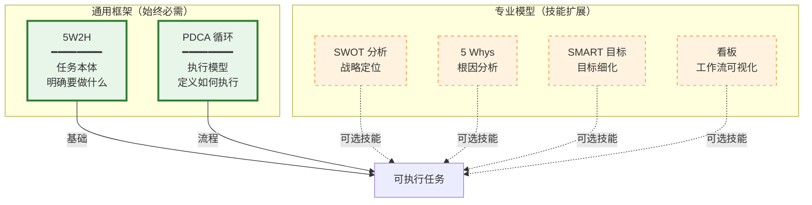
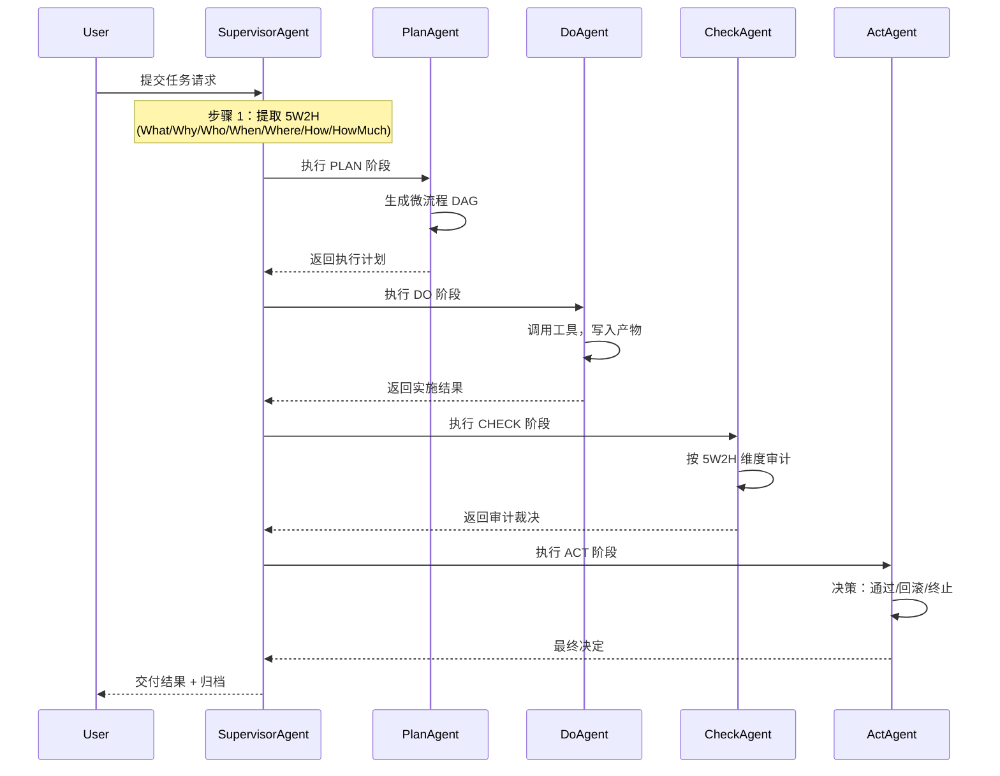
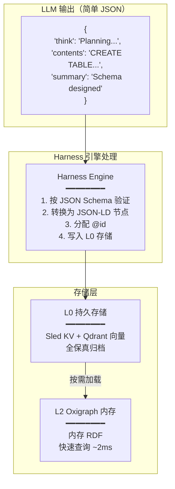
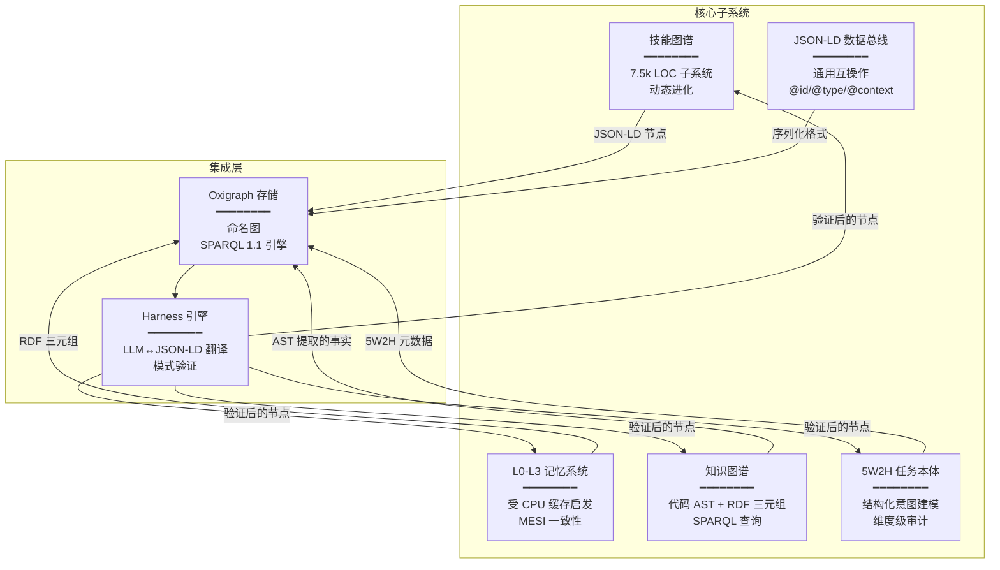
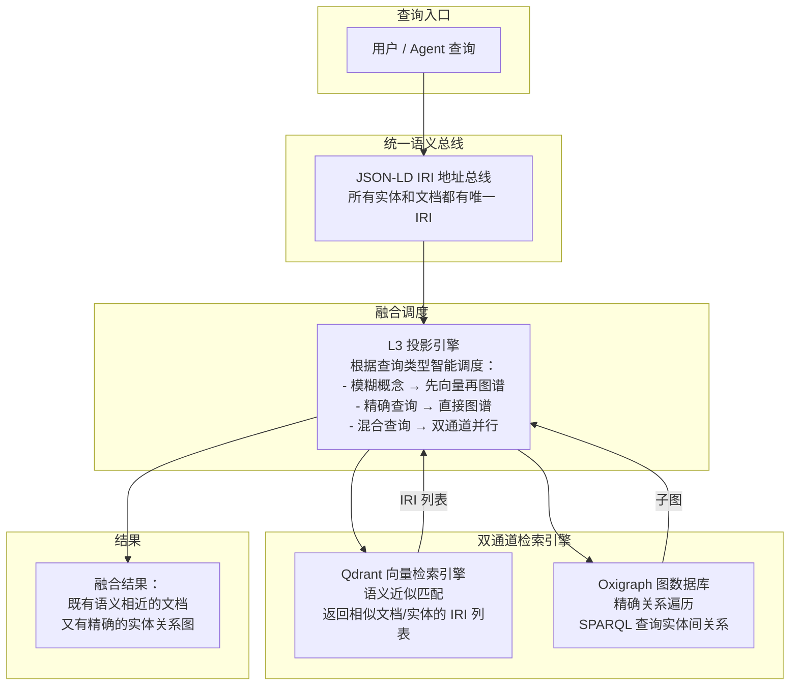

# 核心设计理念：5W2H、JSON-LD 与通用知识图谱

> *本文是 [CORE_DESIGN_PHILOSOPHY.md](CORE_DESIGN_PHILOSOPHY.md) 的中文翻译。有关项目概述，请参阅 [README.md](../README.md) 或 [README.zh.md](../README.zh.md)。*

---

## 1. 为什么是 5W2H + PDCA：所有可执行工作的通用框架

### 1.1 结构化执行的两大支柱

Gliding Horse Agent OS 建立在**两个通用框架**之上，它们是处理任何任务的基础：

1. **5W2H（What-做什么、Why-为什么、Who-谁做、When-何时、Where-何地、How-怎么做、How Much-多少资源）** — **任务本体**
   - 回答："到底需要做什么？"
   - 目的：明确意图、约束和成功标准
   - 时机：在**任务初始化**阶段应用

2. **PDCA 循环（Plan-计划、Do-执行、Check-检查、Act-改进）** — **执行模型**
   - 回答："我们如何系统地执行和改进？"
   - 目的：提供带持续反馈的迭代执行
   - 时机：贯穿**任务生命周期**



**为什么两者缺一不可：**

```
任何可执行任务 = 5W2H（意图清晰度）+ PDCA（系统性执行）
```

| 框架 | 角色 | 缺少它会怎样 |
|-----------|------|---------------|
| **5W2H** | 定义**做什么** | 目标模糊 → 期望偏离 |
| **PDCA** | 定义**如何**迭代执行 | 混乱实施 → 缺乏质量控制 |

**完整工作流：**



### 1.2 5W2H：任务本体

5W2H 捕捉了任何可执行工作的完整本质。如果你无法清晰阐述所有 7 个维度，任务**本质上是不可执行的**。

**为什么 5W2H 不可替代：**

| 维度 | 回答的问题 | 缺失的后果 |
|-----------|-------------------|----------------------|
| **What（做什么）** | 需要做什么？ | 无清晰目标 → 盲目执行 |
| **Why（为什么）** | 为什么重要？ | 无动机/优先级 → 低参与度 |
| **Who（谁做）** | 谁负责？ | 问责缺失 → 无人负责 |
| **When（何时）** | 必须何时完成？ | 无截止日期 → 永远拖延 |
| **Where（何地）** | 在哪里执行？ | 上下文模糊 → 错误环境 |
| **How（怎么做）** | 如何执行？ | 无方法 → 混乱实施 |
| **How Much（多少资源）** | 可用资源？ | 预算超支 → 项目失败 |

任一维度的模糊性都会导致：
- 干系人之间的期望不一致
- 资源配置不当（时间、预算、人员）
- 无法衡量成功或失败
- 审计失败和问责缺失

### 1.3 PDCA：通用化执行模型

与传统管理型 PDCA 不同，Gliding Horse 实现了**通用化计算型 PDCA**，能够适应任务复杂度：

**七个复杂度级别：**

| 级别 | 类型 | PDCA 适配 | 示例 |
|-------|------|----------------|---------|
| **L0** | 即时任务 | 单轮，无需 PDCA | "现在几点？" |
| **L1** | 简单任务 | 单次 PDCA 循环 | "写一个 Python 脚本" |
| **L2** | 标准任务 | 完整 PDCA + 结构化审计 | "分析 Q2 销售数据" |
| **L3** | 复杂项目 | 多智能体并行 Do 阶段 | "构建 REST API + 测试" |
| **L4** | 探索型任务 | 多 DA 并行，不同策略 | "研究最佳技术栈" |
| **L5** | 递归任务 | 子任务生成子 PDCA 循环 | "重构整个代码库" |
| **L6** | 紧急模式 | 跳过 Plan，立即 Do-Check | "立即修复生产 Bug" |

**关键创新**：Supervisor Agent 根据 **5W2H 元数据分析**动态选择合适的 PDCA 模式，而非僵化的模板。这使得同一个编排引擎既能处理简单的查询，也能处理持续数周的工程项目。

### 1.4 专业模型作为技能扩展

在 Gliding Horse Agent OS 中，SWOT、5 Whys、SMART 等专业模型被实现为技能图谱系统中的**可复用技能**。当 5W2H 元数据表明适用时，它们被调用：

```json
{
  "task:5W2H": {
    "what": "分析市场竞争",
    "why": "识别战略定位机会",
    "how": {
      "preferredSkills": ["skill:swot-analysis", "skill:porter-five-forces"]
    }
  }
}
```

此设计确保：
1. **一致性**：每个任务都有相同的结构基础（5W2H + PDCA）
2. **可扩展性**：专业分析方法作为可插拔技能
3. **可审计性**：CA 可独立验证每个维度
4. **模式识别**：具有类似 5W2H 配置的历史任务触发相关技能推荐

---

## 2. JSON-LD 简化用法：连接 LLM 与知识图谱

### 2.1 挑战

LLM 不擅长生成复杂的 JSON-LD 结构。它们擅长生成自然语言和简单的 JSON 对象。然而，系统需要 JSON-LD 来实现：
- 全局实体标识（`@id`）
- 语义类型（`@type`）
- 字段名规范化（`@context`）
- 深度控制以管理 Token 预算

### 2.2 我们的解决方案：Harness 引擎混合方案

我们使用一个**翻译层**（Harness Engine），将简单的 LLM 输出转换为 JSON-LD 节点：



### 2.3 LLM 响应结构（针对存储效率优化）

```json
{
  "think": "Analyzing user request for database schema design...",
  "contents": "CREATE TABLE users (id UUID PRIMARY KEY, email VARCHAR(255) UNIQUE NOT NULL);",
  "summary": "Database schema for user table with UUID primary key and unique email constraint"
}
```

**为什么采用三字段结构？**

| 字段 | 用途 | 存储策略 | 检索模式 |
|-------|---------|-----------------|-------------------|
| **think** | 思维链推理 | 归档至 L0 | 调试 / 可追溯性 |
| **contents** | 完整详细输出 | 归档至 L0 | 缺页故障时加载 |
| **summary** | 简洁摘要 | 索引至 L2 | 快速上下文概览 |

**存储与检索机制：**

```
步骤 1: LLM 生成 think/contents/summary
  → 三个字段均以 @id: "memory:session-001/block-042" 归档至 L0
  → summary 同时在 L2 中建立索引以快速访问

步骤 2: Agent 需要下一轮上下文
  → L2 返回 summary（~50 tokens）作为轻量级上下文
  → L1 上下文窗口保持小巧

步骤 3: 用户要求查看详情（"显示完整的 SQL"）
  → 系统检测到需要完整内容
  → 触发"缺页故障"：通过 IRI 引用从 L0 加载 contents
  → 返回完整 SQL 语句

结果：L1/L2 保持精简，L0 保存全保真，通过 IRI 按需加载
```

**类比 CPU 虚拟内存：**

| 概念 | CPU 架构 | Gliding Horse 内存 |
|---------|-----------------|---------------------|
| 工作集 | RAM（快速、有限） | L2 Oxigraph（快速，~2ms）|
| 页表 | 虚拟→物理映射 | IRI 引用 |
| 缺页故障 | 磁盘 → RAM 加载 | L0 → L2 加载 |
| 交换空间 | 磁盘存储 | L0 Sled + Qdrant |

此设计实现了：
- ✅ **性能**：L2 内存查询延迟 ~2ms
- ✅ **可扩展性**：L0 磁盘存储，容量无限
- ✅ **Token 经济性**：基于摘要的 L1/L2 上下文，Token 使用最小化
- ✅ **可追溯性**：think/contents 完整保留于 L0 供调试
- ✅ **互操作性**：JSON-LD 支持跨智能体数据共享

### 2.4 Harness 引擎的角色

Harness 引擎充当了以下两者之间的**翻译层**：
- **LLM 的舒适区**：包含 think/contents/summary 的简单 JSON
- **系统的需求**：包含 @id、@type、@context 的 JSON-LD，用于互操作

处理流程：
```rust
// 说明转换过程的伪代码
let llm_output = llm_client.generate(prompt).await?; // 返回简单 JSON

// 步骤 1：按 JSON Schema 验证
validation_engine.validate(&llm_output.contents, &skill.input_schema)?;

// 步骤 2：转换为 JSON-LD 节点
let jsonld_node = json!({
    "@id": format!("memory:{}/block-{}", session_id, block_counter),
    "@type": ["mem:MemoryBlock", "exec:TaskResult"],
    "mem:think": llm_output.think,
    "mem:contents": llm_output.contents,
    "mem:summary": llm_output.summary,
    "mem:embeddingPointId": qdrant_client.index(&llm_output.contents).await?
});

// 步骤 3：写入 L0 持久存储（全保真归档）
l0_manager.insert_node(&jsonld_node)?;

// 步骤 4：在 L2 中建立摘要索引以便快速访问
l2_manager.index_summary(&jsonld_node["@id"], &llm_output.summary)?;
```

此设计分离了关注点：
- **L0**：全保真归档（think + contents + summary）
- **L2**：快速访问工作集（summary + 元数据）
- **L1**：活跃上下文窗口（仅摘要，受 Token 约束）

---

## 3. 通用知识图谱：认知骨干

### 3.1 集成架构

Gliding Horse Agent OS 实现了**统一知识图谱**，通过 JSON-LD 和 Oxigraph 无缝集成五个核心子系统：



**关键创新**：不为技能、记忆、任务和代码知识维护独立的数据库，所有数据通过命名图隔离，存在于**同一个 Oxigraph 存储**中。这使得：

1. **跨子系统查询**：SPARQL 可以联合查询技能定义、任务历史和代码产物
2. **统一索引**：向量嵌入（Qdrant）通过 `mem:embeddingPointId` 链接到 RDF 节点
3. **一致的标识**：`@id` 确保同一实体在所有上下文中被一致识别

### 3.2 实际示例：端到端工作流

让我们追踪这些组件在真实场景中如何协同工作：

**场景**：用户请求"将认证模块重构为使用 JWT"

#### 步骤 1：任务初始化（5W2H 提取）
```json
{
  "@id": "task:auth-refactor-001",
  "@type": "task:RefactoringTask",
  "task:5W2H": {
    "what": "用 JWT 替换基于 Session 的认证",
    "why": "提升可扩展性，支持无状态微服务",
    "who": { "requiredRole": "agent:Do" },
    "when": { "deadline": "2026-06-01T18:00:00Z" },
    "where": { "targetRepository": "github.com/myorg/auth-svc" },
    "how": {},
    "howMuch": { "tokenBudget": 10000 }
  }
}
```
→ 存入 L2 黑板（Oxigraph 命名图：`blackboard:task-001`）

#### 步骤 2：技能发现（SPARQL 查询）
```sparql
PREFIX skill: <https://agent-harness.os/skill#>
SELECT ?skill WHERE {
  GRAPH system:skills {
    ?skill a skill:AtomicSkill ;
           skill:tags ?tag .
    FILTER(CONTAINS(LCASE(?tag), "jwt"))
    FILTER(?skill/maturity IN ("production", "stable"))
  }
}
```
→ 返回：`skill:rust-jwt-auth`, `skill:jwt-validation-middleware`

#### 步骤 3：代码知识提取（AST 解析）
```bash
# Tree-sitter 提取现有认证代码结构
tree-sitter parse src/auth.rs --json > ast_output.json
```
→ 转换为 RDF 三元组：
```turtle
code:AuthModule a code:RustModule ;
    code:hasFunction code:session_validate ;
    code:locatedAt "src/auth.rs:42-156" .
```
→ 存入 L0 持久图谱（`system:knowledge`）

#### 步骤 4：规划（PA 生成微流程 DAG）
PA 读取 5W2H 约束 + 技能定义 + 代码结构 → 生成执行计划：
```json
{
  "@id": "plan:auth-refactor-001",
  "plan:steps": [
    { "order": 1, "action": "添加 jsonwebtoken 依赖", "skill": "skill:cargo-add" },
    { "order": 2, "action": "定义 Claims 结构体", "skill": "skill:rust-struct-design" },
    { "order": 3, "action": "实现 Token 签发", "skill": "skill:rust-jwt-auth" },
    { "order": 4, "action": "替换 Session 中间件", "skill": "skill:jwt-validation-middleware" }
  ]
}
```

#### 步骤 5：执行（DA 调用工具）
```rust
// DA 通过 Harness 引擎调用工具
let result = harness.execute_tool(
    "skill:rust-jwt-auth",
    json!({ "secretKey": env::var("JWT_SECRET") })
).await?;

// Harness 按 SHACL 模式校验输入
// 用 Ed25519 签名调用
// 将结果写入 L2，@id: "blackboard:task-001/step-3-result"
```

#### 步骤 6：检查（CA 按 5W2H 维度审计）
```json
{
  "auditBy5W2H": {
    "what": { "verdict": "PASS", "evidence": "JWT 实现完成" },
    "why": { "verdict": "PASS", "evidence": "无状态认证已实现" },
    "when": { "verdict": "PASS", "evidence": "截止日期前完成" },
    "howMuch": { "verdict": "WARNING", "evidence": "Token 预算已使用 85%" }
  }
}
```

#### 步骤 7：归档与学习（AA 更新技能图谱）
```sparql
# 更新技能统计
INSERT {
  skill:rust-jwt-auth skill:graphMeta ?newMeta .
  ?newMeta skill:usageCount 48 ;
           skill:successRate 0.92 .
}
WHERE {
  skill:rust-jwt-auth skill:graphMeta ?oldMeta .
  # 计算新成功率...
}
```

**结果**：整个工作流利用了：
- ✅ **5W2H** 进行结构化任务定义和审计
- ✅ **JSON-LD** 进行可互操作的数据交换
- ✅ **技能图谱** 提供可复用的能力
- ✅ **知识图谱** 进行代码理解
- ✅ **L0-L3 记忆** 实现高效的上下文管理
- ✅ **Oxigraph** 作为统一存储后端

### 3.3 性能特征

| 操作 | 延迟 | 机制 |
|-----------|---------|-----------|
| L2 节点插入 | ~2ms | Oxigraph 内存 INSERT |
| L3 SPARQL 查询 | ~15ms | CONSTRUCT + Frame 投影 |
| L0 向量搜索 | ~50ms | Qdrant HNSW 索引 |
| 技能发现 | ~20ms | SPARQL + 向量相似度 |
| 代码 AST 解析 | ~100ms | Tree-sitter 增量解析 |
| Harness 验证 | ~5ms | JSON Schema + SHACL 检查 |

**可扩展性**：
- L2 支持约 500 ops/sec（适用于活跃任务工作集）
- L0 可扩展到数百万节点（磁盘存储 + 压缩）
- 命名图提供逻辑隔离而无需性能代价

---

## 4. 技能图谱与知识图谱融合：自进化认知架构

这是 Gliding Horse 区别于所有同类系统的一项根本性架构创新。传统设计中，技能（Skills）是静态指令文件，知识（Knowledge）是外部检索的文本块，两者彼此割裂。Gliding Horse 基于 JSON‑LD 语义总线，将技能、知识碎片、经验教训统一表达为图节点，使 Skill Graph 与 Knowledge Graph 天然融为一体。

### 4.1 三层自进化能力

**经验自动回写：** 每个任务完成后，AA（决策 Agent）自动从执行轨迹中提取失败模式、新关联和成功路径，以 KnowledgeFragment 形式挂载到对应技能节点上。下次执行同类任务时，这些碎片作为"免疫情报"自动注入上下文，避免重复踩坑。

**技能图自生长：** 当 DA（执行 Agent）遇到现有技能无法覆盖的问题时，系统触发 `/learn` 机制，SA 自动创建新技能草稿节点并建立与现有图谱的语义链接；`/reduce` 机制则从解决方案中提炼出标准化步骤，使技能从"草稿"演化为"已验证"状态。

**信任与成熟度演化：** 每个技能节点携带 `successRate`、`usageCount`、`maturity` 等运行时指标。随着成功执行的累积，技能自动从 `experimental → stable → production` 升级，信任体系逐层传递，无需人工干预。

### 4.2 与同类系统的对比

| 维度 | 其他 Agent 框架 | Gliding Horse |
|------|----------------|---------------|
| **技能组织** | 静态 Markdown 文件或代码函数，需人工维护 | JSON‑LD 图节点，6 种语义链接，可遍历、可推理 |
| **知识经验** | 独立于技能的向量库文本块，无结构化关联 | 经验碎片作为技能节点的附属图节点，自动挂载注入 |
| **技能演化** | 依赖开发者手动更新版本或重写 | AA 自动回写成功率、失败模式，成熟度自动升级 |
| **技能发现** | 按文件名或标签匹配 | SPARQL 语义查询 + 链接遍历，沿 Prerequisite/Related/Alternative 边发现最优技能链 |
| **上下文效率** | 全量技能描述注入 | 五级渐进式投影，按需从 MOC → 摘要 → 链接 → 步骤 → 全文逐层加载，Token 节省 >90% |

### 4.3 行业现状：两条技术路线各走各路

纯向量检索（RAG）方案（LangChain + Pinecone/Chroma）语义模糊匹配强，但无法表达"A是B的父类"这类结构化关系，实体间的精确关系淹没在向量空间里。纯知识图谱方案（Neo4j + SPARQL）精确关系查询强，但无法处理"跟这个意思差不多"的模糊匹配，需要精确 IRI 或关键词才能命中。

行业痛点是：大多数系统选择其中一条路，或者简单拼接（先向量搜、再图谱查，或反过来），两者之间缺乏统一的语义总线来调度和融合结果。

### 4.4 统一方案：JSON‑LD IRI 作为"统一地址总线"

Gliding Horse 从根本上解决了这个割裂问题：



**三个关键创新：**

1. **IRI 作为统一标识符：** Qdrant 中每个向量点都对应一个 IRI（`qdrant:pointId → urn:memory:session-042/block-017`），向量检索返回的是一组 IRI，而非孤立的文本块。

2. **IRI 作为桥梁：** 拿到 IRI 后，L3 投影引擎立即在 Oxigraph 中执行 SPARQL 查询，获取该实体的所有关联属性、上下游关系、历史版本，实现向量语义与图结构的无缝衔接。

3. **双向互检索：** 用户也可先在图谱中精确定位某个实体，再通过该实体的嵌入向量在 Qdrant 中找到"语义相近"的其他实体，形成从精确到模糊的完整检索闭环。

---

## 总结

这三个设计支柱——**5W2H + PDCA 作为通用框架**、**通过 Harness 引擎简化 JSON-LD 使用**、以及**通用知识图谱集成**——构成了 Gliding Horse Agent OS 的认知骨干。它们实现了：

1. **结构化意图建模**：每个任务精确定义（5W2H）并系统执行（PDCA）
2. **高效的 LLM 交互**：简单 JSON 输入（think/contents/summary）转换为丰富的 JSON-LD 输出
3. **统一数据管理**：单一 Oxigraph 存储，支持跨子系统查询
4. **Token 经济的上下文管理**：基于摘要的 L1/L2 结合全保真 L0 归档（按需缺页加载）
5. **可扩展的技能生态**：专业模型（SWOT、5 Whys 等）作为可插拔技能
6. **可追溯性与调试**：think/contents 完整保留于 L0 供事后分析

它们共同创造了一个既**强大**（处理复杂的多智能体工作流）又**实用**（在 LLM 限制和 Token 预算内工作）的系统。

### 关键设计原则

| 原则 | 实现 | 收益 |
|-----------|---------------|---------|
| **双通用框架** | 5W2H（意图）+ PDCA（执行） | 处理从简单到复杂的任何任务 |
| **混合 JSON 处理** | LLM 生成简单 JSON → Harness 转换为 JSON-LD | 发挥 LLM 优势同时保持语义互操作 |
| **CPU 缓存启发的记忆** | L0（磁盘）/ L1（上下文）/ L2（工作集）/ L3（投影） | 平衡性能、容量和 Token 经济性 |
| **缺页故障模式** | L2 中存摘要，L0 中存全内容，按需加载 | 保持活跃上下文小巧的同时保留全保真 |
| **统一知识图谱** | 所有子系统通过命名图共享单一 Oxigraph 存储 | 支持跨域查询和一致的标识 |

### 架构哲学

```
Gliding Horse Agent OS = 古老智慧 × 现代技术

木牛流马 → 自主运输驾驭
    ↓
Agent Harness → 多智能体编排基础设施
    ↓
核心创新：
    • 5W2H + PDCA：所有可执行工作的通用框架
    • JSON-LD + Harness：连接 LLM 简洁性与语义网标准
    • 统一知识图谱：横跨技能、记忆、任务和代码的唯一真相源
```

此设计传承了诸葛亮构建自适应系统以延伸人类能力的遗产，如今应用于 AI 智能体编排领域。
